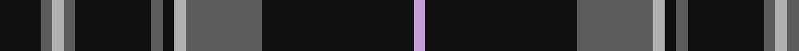

In pattern [KBYBKBKYBKW](/patterns/kbybkbkybkw/).

This was sourced from house-of-tartan.  It is a [11 stripes tartan](/stripes/stripes11/).

Original link http://www.house-of-tartan.scotland.net/house/TartanViewjs.asp?colr=Def&tnam=6850

## Thread count
K/14 N4 Na4 N4 K26 N4 K4 Na4 N26 K52 LP/4

## Palette
Each colour and its ΔE from the base-6 reference it is a variant of.

| Colour | Shade | Base | ΔE (OKLab) |
|---|---|---|---|
| K | <code style="background-color:#101010;">#101010</code> `#101010` | K <code style="background-color:#000000;">#000000</code> | 0.17 |
| LN | <code style="background-color:#E0E0E0;">#E0E0E0</code> `#E0E0E0` | W <code style="background-color:#F4F4F0;">#F4F4F0</code> | 0.06 |
| LP | <code style="background-color:#C49CD8;">#C49CD8</code> `#C49CD8` | W <code style="background-color:#F4F4F0;">#F4F4F0</code> | 0.24 |
| N | <code style="background-color:#5C5C5C;">#5C5C5C</code> `#5C5C5C` | B <code style="background-color:#2C4084;">#2C4084</code> | 0.14 |
| Na | <code style="background-color:#B0B0B0;">#B0B0B0</code> `#B0B0B0` | Y <code style="background-color:#E8C000;">#E8C000</code> | 0.18 |

## Nearest tartans

The nearest existing variants by ΔTartan distance.

1. [King Robert the Bruce Memorial, The](/setts/s10/r8k79b4k4w4k6b22k6r16k6-b666666-k101010-rbe273d-wdeded5/) — ΔT 1.14
1. [Valdres, Kvam & Vang #3](/setts/s10/k8w2r8k4g4r6g4k40r4k4-g006818-k101010-rc80000-we0e0e0/) — ΔT 1.22
1. [Flowers of the Forest, The](/setts/s10/b32ba16bb20r4bb20r4bb20r4bb64b4-b0596fa-ba5f749c-bb441800-rc8002c/) — ΔT 1.22
1. [Kells Irish Pubs (Corporate)](/setts/s12/k34r4k6g4k6g4k48b16g8b8g6b16-b1474b4-g006818-k101010-r888888/) — ΔT 1.25
1. [Mountain Rescue Assoc. (Corporate)](/setts/s7/k64b4k12b4k26ba60w4-b1474b4-ba5c5c5c-k101010-wfcfcfc/) — ΔT 1.25
1. [King Robert the Bruce Memorial (Com](/setts/s10/r8k79ra4k4w4k6ra22k6r16k6-k101010-rc80000-ra888888-wc0c0c0/) — ΔT 1.32
1. [Kells Irish Pubs](/setts/s12/k34y4k6g4k6g4k48b16g8b8g6b16-b5389c9-g47884e-k101010-y909090/) — ΔT 1.35
1. [Jenkins Welsh Name Tartan Tartan Number: 5757. Earliest known date: 2002 The tartan for this Welsh surname and its variations, Jenks, Jenkin, Jankin, Seincyn, is actually woven in Wales at the Cambrian Woollen Mill, weaving on the same site since 1830. This tartan differs from many traditional patterns in that the warp and weft differ, giving the finished worsted wool cloth more of a predominant stripe, vertically noticeable in the finished Kilt, or Cilt in Wales. See products available Copyright © Blair Urquhart, Comrie, 2015](/setts/s11/g8b3g2b4y2b5g7b4g4b37r6-b202060-g006818-rc80000-ybc8c00/) — ΔT 1.39
1. [Valdres Kvam and Vang District Tartan Tartan Number: 2124. Earliest known date: 1850's One of the many designs produced in this secluded valley in the middle of Norway. Unlike Gudbrandsdalen, no connection with Scottish tartans can be found, but further research is planned. See products available Copyright © Blair Urquhart, Comrie, 2015](/setts/s11/k4w1r4k2g2r3k2k20r2k2r2-g006818-k101010-rc80000-we0e0e0/) — ΔT 1.41
1. [Pride of Scotland Platinum](/setts/s11/k20b4r4b4k28b4k4w2b24k48ra4-b5c5c5c-k101010-r888888-rab468ac-wc49cd8/) — ΔT 1.41

## Neighbour map

Every grey dot is one of 15726 variants placed by the first two principal components of the ΔTartan feature space (44% of its variance). Red is this tartan; blue dots are its nearest — click one to open its page.

<svg viewBox="0 0 640 380" role="img" style="max-width:100%;height:auto;border:1px solid #e0e0e0;border-radius:4px;display:block" xmlns="http://www.w3.org/2000/svg"><image href="/nn/cloud.v1.png" width="640" height="380"/><a href="/setts/s10/r8k79b4k4w4k6b22k6r16k6-b666666-k101010-rbe273d-wdeded5/"><circle cx="408.7" cy="135.3" r="4" fill="#3465a4"><title>King Robert the Bruce Memorial, The</title></circle></a><a href="/setts/s10/k8w2r8k4g4r6g4k40r4k4-g006818-k101010-rc80000-we0e0e0/"><circle cx="413.1" cy="141.0" r="4" fill="#3465a4"><title>Valdres, Kvam &amp; Vang #3</title></circle></a><a href="/setts/s10/b32ba16bb20r4bb20r4bb20r4bb64b4-b0596fa-ba5f749c-bb441800-rc8002c/"><circle cx="377.0" cy="166.6" r="4" fill="#3465a4"><title>Flowers of the Forest, The</title></circle></a><a href="/setts/s12/k34r4k6g4k6g4k48b16g8b8g6b16-b1474b4-g006818-k101010-r888888/"><circle cx="321.2" cy="177.0" r="4" fill="#3465a4"><title>Kells Irish Pubs (Corporate)</title></circle></a><a href="/setts/s7/k64b4k12b4k26ba60w4-b1474b4-ba5c5c5c-k101010-wfcfcfc/"><circle cx="364.0" cy="189.8" r="4" fill="#3465a4"><title>Mountain Rescue Assoc. (Corporate)</title></circle></a><a href="/setts/s10/r8k79ra4k4w4k6ra22k6r16k6-k101010-rc80000-ra888888-wc0c0c0/"><circle cx="397.6" cy="129.1" r="4" fill="#3465a4"><title>King Robert the Bruce Memorial (Com</title></circle></a><a href="/setts/s12/k34y4k6g4k6g4k48b16g8b8g6b16-b5389c9-g47884e-k101010-y909090/"><circle cx="302.2" cy="165.8" r="4" fill="#3465a4"><title>Kells Irish Pubs</title></circle></a><a href="/setts/s11/g8b3g2b4y2b5g7b4g4b37r6-b202060-g006818-rc80000-ybc8c00/"><circle cx="420.2" cy="155.2" r="4" fill="#3465a4"><title>Jenkins Welsh Name Tartan Tartan Number: 5757. Earliest known date: 2002 The tartan for this Welsh surname and its variations, Jenks, Jenkin, Jankin, Seincyn, is actually woven in Wales at the Cambrian Woollen Mill, weaving on the same site since 1830. This tartan differs from many traditional patterns in that the warp and weft differ, giving the finished worsted wool cloth more of a predominant stripe, vertically noticeable in the finished Kilt, or Cilt in Wales. See products available Copyright © Blair Urquhart, Comrie, 2015</title></circle></a><a href="/setts/s11/k4w1r4k2g2r3k2k20r2k2r2-g006818-k101010-rc80000-we0e0e0/"><circle cx="429.1" cy="135.8" r="4" fill="#3465a4"><title>Valdres Kvam and Vang District Tartan Tartan Number: 2124. Earliest known date: 1850's One of the many designs produced in this secluded valley in the middle of Norway. Unlike Gudbrandsdalen, no connection with Scottish tartans can be found, but further research is planned. See products available Copyright © Blair Urquhart, Comrie, 2015</title></circle></a><a href="/setts/s11/k20b4r4b4k28b4k4w2b24k48ra4-b5c5c5c-k101010-r888888-rab468ac-wc49cd8/"><circle cx="428.1" cy="143.7" r="4" fill="#3465a4"><title>Pride of Scotland Platinum</title></circle></a><circle cx="389.6" cy="168.9" r="5" fill="#c00000"/></svg>

ID: /setts/s11/k14b4y4b4k26b4k4y4b26k52w4-b5c5c5c-k101010-wc49cd8-yb0b0b0/
