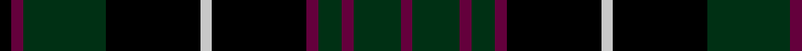

**Bands:** [KBGKWKBGBGB](/stripes/kbgkwkbgbgb/) · **Stripes:** [K DP DG K LB K DP DG DP DG DP](/stripes/stripes11/) K DP DG K LB K DP DG DP DG DP

This was sourced from register-of-tartans.  It is a [11 band tartan](/bands/bands11/).

Original link https://www.tartanregister.gov.uk/tartanDetails.aspx?ref=1117

## Register references

External register numbers recorded for this tartan.

- Scottish Register of Tartans: [1117](https://www.tartanregister.gov.uk/tartanDetails.aspx?ref=1117)
- Scottish Tartans Authority (ITI): 4816

## Thread count
K/4 DR4 DG28 K32 N4 K32 DR4 DG8 DR4 DG16 DR/4

## Palette
Each colour and its ΔE from the base-6 reference it is a variant of.

| Colour | Shade | Base | ΔE (OKLab) |
|---|---|---|---|
| DG | <code style="background-color:#003014;">#003014</code> `#003014` | G <code style="background-color:#006100;">#006100</code> | 0.17 |
| DR | <code style="background-color:#64003C;">#64003C</code> `#64003C` | B <code style="background-color:#2A418A;">#2A418A</code> | 0.19 |
| K | <code style="background-color:#000000;">#000000</code> `#000000` | K <code style="background-color:#000000;">#000000</code> | 0.00 |
| N | <code style="background-color:#C8C8C8;">#C8C8C8</code> `#C8C8C8` | W <code style="background-color:#F7F7F7;">#F7F7F7</code> | 0.14 |

## Nearest tartans

The nearest existing variants by ΔTartan distance.

1. [Daks (Chino Check)](/setts/s12/k22k3k7k2k2k2k2db10y6k2y3k2~x2/) — ΔT 1.09
1. [Daly (2016)](/setts/s12/k5r3k24dg13k3db3k3db11k6dg3k3r3~x2/) — ΔT 1.12
1. [Laois Irish County Tartan Tartan Number: 2252. Earliest known date: 1996 One of a series of Irish District tartans designed by Polly Wittering of the House of Edgar, with colours reminiscent of the Country with soft warm colours dominating. See products available Copyright © Blair Urquhart, Comrie, 2015](/setts/s9/k15n2k5n5k18y5k5y2k15~x2/) — ΔT 1.19
1. [Davidson](/setts/s11/r1k6dg1k1dg8k1dg8db1dg1db6r1~x2/) — ΔT 1.19
1. [Lunar (Fashion)](/setts/s11/k10k1k3k7n1k1n1k1n1k1n7~x4/) — ΔT 1.30
1. [Printing Industries of America](/setts/s8/k7r2k2k6lo1k1lo1k4~x4/) — ΔT 1.32
1. [Chess](/setts/s13/k1w1k8k1k1dg8k1k8k1dg1k8w1k1~x6/) — ΔT 1.32
1. [Guthrie](/setts/s9/k1g8k9r1k1r1k9db8r1~x6/) — ΔT 1.37
1. [Episcopal Clergy (Corporate)](/setts/s11/k1r1g7k8lb1k8r1g2r1g4r1~x4/) — ΔT 1.43
1. [Lunar](/setts/s11/k10r1k3do7n1do1n1do1n1do1n7~x4/) — ΔT 1.44

## Neighbour map

Every grey dot is one of 14299 variants placed by the first two principal components of the ΔTartan feature space (44% of its variance). Red is this tartan; blue dots are its nearest — click one to open its page.

<svg viewBox="0 0 640 380" role="img" style="max-width:100%;height:auto;border:1px solid #e0e0e0;border-radius:4px;display:block" xmlns="http://www.w3.org/2000/svg"><image href="/nn/cloud.v1.png" width="640" height="380"/><a href="/setts/s12/k22k3k7k2k2k2k2db10y6k2y3k2~x2/"><circle cx="278.0" cy="187.1" r="4" fill="#3465a4"><title>Daks (Chino Check)</title></circle></a><a href="/setts/s12/k5r3k24dg13k3db3k3db11k6dg3k3r3~x2/"><circle cx="262.3" cy="189.5" r="4" fill="#3465a4"><title>Daly (2016)</title></circle></a><a href="/setts/s9/k15n2k5n5k18y5k5y2k15~x2/"><circle cx="278.6" cy="231.2" r="4" fill="#3465a4"><title>Laois Irish County Tartan Tartan Number: 2252. Earliest known date: 1996 One of a series of Irish District tartans designed by Polly Wittering of the House of Edgar, with colours reminiscent of the Country with soft warm colours dominating. See products available Copyright © Blair Urquhart, Comrie, 2015</title></circle></a><a href="/setts/s11/r1k6dg1k1dg8k1dg8db1dg1db6r1~x2/"><circle cx="255.9" cy="203.4" r="4" fill="#3465a4"><title>Davidson</title></circle></a><a href="/setts/s11/k10k1k3k7n1k1n1k1n1k1n7~x4/"><circle cx="214.7" cy="187.5" r="4" fill="#3465a4"><title>Lunar (Fashion)</title></circle></a><a href="/setts/s8/k7r2k2k6lo1k1lo1k4~x4/"><circle cx="231.3" cy="236.5" r="4" fill="#3465a4"><title>Printing Industries of America</title></circle></a><a href="/setts/s13/k1w1k8k1k1dg8k1k8k1dg1k8w1k1~x6/"><circle cx="274.5" cy="198.2" r="4" fill="#3465a4"><title>Chess</title></circle></a><a href="/setts/s9/k1g8k9r1k1r1k9db8r1~x6/"><circle cx="233.2" cy="197.0" r="4" fill="#3465a4"><title>Guthrie</title></circle></a><a href="/setts/s11/k1r1g7k8lb1k8r1g2r1g4r1~x4/"><circle cx="232.9" cy="191.0" r="4" fill="#3465a4"><title>Episcopal Clergy (Corporate)</title></circle></a><a href="/setts/s11/k10r1k3do7n1do1n1do1n1do1n7~x4/"><circle cx="215.0" cy="178.7" r="4" fill="#3465a4"><title>Lunar</title></circle></a><circle cx="268.1" cy="210.3" r="5" fill="#c00000"/></svg>

ID: /setts/s11/k1dp1dg7k8lb1k8dp1dg2dp1dg4dp1~x4/
