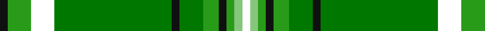

**Bands:** [KGWGKGGKGYW](/stripes/kgwgkggkgyw/) · **Stripes:** [K G W G K G G K G LG W](/stripes/stripes11/) K G W G K G G K G LG W

This was sourced from register-of-tartans.  It is a [11 band tartan](/bands/bands11/).

Original link https://www.tartanregister.gov.uk/tartanDetails.aspx?ref=11063

## Register references

External register numbers recorded for this tartan.

- Scottish Register of Tartans: [11063](https://www.tartanregister.gov.uk/tartanDetails.aspx?ref=11063)

## Thread count
K/2 Ga6 W6 G30 K2 G6 Ga4 K2 Ga2 LG2 W/2

## Palette
Each colour and its ΔE from the base-6 reference it is a variant of.

| Colour | Shade | Base | ΔE (OKLab) |
|---|---|---|---|
| G | <code style="background-color:#007800;">#007800</code> `#007800` | G <code style="background-color:#006100;">#006100</code> | 0.07 |
| Ga | <code style="background-color:#289C18;">#289C18</code> `#289C18` | G <code style="background-color:#006100;">#006100</code> | 0.19 |
| K | <code style="background-color:#101010;">#101010</code> `#101010` | K <code style="background-color:#000000;">#000000</code> | 0.17 |
| LG | <code style="background-color:#86C67C;">#86C67C</code> `#86C67C` | Y <code style="background-color:#F2BF00;">#F2BF00</code> | 0.15 |
| W | <code style="background-color:#FFFFFF;">#FFFFFF</code> `#FFFFFF` | W <code style="background-color:#F7F7F7;">#F7F7F7</code> | 0.02 |

## Nearest tartans

The nearest existing variants by ΔTartan distance.

1. [University of North Texas](/setts/s11/k1g3w3g15k1g3g2k1g1g1w1~x2/) — ΔT 0.43
1. [Montgomery, Stuart (Personal)](/setts/s10/db6g24k1w2k1g24g24w3k1w3~x2/) — ΔT 1.12
1. [Monroig, Eric (Personal)](/setts/s12/ly2g16ly1b6r1ly1r1b6ly1g16b2r2~x2/) — ΔT 1.34
1. [Humphries (Name)](/setts/s8/g18r1lb2k1lb2r1o6k2~x4/) — ΔT 1.37
1. [O'Neill](/setts/s8/w6g5r5g45k4o24k4g5~x2/) — ΔT 1.46
1. [Alberta District Tartan Tartan Number: 2055. Earliest known date: 1961 Designed for the Edmonton Rehabilitation Society as a project for handloom weaving by disabled students. The Provincial Legislative of Alberta gave formal approval for the Alberta tartan in 1961. See products available Copyright © Blair Urquhart, Comrie, 2015](/setts/s7/g12k1r1k1t2k1ly4~x2/) — ΔT 1.53
1. [Alberta (Province)](/setts/s7/g13k1r1k1b2k1ly4~x8/) — ΔT 1.54
1. [West Lothian/Linlithgowshire](/setts/s9/g40k8g4k8g4m14g64t9g3/) — ΔT 1.55
1. [Offally County Crest (Fashion)](/setts/s11/ly24k8lp4k6g76k8w14g4k9g12lo10/) — ΔT 1.58
1. [New World Irish (Fashion)](/setts/s8/w9dg2g2w3g18k2dg33lo2~x2/) — ΔT 1.60

## Neighbour map

Every grey dot is one of 14313 variants placed by the first two principal components of the ΔTartan feature space (44% of its variance). Red is this tartan; blue dots are its nearest — click one to open its page.

<svg viewBox="0 0 640 380" role="img" style="max-width:100%;height:auto;border:1px solid #e0e0e0;border-radius:4px;display:block" xmlns="http://www.w3.org/2000/svg"><image href="/nn/cloud.v1.png" width="640" height="380"/><a href="/setts/s11/k1g3w3g15k1g3g2k1g1g1w1~x2/"><circle cx="283.3" cy="124.4" r="4" fill="#3465a4"><title>University of North Texas</title></circle></a><a href="/setts/s10/db6g24k1w2k1g24g24w3k1w3~x2/"><circle cx="295.8" cy="132.6" r="4" fill="#3465a4"><title>Montgomery, Stuart (Personal)</title></circle></a><a href="/setts/s12/ly2g16ly1b6r1ly1r1b6ly1g16b2r2~x2/"><circle cx="324.7" cy="144.1" r="4" fill="#3465a4"><title>Monroig, Eric (Personal)</title></circle></a><a href="/setts/s8/g18r1lb2k1lb2r1o6k2~x4/"><circle cx="290.0" cy="129.3" r="4" fill="#3465a4"><title>Humphries (Name)</title></circle></a><a href="/setts/s8/w6g5r5g45k4o24k4g5~x2/"><circle cx="283.8" cy="159.3" r="4" fill="#3465a4"><title>O'Neill</title></circle></a><a href="/setts/s7/g12k1r1k1t2k1ly4~x2/"><circle cx="270.7" cy="155.4" r="4" fill="#3465a4"><title>Alberta District Tartan Tartan Number: 2055. Earliest known date: 1961 Designed for the Edmonton Rehabilitation Society as a project for handloom weaving by disabled students. The Provincial Legislative of Alberta gave formal approval for the Alberta tartan in 1961. See products available Copyright © Blair Urquhart, Comrie, 2015</title></circle></a><a href="/setts/s7/g13k1r1k1b2k1ly4~x8/"><circle cx="291.1" cy="152.7" r="4" fill="#3465a4"><title>Alberta (Province)</title></circle></a><a href="/setts/s9/g40k8g4k8g4m14g64t9g3/"><circle cx="231.5" cy="134.4" r="4" fill="#3465a4"><title>West Lothian/Linlithgowshire</title></circle></a><a href="/setts/s11/ly24k8lp4k6g76k8w14g4k9g12lo10/"><circle cx="236.6" cy="95.1" r="4" fill="#3465a4"><title>Offally County Crest (Fashion)</title></circle></a><a href="/setts/s8/w9dg2g2w3g18k2dg33lo2~x2/"><circle cx="270.5" cy="149.9" r="4" fill="#3465a4"><title>New World Irish (Fashion)</title></circle></a><circle cx="281.3" cy="123.1" r="5" fill="#c00000"/></svg>

ID: /setts/s11/k1g3w3g15k1g3g2k1g1lg1w1~x2/
