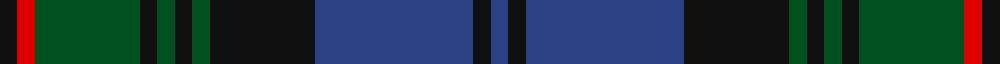

In pattern [BKBKGKGKGRK](/stripes/bkbkgkgkgrk/).

This was sourced from register-of-tartans.  It is a [11 stripe tartan](/stripes/stripes11/).

Original link https://www.tartanregister.gov.uk/tartanDetails.aspx?ref=2230

## Also known as

This cloth is also recorded under:

- Louise

## Register references

External register numbers recorded for this tartan.

- Scottish Register of Tartans: [2230](https://www.tartanregister.gov.uk/tartanDetails.aspx?ref=2230)
- Scottish Tartans World Register: 298

## Thread count
K/2 R2 G12 K2 G2 K2 G2 K12 B18 K2 B/2

## Palette
Each colour and the base-6 reference it is a variant of.

| Colour | Shade | Base |
|---|---|---|
| B | <code style="background-color:#2C4084;">#2C4084</code> `oklch(39.4% 0.117 268.3)` <small>#2C4084</small> | B <code style="background-color:#2A418A;">#2A418A</code> |
| G | <code style="background-color:#005020;">#005020</code> `oklch(37.7% 0.105 149.6)` <small>#005020</small> | G <code style="background-color:#006100;">#006100</code> |
| K | <code style="background-color:#101010;">#101010</code> `oklch(17.3% 0.000 89.9)` <small>#101010</small> | K <code style="background-color:#000000;">#000000</code> |
| R | <code style="background-color:#DC0000;">#DC0000</code> `oklch(56.2% 0.230 29.2)` <small>#DC0000</small> | R <code style="background-color:#CC0000;">#CC0000</code> |

## Nearest tartans

The nearest existing variants by ΔTartan distance.

1. [MacAndreis (Personal)](/setts/s10/k3dg4db25k16dg3k3dg3k3dg6r3~x2/) — ΔT 0.72
1. [Aitchison Family (Kinghorn) (Personal)](/setts/s9/k2db3k2db18k11db2k11g25p2~x2/) — ΔT 0.84
1. [Lamont](/setts/s8/db10k1db1k1db2k8dg10w1~x4/) — ΔT 0.99
1. [Black from Cumnock (Personal)](/setts/s13/db8k1db1k1db1k8ly1dg14ly1k8db8k1db1~x2/) — ΔT 0.99
1. [Princess Louise (Royal)](/setts/s11/g2k1db9k7g1k1g1k1g9r1db1~x4/) — ΔT 1.02
1. [Christian Dewar (Personal)](/setts/s9/db16k2db2k2db2k6dg13ly2dg3~x2/) — ΔT 1.05
1. [Urquhart](/setts/s13/g4k1g1k1g1k8db8r1db8k8g8k1g1~x8/) — ΔT 1.06
1. [MacHarg, Iain](/setts/s9/g20k2g2k2g2k8db24dp3db3~x2/) — ΔT 1.06
1. [Urquhart (Logan)](/setts/s13/g8k1g1k1g1k8db8r1db8k8g8k1g1~x2/) — ΔT 1.10
1. [Dunedin Chapter](/setts/s10/db32dg2db2dg14k2dg14k2dg2k15r2~x2/) — ΔT 1.12

## Neighbour map

Every grey dot is one of 14299 variants placed by the first two principal components of the ΔTartan feature space (44% of its variance). Red is this tartan; blue dots are its nearest — click one to open its page.

<svg viewBox="0 0 640 380" role="img" style="max-width:100%;height:auto;border:1px solid #e0e0e0;border-radius:4px;display:block" xmlns="http://www.w3.org/2000/svg"><image href="/nn/cloud.v1.png" width="640" height="380"/><a href="/setts/s10/k3dg4db25k16dg3k3dg3k3dg6r3~x2/"><circle cx="257.1" cy="221.1" r="4" fill="#3465a4"><title>MacAndreis (Personal)</title></circle></a><a href="/setts/s9/k2db3k2db18k11db2k11g25p2~x2/"><circle cx="247.5" cy="212.4" r="4" fill="#3465a4"><title>Aitchison Family (Kinghorn) (Personal)</title></circle></a><a href="/setts/s8/db10k1db1k1db2k8dg10w1~x4/"><circle cx="244.0" cy="219.3" r="4" fill="#3465a4"><title>Lamont</title></circle></a><a href="/setts/s13/db8k1db1k1db1k8ly1dg14ly1k8db8k1db1~x2/"><circle cx="238.8" cy="179.2" r="4" fill="#3465a4"><title>Black from Cumnock (Personal)</title></circle></a><a href="/setts/s11/g2k1db9k7g1k1g1k1g9r1db1~x4/"><circle cx="233.6" cy="196.3" r="4" fill="#3465a4"><title>Princess Louise (Royal)</title></circle></a><a href="/setts/s9/db16k2db2k2db2k6dg13ly2dg3~x2/"><circle cx="272.9" cy="232.2" r="4" fill="#3465a4"><title>Christian Dewar (Personal)</title></circle></a><a href="/setts/s13/g4k1g1k1g1k8db8r1db8k8g8k1g1~x8/"><circle cx="214.8" cy="212.1" r="4" fill="#3465a4"><title>Urquhart</title></circle></a><a href="/setts/s9/g20k2g2k2g2k8db24dp3db3~x2/"><circle cx="273.5" cy="195.7" r="4" fill="#3465a4"><title>MacHarg, Iain</title></circle></a><a href="/setts/s13/g8k1g1k1g1k8db8r1db8k8g8k1g1~x2/"><circle cx="204.7" cy="214.8" r="4" fill="#3465a4"><title>Urquhart (Logan)</title></circle></a><a href="/setts/s10/db32dg2db2dg14k2dg14k2dg2k15r2~x2/"><circle cx="302.9" cy="197.1" r="4" fill="#3465a4"><title>Dunedin Chapter</title></circle></a><circle cx="244.6" cy="208.9" r="5" fill="#c00000"/></svg>

ID: /setts/s11/k1r1dg6k1dg1k1dg1k6db9k1db1~x2/
