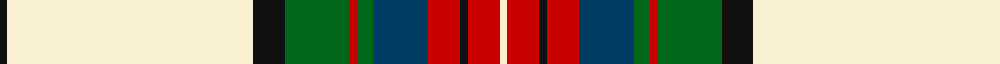

In pattern [KWKGRGBRKRW](/patterns/kwkgrgbrkrw/).

This was sourced from register-of-tartans.  It is a [11 stripes tartan](/stripes/stripes11/).

Original link https://www.tartanregister.gov.uk/tartanDetails.aspx?ref=1747

## Attestations

This cloth appears in 2 source records; the oldest owns this page.

- 01/03/2007 — Hohenzollern (register-of-tartans, [record](https://www.tartanregister.gov.uk/tartanDetails.aspx?ref=1747))
- March 2007 — Hohenzollern (Personal) (tartans-authority, [record](http://www.tartansauthority.com/tartan-ferret/display/7153/))

## Thread count
K/2 LY62 K8 G16 R2 G4 DBa14 R8 K2 R8 LY/2

## Palette
Each colour and its ΔE from the base-6 reference it is a variant of.

| Colour | Shade | Base | ΔE (OKLab) |
|---|---|---|---|
| DB | <code style="background-color:#2C2C80;">#2C2C80</code> `#2C2C80` | B <code style="background-color:#2A418A;">#2A418A</code> | 0.06 |
| DBa | <code style="background-color:#003C64;">#003C64</code> `#003C64` | B <code style="background-color:#2A418A;">#2A418A</code> | 0.08 |
| G | <code style="background-color:#006818;">#006818</code> `#006818` | G <code style="background-color:#006100;">#006100</code> | 0.02 |
| K | <code style="background-color:#101010;">#101010</code> `#101010` | K <code style="background-color:#000000;">#000000</code> | 0.17 |
| LB | <code style="background-color:#98C8E8;">#98C8E8</code> `#98C8E8` | W <code style="background-color:#F7F7F7;">#F7F7F7</code> | 0.18 |
| LY | <code style="background-color:#F8F0D0;">#F8F0D0</code> `#F8F0D0` | W <code style="background-color:#F7F7F7;">#F7F7F7</code> | 0.05 |
| R | <code style="background-color:#C80000;">#C80000</code> `#C80000` | R <code style="background-color:#CC0000;">#CC0000</code> | 0.01 |
| Y | <code style="background-color:#E8C000;">#E8C000</code> `#E8C000` | Y <code style="background-color:#F2BF00;">#F2BF00</code> | 0.02 |

## Nearest tartans

The nearest existing variants by ΔTartan distance.

1. [Glen Coe #3](/setts/s11/w32k10y1k2w1k2r7g3k1g3w1~g8c7038-k101010-ra00000-wf8e8d8-yd09800~x4/) — ΔT 0.82
1. [Rothesay, Duke of](/setts/s11/r2w28b4w2k6w2g7r4k1r2w1~b304080-g008000-k000000-rc00000-we0e0e0~x2/) — ΔT 0.82
1. [Glenmore Pink](/setts/s11/w60b24r3b5w3b5ra16r8k3r6w4~b1c1c1c-k101010-r888888-ra946880-wf8e8d8/) — ΔT 0.97
1. [Allandale Red Dress Tartan Tartan Number: 8457. Earliest known date: Threadcount and colours aren't 100% original. Generated manually. See products available Copyright © Blair Urquhart, Comrie, 2015](/setts/s12/g3r2g1r9ra2k3r5g17w40ka1w2ka3~g006818-k000000-ka101010-rc80000-ra888888-we0e0e0~x2/) — ΔT 0.99
1. [Ben Vorlich](/setts/s11/w68y3w3y8w3y3r24b16ra3b20y3~b1c1c1c-r858585-ra70000c-we0e0e0-yb8b8b8~x2/) — ΔT 1.00
1. [Royal Stuart / Stewart](/setts/s11/r3w28k2w2k2w2g12r8k1r1w1~g008000-k000000-rc00000-we0e0e0~x2/) — ΔT 1.02
1. [Royal Stuart Royal Family Tartan Tartan Number: 1689. Earliest known date: 1842 The spelling of the name Stuart does not neccessarily indicate the branch of the Stewart Clan. It is the spelling adopted by Mary, Queen of Scots, to accomodate the French alphabet, but does not imply Royal lineage. The Sobieski Stuart brothers used this spelling in the Vestiarium Scoticum (1842). The sett shows some minor variations to the usual pattern. See products available Copyright © Blair Urquhart, Comrie, 2015](/setts/s11/r3w28k2w2k2w2g12r8k1r1w1~g006818-k101010-rc80000-we0e0e0~x2/) — ΔT 1.07
1. [Glenmore Green](/setts/s11/w38k10b2k3w2k3g8r3k2r3w2~b441800-g5c6428-k101010-ra07c58-wf0f0d8~x2/) — ΔT 1.08
1. [Stewart Victoria Royal Family Tartan Tartan Number: 1676. Earliest known date: 1886 James Grant took all of the seventy two tartans in his book, 'Tartans of the Clans of Scotland', published in 1886 by W.&A.K.Johnston, from actual specimens in use at the time. Many are identical to those found in the earlier work of W. and A.Smith in 1850. The Victoria sett was known to have been favourably regarded by that great Queen. The tartan is also known as Royal Stewart Dress. See products available Copyright © Blair Urquhart, Comrie, 2015](/setts/s14/r2w24b3w3k6y1k1w1k1g8r4k1r2w1~b5c8ca8-g006818-k101010-rc80000-we0e0e0-ye8c000~x2/) — ΔT 1.10
1. [Drummond of Perth Dress (Dance)](/setts/s9/w50k3g10ga11w1k1r20w3r5~g006818-ga408060-k101010-r800028-we0e0e0~x2/) — ΔT 1.11

## Neighbour map

Every grey dot is one of 15726 variants placed by the first two principal components of the ΔTartan feature space (44% of its variance). Red is this tartan; blue dots are its nearest — click one to open its page.

<svg viewBox="0 0 640 380" role="img" style="max-width:100%;height:auto;border:1px solid #e0e0e0;border-radius:4px;display:block" xmlns="http://www.w3.org/2000/svg"><image href="/nn/cloud.v1.png" width="640" height="380"/><a href="/setts/s11/w32k10y1k2w1k2r7g3k1g3w1~g8c7038-k101010-ra00000-wf8e8d8-yd09800~x4/"><circle cx="284.3" cy="55.0" r="4" fill="#3465a4"><title>Glen Coe #3</title></circle></a><a href="/setts/s11/r2w28b4w2k6w2g7r4k1r2w1~b304080-g008000-k000000-rc00000-we0e0e0~x2/"><circle cx="274.1" cy="68.5" r="4" fill="#3465a4"><title>Rothesay, Duke of</title></circle></a><a href="/setts/s11/w60b24r3b5w3b5ra16r8k3r6w4~b1c1c1c-k101010-r888888-ra946880-wf8e8d8/"><circle cx="227.4" cy="83.4" r="4" fill="#3465a4"><title>Glenmore Pink</title></circle></a><a href="/setts/s12/g3r2g1r9ra2k3r5g17w40ka1w2ka3~g006818-k000000-ka101010-rc80000-ra888888-we0e0e0~x2/"><circle cx="239.1" cy="32.9" r="4" fill="#3465a4"><title>Allandale Red Dress Tartan Tartan Number: 8457. Earliest known date: Threadcount and colours aren't 100% original. Generated manually. See products available Copyright © Blair Urquhart, Comrie, 2015</title></circle></a><a href="/setts/s11/w68y3w3y8w3y3r24b16ra3b20y3~b1c1c1c-r858585-ra70000c-we0e0e0-yb8b8b8~x2/"><circle cx="231.3" cy="80.4" r="4" fill="#3465a4"><title>Ben Vorlich</title></circle></a><a href="/setts/s11/r3w28k2w2k2w2g12r8k1r1w1~g008000-k000000-rc00000-we0e0e0~x2/"><circle cx="287.9" cy="84.2" r="4" fill="#3465a4"><title>Royal Stuart / Stewart</title></circle></a><a href="/setts/s11/r3w28k2w2k2w2g12r8k1r1w1~g006818-k101010-rc80000-we0e0e0~x2/"><circle cx="293.7" cy="85.4" r="4" fill="#3465a4"><title>Royal Stuart Royal Family Tartan Tartan Number: 1689. Earliest known date: 1842 The spelling of the name Stuart does not neccessarily indicate the branch of the Stewart Clan. It is the spelling adopted by Mary, Queen of Scots, to accomodate the French alphabet, but does not imply Royal lineage. The Sobieski Stuart brothers used this spelling in the Vestiarium Scoticum (1842). The sett shows some minor variations to the usual pattern. See products available Copyright © Blair Urquhart, Comrie, 2015</title></circle></a><a href="/setts/s11/w38k10b2k3w2k3g8r3k2r3w2~b441800-g5c6428-k101010-ra07c58-wf0f0d8~x2/"><circle cx="265.0" cy="78.7" r="4" fill="#3465a4"><title>Glenmore Green</title></circle></a><a href="/setts/s14/r2w24b3w3k6y1k1w1k1g8r4k1r2w1~b5c8ca8-g006818-k101010-rc80000-we0e0e0-ye8c000~x2/"><circle cx="217.3" cy="45.5" r="4" fill="#3465a4"><title>Stewart Victoria Royal Family Tartan Tartan Number: 1676. Earliest known date: 1886 James Grant took all of the seventy two tartans in his book, 'Tartans of the Clans of Scotland', published in 1886 by W.&amp;A.K.Johnston, from actual specimens in use at the time. Many are identical to those found in the earlier work of W. and A.Smith in 1850. The Victoria sett was known to have been favourably regarded by that great Queen. The tartan is also known as Royal Stewart Dress. See products available Copyright © Blair Urquhart, Comrie, 2015</title></circle></a><a href="/setts/s9/w50k3g10ga11w1k1r20w3r5~g006818-ga408060-k101010-r800028-we0e0e0~x2/"><circle cx="288.5" cy="64.3" r="4" fill="#3465a4"><title>Drummond of Perth Dress (Dance)</title></circle></a><circle cx="244.7" cy="60.5" r="5" fill="#c00000"/></svg>

ID: /setts/s11/k1w31k4g8r1g2b7r4k1r4w1~b003c64-g006818-k101010-rc80000-wf8f0d0~x2/
