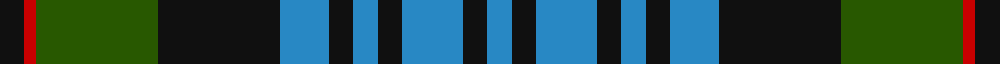

In pattern [BKBKBKBKGRK](/stripes/bkbkbkbkgrk/).

This was sourced from register-of-tartans.  It is a [11 stripe tartan](/stripes/stripes11/).

Original link https://www.tartanregister.gov.uk/tartanDetails.aspx?ref=260

## Attestations

This cloth appears in 2 source records; the oldest owns this page.

- 01/07/2000 — Bijral (register-of-tartans, [record](https://www.tartanregister.gov.uk/tartanDetails.aspx?ref=260))
- pre 2002 — Bijral (Name) (tartans-authority, [record](http://www.tartansauthority.com/tartan-ferret/display/4009/))

## Register references

External register numbers recorded for this tartan.

- Scottish Register of Tartans: [260](https://www.tartanregister.gov.uk/tartanDetails.aspx?ref=260)
- Scottish Tartans Authority (ITI): 4009
- Scottish Tartans World Register: 2709

## Thread count
K/4 R2 G20 K20 B8 K4 B4 K4 B10 K4 B/4

## Palette
Each colour and the base-6 reference it is a variant of.

| Colour | Shade | Base |
|---|---|---|
| B | <code style="background-color:#2888C4;">#2888C4</code> `oklch(60.1% 0.125 241.5)` <small>#2888C4</small> | B <code style="background-color:#2A418A;">#2A418A</code> |
| G | <code style="background-color:#285800;">#285800</code> `oklch(41.0% 0.122 135.8)` <small>#285800</small> | G <code style="background-color:#006100;">#006100</code> |
| K | <code style="background-color:#101010;">#101010</code> `oklch(17.3% 0.000 89.9)` <small>#101010</small> | K <code style="background-color:#000000;">#000000</code> |
| R | <code style="background-color:#C80000;">#C80000</code> `oklch(52.3% 0.215 29.2)` <small>#C80000</small> | R <code style="background-color:#CC0000;">#CC0000</code> |

## Nearest tartans

The nearest existing variants by ΔTartan distance.

1. [Newlands of Lauriston](/setts/s10/b9k9b9r2k20g13r2g4r2g4~x2/) — ΔT 0.66
1. [Guthrie (Name)](/setts/s9/k1g12k12r1k1r1k12b12r1~x4/) — ΔT 0.86
1. [U.S. Border Patrol](/setts/s8/k10b10k15g40k15b10k10ly3~x2/) — ΔT 0.87
1. [Pinney's of Scotland](/setts/s10/k4g2db10ly1db2g13k11g13db13ly2~x2/) — ΔT 0.88
1. [Lamont #3](/setts/s13/b23k3b3k3b3k22g22w3g22k22b18k3b3~x2/) — ΔT 0.91
1. [Gary/Garry (Name)](/setts/s8/k4g24db6dp3k6dp12g3dp4~x2/) — ΔT 0.93
1. [Graden (Personal)](/setts/s9/db22g4k4g14lb3g4lb3g4k3~x2/) — ΔT 0.97
1. [Guthrie](/setts/s16/g12k12r1k1r1k12b12r1b12k12r1k1r1k12g12k1~x4/) — ΔT 1.00
1. [Atholl (District)](/setts/s13/b25k4b4k4b4k26g25r6g25k26b25k2r6~x2/) — ΔT 1.01
1. [Forbes](/setts/s15/db8k1db2k1db2k6g8k1w2k1g8k6db8k1db2~x4/) — ΔT 1.01

## Neighbour map

Every grey dot is one of 14299 variants placed by the first two principal components of the ΔTartan feature space (44% of its variance). Red is this tartan; blue dots are its nearest — click one to open its page.

<svg viewBox="0 0 640 380" role="img" style="max-width:100%;height:auto;border:1px solid #e0e0e0;border-radius:4px;display:block" xmlns="http://www.w3.org/2000/svg"><image href="/nn/cloud.v1.png" width="640" height="380"/><a href="/setts/s10/b9k9b9r2k20g13r2g4r2g4~x2/"><circle cx="187.7" cy="204.9" r="4" fill="#3465a4"><title>Newlands of Lauriston</title></circle></a><a href="/setts/s9/k1g12k12r1k1r1k12b12r1~x4/"><circle cx="256.3" cy="186.7" r="4" fill="#3465a4"><title>Guthrie (Name)</title></circle></a><a href="/setts/s8/k10b10k15g40k15b10k10ly3~x2/"><circle cx="228.6" cy="203.8" r="4" fill="#3465a4"><title>U.S. Border Patrol</title></circle></a><a href="/setts/s10/k4g2db10ly1db2g13k11g13db13ly2~x2/"><circle cx="190.9" cy="198.0" r="4" fill="#3465a4"><title>Pinney's of Scotland</title></circle></a><a href="/setts/s13/b23k3b3k3b3k22g22w3g22k22b18k3b3~x2/"><circle cx="166.1" cy="199.5" r="4" fill="#3465a4"><title>Lamont #3</title></circle></a><a href="/setts/s8/k4g24db6dp3k6dp12g3dp4~x2/"><circle cx="213.9" cy="212.6" r="4" fill="#3465a4"><title>Gary/Garry (Name)</title></circle></a><a href="/setts/s9/db22g4k4g14lb3g4lb3g4k3~x2/"><circle cx="217.2" cy="209.0" r="4" fill="#3465a4"><title>Graden (Personal)</title></circle></a><a href="/setts/s16/g12k12r1k1r1k12b12r1b12k12r1k1r1k12g12k1~x4/"><circle cx="239.5" cy="170.0" r="4" fill="#3465a4"><title>Guthrie</title></circle></a><a href="/setts/s13/b25k4b4k4b4k26g25r6g25k26b25k2r6~x2/"><circle cx="174.4" cy="185.2" r="4" fill="#3465a4"><title>Atholl (District)</title></circle></a><a href="/setts/s15/db8k1db2k1db2k6g8k1w2k1g8k6db8k1db2~x4/"><circle cx="182.9" cy="198.0" r="4" fill="#3465a4"><title>Forbes</title></circle></a><circle cx="209.7" cy="194.6" r="5" fill="#c00000"/></svg>

ID: /setts/s11/k2r1dg10k10t4k2t2k2t5k2t2~x2/
