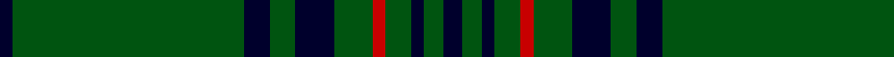

**Bands:** [KGKGKGRGKGK](/stripes/kgkgkgrgkgk/) · **Stripes:** [K DG K DG K DG R DG K DG K](/stripes/stripes11/) K DG K DG K DG R DG K DG K

This was sourced from tartans-authority.  It is a [11 band tartan](/bands/bands11/).

Original link http://www.tartansauthority.com/tartan-ferret/display/7678/

## Attestations

This cloth appears in 3 source records; the oldest owns this page.

- pre 2008 — Madoc (Welsh Name) (tartans-authority, [record](http://www.tartansauthority.com/tartan-ferret/display/7678/))
- undated — Madoc of Wales (register-of-tartans, [record](https://www.tartanregister.gov.uk/tartanDetails.aspx?ref=5680))
- undated — Madoc Welsh Name Tartan Tartan Number: 7678. Earliest known date: pre 2008 The tartan for this Welsh surname and its variations, Madog Maddocks, is actually woven in Wales at the Cambrian Woollen Mill, weaving on the same site since 1830. This tartan differs from many traditional patterns in that the warp and weft differ, giving the finished worsted wool cloth more of a predominant stripe, vertically noticeable in the finished Kilt, or Cilt in Wales. See products available Copyright © Blair Urquhart, Comrie, 2015 (house-of-tartan, [record](http://www.house-of-tartan.scotland.net/house/TartanViewjs.asp?colr=Def&tnam=7678))

## Register references

External register numbers recorded for this tartan.

- Scottish Register of Tartans: [5680](https://www.tartanregister.gov.uk/tartanDetails.aspx?ref=5680)
- Scottish Tartans Authority (ITI): 7678

## Thread count
DBa/2 G36 DBa4 G4 DBa6 G6 R2 G4 DBa2 G3 DBa/3

## Palette
Each colour and its ΔE from the base-6 reference it is a variant of.

| Colour | Shade | Base | ΔE (OKLab) |
|---|---|---|---|
| DB | <code style="background-color:#00385C;">#00385C</code> `#00385C` | B <code style="background-color:#2A418A;">#2A418A</code> | 0.09 |
| DBa | <code style="background-color:#00002C;">#00002C</code> `#00002C` | K <code style="background-color:#000000;">#000000</code> | 0.16 |
| G | <code style="background-color:#005410;">#005410</code> `#005410` | G <code style="background-color:#006100;">#006100</code> | 0.05 |
| LT | <code style="background-color:#807034;">#807034</code> `#807034` | G <code style="background-color:#006100;">#006100</code> | 0.16 |
| R | <code style="background-color:#C80000;">#C80000</code> `#C80000` | R <code style="background-color:#CC0000;">#CC0000</code> | 0.01 |

## Nearest tartans

The nearest existing variants by ΔTartan distance.

1. [Highland Hospice (Fashion)](/setts/s10/g51dp3g5lo3g5dp5g5dp5g5lo3~x2/) — ΔT 1.25
1. [Highland Hospice](/setts/s18/g51dp3g5lo3g5dp5g5dp5g5lo3g5dp5g5dp5g5lo3g5dp3~x2/) — ΔT 1.38
1. [Irish Heritage](/setts/s11/g4k6g4k6g12k75g3k6g14k6w4/) — ΔT 1.48
1. [Reagan (Personal)](/setts/s10/k4g12k3g4k3g3k36g3k2ly3~x2/) — ΔT 1.60
1. [McCall, F W (Personal)](/setts/s9/dg6do2m1dg15m3do1dg15g6m1~x2/) — ΔT 1.67
1. [Kinfauns Castle](/setts/s10/r4p12dg2p2dg24dg2dg2dg16dg2w1~x2/) — ΔT 1.83
1. [Owen Welsh Name Tartan Tartan Number: 5750. Earliest known date: 2002 The tartan for this Welsh surname and its variations, Bowen, Ifan, is actually woven in Wales at the Cambrian Woollen Mill, weaving on the same site since 1830. This tartan differs from many traditional patterns in that the warp and weft differ, giving the finished worsted wool cloth more of a predominant stripe, vertically noticeable in the finished Kilt, or Cilt in Wales. See products available Copyright © Blair Urquhart, Comrie, 2015](/setts/s10/g3dt1g2r1g3db3g2db2g18dt2~x2/) — ΔT 1.84
1. [Owen (Welsh Name)](/setts/s10/g3r1g2db1g3r3g2r2g18r2~x2/) — ΔT 1.85
1. [Ross Hunting Clan Tartan Tartan Number: 756. Earliest known date: 1850 The threadcount is based on a sample from the MacGregor-Hastie collection of the Scottish Tartans Society. This version originally showed the light green overcheck having six stripes. BU noted irregularities in the threadcount, and suggests that 4 light green stripes would produce a more plausible kilting fabric. BU created the original transcription. Earliest historical reference. Other sources give Smith Museum, Stirling as the source. See products available Copyright © Blair Urquhart, Comrie, 2015](/setts/s12/g6g3g3g4g4k5g3k5g28r2g4r2~x2/) — ΔT 1.88
1. [Glenfeshie (Personal)](/setts/s9/r4g3dp3g44dp16g10w2g2dp2~x2/) — ΔT 1.89

## Neighbour map

Every grey dot is one of 14313 variants placed by the first two principal components of the ΔTartan feature space (44% of its variance). Red is this tartan; blue dots are its nearest — click one to open its page.

<svg viewBox="0 0 640 380" role="img" style="max-width:100%;height:auto;border:1px solid #e0e0e0;border-radius:4px;display:block" xmlns="http://www.w3.org/2000/svg"><image href="/nn/cloud.v1.png" width="640" height="380"/><a href="/setts/s10/g51dp3g5lo3g5dp5g5dp5g5lo3~x2/"><circle cx="559.9" cy="179.4" r="4" fill="#3465a4"><title>Highland Hospice (Fashion)</title></circle></a><a href="/setts/s18/g51dp3g5lo3g5dp5g5dp5g5lo3g5dp5g5dp5g5lo3g5dp3~x2/"><circle cx="483.6" cy="146.6" r="4" fill="#3465a4"><title>Highland Hospice</title></circle></a><a href="/setts/s11/g4k6g4k6g12k75g3k6g14k6w4/"><circle cx="502.8" cy="152.0" r="4" fill="#3465a4"><title>Irish Heritage</title></circle></a><a href="/setts/s10/k4g12k3g4k3g3k36g3k2ly3~x2/"><circle cx="445.3" cy="172.8" r="4" fill="#3465a4"><title>Reagan (Personal)</title></circle></a><a href="/setts/s9/dg6do2m1dg15m3do1dg15g6m1~x2/"><circle cx="453.4" cy="206.0" r="4" fill="#3465a4"><title>McCall, F W (Personal)</title></circle></a><a href="/setts/s10/r4p12dg2p2dg24dg2dg2dg16dg2w1~x2/"><circle cx="476.8" cy="164.2" r="4" fill="#3465a4"><title>Kinfauns Castle</title></circle></a><a href="/setts/s10/g3dt1g2r1g3db3g2db2g18dt2~x2/"><circle cx="537.0" cy="193.5" r="4" fill="#3465a4"><title>Owen Welsh Name Tartan Tartan Number: 5750. Earliest known date: 2002 The tartan for this Welsh surname and its variations, Bowen, Ifan, is actually woven in Wales at the Cambrian Woollen Mill, weaving on the same site since 1830. This tartan differs from many traditional patterns in that the warp and weft differ, giving the finished worsted wool cloth more of a predominant stripe, vertically noticeable in the finished Kilt, or Cilt in Wales. See products available Copyright © Blair Urquhart, Comrie, 2015</title></circle></a><a href="/setts/s10/g3r1g2db1g3r3g2r2g18r2~x2/"><circle cx="514.8" cy="170.2" r="4" fill="#3465a4"><title>Owen (Welsh Name)</title></circle></a><a href="/setts/s12/g6g3g3g4g4k5g3k5g28r2g4r2~x2/"><circle cx="436.2" cy="180.0" r="4" fill="#3465a4"><title>Ross Hunting Clan Tartan Tartan Number: 756. Earliest known date: 1850 The threadcount is based on a sample from the MacGregor-Hastie collection of the Scottish Tartans Society. This version originally showed the light green overcheck having six stripes. BU noted irregularities in the threadcount, and suggests that 4 light green stripes would produce a more plausible kilting fabric. BU created the original transcription. Earliest historical reference. Other sources give Smith Museum, Stirling as the source. See products available Copyright © Blair Urquhart, Comrie, 2015</title></circle></a><a href="/setts/s9/r4g3dp3g44dp16g10w2g2dp2~x2/"><circle cx="450.2" cy="148.0" r="4" fill="#3465a4"><title>Glenfeshie (Personal)</title></circle></a><circle cx="520.2" cy="181.8" r="5" fill="#c00000"/></svg>

ID: /setts/s11/k3dg3k2dg4r2dg6k6dg4k4dg36k2/
