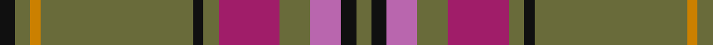

In pattern [GKRGRGKGYGK](/stripes/gkrgrgkgygk/).

This was sourced from register-of-tartans.  It is a [11 stripe tartan](/stripes/stripes11/).

Original link https://www.tartanregister.gov.uk/tartanDetails.aspx?ref=10203

## Register references

External register numbers recorded for this tartan.

- Scottish Register of Tartans: [10203](https://www.tartanregister.gov.uk/tartanDetails.aspx?ref=10203)

## Thread count
K/6 G6 DY4 G60 K4 G6 R24 G12 P12 K6 G/6

## Palette
Each colour and the base-6 reference it is a variant of.

| Colour | Shade | Base |
|---|---|---|
| DY | <code style="background-color:#CB8000;">#CB8000</code> `oklch(66.3% 0.144 69.1)` <small>#CB8000</small> | Y <code style="background-color:#F2BF00;">#F2BF00</code> |
| G | <code style="background-color:#696B3A;">#696B3A</code> `oklch(51.4% 0.070 110.7)` <small>#696B3A</small> | G <code style="background-color:#006100;">#006100</code> |
| K | <code style="background-color:#101010;">#101010</code> `oklch(17.3% 0.000 89.9)` <small>#101010</small> | K <code style="background-color:#000000;">#000000</code> |
| P | <code style="background-color:#B966AE;">#B966AE</code> `oklch(62.9% 0.140 332.2)` <small>#B966AE</small> | R <code style="background-color:#CC0000;">#CC0000</code> |
| R | <code style="background-color:#A01D69;">#A01D69</code> `oklch(47.8% 0.178 351.0)` <small>#A01D69</small> | R <code style="background-color:#CC0000;">#CC0000</code> |

## Nearest tartans

The nearest existing variants by ΔTartan distance, with this tartan at the top so the swatches line up against it.

ΔTartan

Tartan

Sett

—

<a href="/ttd/edit/#slug=k3y3lo2y30k2y3m12y6m6k3y3~x2">McAlifyfe (Personal)</a> <a class="nn-out" href="/setts/s11/k3y3lo2y30k2y3m12y6m6k3y3~x2/" title="open its dictionary page">↗</a>

1.01

<a href="/ttd/edit/#slug=n19do2k3o1k1w1k1do6n3k1n6~x4">Glen Clova #1</a> <a class="nn-out" href="/setts/s11/n19do2k3o1k1w1k1do6n3k1n6~x4/" title="open its dictionary page">↗</a>

1.04

<a href="/ttd/edit/#slug=k3y3ly2y30k2y3m12y6m6k3y3~x2">McAlifyfe (Personal)</a> <a class="nn-out" href="/setts/s11/k3y3ly2y30k2y3m12y6m6k3y3~x2/" title="open its dictionary page">↗</a>

1.09

<a href="/setts/s12/r4lo27dy9w2b2dy2b4~x3/">Unidentified #25</a>

1.21

<a href="/ttd/edit/#slug=y40dt10o2dt2w2dt3r8y6dt2y4w2~x2">Cavalier, Green</a> <a class="nn-out" href="/setts/s11/y40dt10o2dt2w2dt3r8y6dt2y4w2~x2/" title="open its dictionary page">↗</a>

1.25

<a href="/ttd/edit/#slug=n36dr10lo2dr5g2dr5lo10n5lo2n10w2~x2">Toyokawa Check</a> <a class="nn-out" href="/setts/s11/n36dr10lo2dr5g2dr5lo10n5lo2n10w2~x2/" title="open its dictionary page">↗</a>

1.26

<a href="/ttd/edit/#slug=k1r14g1r1g6lb2g6r1g1r14k1lb1~x4">MacMaster Clan/Family Tartan Tartan Number: 3493. Earliest known date: 1986 Designed by Phil Smith in 1986 for all of the names MacMaster, MacMasters etc. See MacMasters Canada. See products available Copyright © Blair Urquhart, Comrie, 2015</a> <a class="nn-out" href="/setts/s12/k1r14g1r1g6lb2g6r1g1r14k1lb1~x4/" title="open its dictionary page">↗</a>

1.28

<a href="/ttd/edit/#slug=o40dt10y2dt2w2dt3y8o6dt2o4w2~x2">Cavalier, Brown</a> <a class="nn-out" href="/setts/s11/o40dt10y2dt2w2dt3y8o6dt2o4w2~x2/" title="open its dictionary page">↗</a>

1.30

<a href="/ttd/edit/#slug=lo3y40db12lo3k2lb4k2lo3~x2">Tunes of Glory (Film)</a> <a class="nn-out" href="/setts/s8/lo3y40db12lo3k2lb4k2lo3~x2/" title="open its dictionary page">↗</a>

1.33

<a href="/ttd/edit/#slug=o66m3g3m3g16dr8g3dr3m4~x2">Scottish National Htg (Fashion)</a> <a class="nn-out" href="/setts/s9/o66m3g3m3g16dr8g3dr3m4~x2/" title="open its dictionary page">↗</a>

1.36

<a href="/ttd/edit/#slug=o40dt10y2dt2w2dt3r8o6dt2o4w2~x2">Cavalier, Red</a> <a class="nn-out" href="/setts/s11/o40dt10y2dt2w2dt3r8o6dt2o4w2~x2/" title="open its dictionary page">↗</a>

## Neighbour map

Every grey dot is one of 14299 variants placed by the first two principal components of the ΔTartan feature space (44% of its variance). Red is this tartan; blue dots are its nearest — click one to open its page.

<svg viewBox="0 0 640 380" role="img" style="max-width:100%;height:auto;border:1px solid #e0e0e0;border-radius:4px;display:block" xmlns="http://www.w3.org/2000/svg"><image href="/nn/cloud.v1.png" width="640" height="380"/><a href="/setts/s11/n19do2k3o1k1w1k1do6n3k1n6~x4/"><circle cx="410.7" cy="145.4" r="4" fill="#3465a4"><title>Glen Clova #1</title></circle></a><a href="/setts/s11/k3y3ly2y30k2y3m12y6m6k3y3~x2/"><circle cx="352.6" cy="136.6" r="4" fill="#3465a4"><title>McAlifyfe (Personal)</title></circle></a><a href="/setts/s12/r4lo27dy9w2b2dy2b4~x3/"><circle cx="358.3" cy="147.9" r="4" fill="#3465a4"><title>Unidentified #25</title></circle></a><a href="/setts/s11/y40dt10o2dt2w2dt3r8y6dt2y4w2~x2/"><circle cx="387.8" cy="122.6" r="4" fill="#3465a4"><title>Cavalier, Green</title></circle></a><a href="/setts/s11/n36dr10lo2dr5g2dr5lo10n5lo2n10w2~x2/"><circle cx="384.5" cy="157.9" r="4" fill="#3465a4"><title>Toyokawa Check</title></circle></a><a href="/setts/s12/k1r14g1r1g6lb2g6r1g1r14k1lb1~x4/"><circle cx="374.5" cy="139.7" r="4" fill="#3465a4"><title>MacMaster Clan/Family Tartan Tartan Number: 3493. Earliest known date: 1986 Designed by Phil Smith in 1986 for all of the names MacMaster, MacMasters etc. See MacMasters Canada. See products available Copyright © Blair Urquhart, Comrie, 2015</title></circle></a><a href="/setts/s11/o40dt10y2dt2w2dt3y8o6dt2o4w2~x2/"><circle cx="372.9" cy="108.3" r="4" fill="#3465a4"><title>Cavalier, Brown</title></circle></a><a href="/setts/s8/lo3y40db12lo3k2lb4k2lo3~x2/"><circle cx="356.8" cy="126.1" r="4" fill="#3465a4"><title>Tunes of Glory (Film)</title></circle></a><a href="/setts/s9/o66m3g3m3g16dr8g3dr3m4~x2/"><circle cx="400.8" cy="120.5" r="4" fill="#3465a4"><title>Scottish National Htg (Fashion)</title></circle></a><a href="/setts/s11/o40dt10y2dt2w2dt3r8o6dt2o4w2~x2/"><circle cx="370.8" cy="103.8" r="4" fill="#3465a4"><title>Cavalier, Red</title></circle></a><circle cx="373.9" cy="146.9" r="5" fill="#c00000"/></svg>

ID: /setts/s11/k3y3lo2y30k2y3m12y6m6k3y3~x2/
