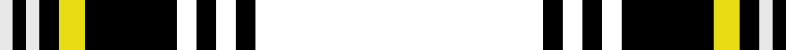

In pattern [KKKKKKYKWKW](/patterns/kkkkkkykwkw/).

This was sourced from house-of-tartan.  It is a [11 stripes tartan](/stripes/stripes11/).

Original link http://www.house-of-tartan.scotland.net/house/TartanViewjs.asp?colr=Def&tnam=7425

## Thread count
LN/4 K4 LN4 K6 Yc8 K28 RB6 K6 RB6 K6 RB/88

## Palette
Each colour and its ΔE from the base-6 reference it is a variant of.

| Colour | Shade | Base | ΔE (OKLab) |
|---|---|---|---|
| DB | <code style="background-color:#200C60;">#200C60</code> `#200C60` | B <code style="background-color:#2A418A;">#2A418A</code> | 0.15 |
| K | <code style="background-color:#000000;">#000000</code> `#000000` | K <code style="background-color:#000000;">#000000</code> | 0.00 |
| LN | <code style="background-color:#E8E8E8;">#E8E8E8</code> `#E8E8E8` | W <code style="background-color:#F7F7F7;">#F7F7F7</code> | 0.05 |
| Y | <code style="background-color:#F0C400;">#F0C400</code> `#F0C400` | Y <code style="background-color:#F2BF00;">#F2BF00</code> | 0.01 |
| Ya | <code style="background-color:#F4BC3C;">#F4BC3C</code> `#F4BC3C` | Y <code style="background-color:#F2BF00;">#F2BF00</code> | 0.02 |
| Yb | <code style="background-color:#D8F000;">#D8F000</code> `#D8F000` | Y <code style="background-color:#F2BF00;">#F2BF00</code> | 0.13 |
| Yc | <code style="background-color:#E8DC14;">#E8DC14</code> `#E8DC14` | Y <code style="background-color:#F2BF00;">#F2BF00</code> | 0.07 |

## Nearest tartans

The nearest existing variants by ΔTartan distance.

1. [Glen Ross (WCWM - 2)](/setts/s12/k48b4k6y2k2r2k2b10ra6k2ra3r2x2~b606060-k000000-r880000-rab07430-yacacac/) — ΔT 1.70
1. [Stewart of Bute Hunting Clan/Family Tartan Tartan Number: 5175. Earliest known date: 01/01/2002 No details known. See products available Copyright © Blair Urquhart, Comrie, 2015](/setts/s10/k22g11ka2g4ka2g6ka16k40k2w6x2~g006818-k000000-ka101010-wc0c0c0/) — ΔT 1.72
1. [Arbroath Smokie Corporate Tartan Tartan Number: 6596. Earliest known date: 01/01/2005 Designed by Heather Yellowly of the Strathmore Woollen Co, of Forfar for Campbell Scott of Arbroath Fisheries. The tartan celebrates the European protective geographical status being awarded to the Arbroath Smokie - one of only a few food products to have been awarded this status. Colours: red represents the sandstone of Arbroath Abbey where the Declaration of Independence was signed in 1320; blue and white represent the sea; the red glow of the smokie barrel and the golden yellow of the delicacy itself. See products available Copyright © Blair Urquhart, Comrie, 2015](/setts/s9/y1k45b23w1b6r2y1r2y1x2~b14283c-k000000-rc80000-we0e0e0-ybc8c00/) — ΔT 1.87
1. [Langtree](/setts/s12/k86g6k4w3k3r3k3g22ra14k3ra6w4~g808080-k000000-rc00000-ra906030-we0e0e0/) — ΔT 1.92
1. [Grey Spencer Plaid](/setts/s11/k40g8r2g2w2g2k9w5g2w5k2x2~g808080-k000000-r806050-we0e0e0/) — ΔT 1.97
1. [Home, or Hume](/setts/s8/k28r1k2r1k8b24g2b3x2~b304080-g008000-k000000-rc00000/) — ΔT 1.97
1. [Valdres, Kvam and Vang](/setts/s11/k4w1r4k2g2r3k2k20r2k2r2~g008000-k000000-rc00000-we0e0e0/) — ΔT 1.98
1. [Childers (Gurkha Rifles)](/setts/s10/k8g28k8ga17k88ga17k8g28k8r6~g5c6428-ga004c00-k000000-rc80000/) — ΔT 2.00
1. [Hughes (USA) (Personal)](/setts/s18/k12b3ba4b3k3ka36b3ba2ka3ba2b3ka36k3b3ba4b3k12ba4x2~b2c2c80-ba2474e8-k101010-ka000000/) — ΔT 2.03
1. [Malone (2016)](/setts/s11/k8g1k20g1k4g1k3g4w2g24y3x2~g005020-k000000-wf8f8f8-ybc8c00/) — ΔT 2.10

## Neighbour map

Every grey dot is one of 15726 variants placed by the first two principal components of the ΔTartan feature space (44% of its variance). Red is this tartan; blue dots are its nearest — click one to open its page.

<svg viewBox="0 0 640 380" role="img" style="max-width:100%;height:auto;border:1px solid #e0e0e0;border-radius:4px;display:block" xmlns="http://www.w3.org/2000/svg"><image href="/nn/cloud.v1.png" width="640" height="380"/><a href="/setts/s12/k48b4k6y2k2r2k2b10ra6k2ra3r2x2~b606060-k000000-r880000-rab07430-yacacac/"><circle cx="398.5" cy="97.4" r="4" fill="#3465a4"><title>Glen Ross (WCWM - 2)</title></circle></a><a href="/setts/s10/k22g11ka2g4ka2g6ka16k40k2w6x2~g006818-k000000-ka101010-wc0c0c0/"><circle cx="320.4" cy="163.9" r="4" fill="#3465a4"><title>Stewart of Bute Hunting Clan/Family Tartan Tartan Number: 5175. Earliest known date: 01/01/2002 No details known. See products available Copyright © Blair Urquhart, Comrie, 2015</title></circle></a><a href="/setts/s9/y1k45b23w1b6r2y1r2y1x2~b14283c-k000000-rc80000-we0e0e0-ybc8c00/"><circle cx="379.0" cy="98.8" r="4" fill="#3465a4"><title>Arbroath Smokie Corporate Tartan Tartan Number: 6596. Earliest known date: 01/01/2005 Designed by Heather Yellowly of the Strathmore Woollen Co, of Forfar for Campbell Scott of Arbroath Fisheries. The tartan celebrates the European protective geographical status being awarded to the Arbroath Smokie - one of only a few food products to have been awarded this status. Colours: red represents the sandstone of Arbroath Abbey where the Declaration of Independence was signed in 1320; blue and white represent the sea; the red glow of the smokie barrel and the golden yellow of the delicacy itself. See products available Copyright © Blair Urquhart, Comrie, 2015</title></circle></a><a href="/setts/s12/k86g6k4w3k3r3k3g22ra14k3ra6w4~g808080-k000000-rc00000-ra906030-we0e0e0/"><circle cx="363.7" cy="80.4" r="4" fill="#3465a4"><title>Langtree</title></circle></a><a href="/setts/s11/k40g8r2g2w2g2k9w5g2w5k2x2~g808080-k000000-r806050-we0e0e0/"><circle cx="362.8" cy="120.6" r="4" fill="#3465a4"><title>Grey Spencer Plaid</title></circle></a><a href="/setts/s8/k28r1k2r1k8b24g2b3x2~b304080-g008000-k000000-rc00000/"><circle cx="365.1" cy="153.5" r="4" fill="#3465a4"><title>Home, or Hume</title></circle></a><a href="/setts/s11/k4w1r4k2g2r3k2k20r2k2r2~g008000-k000000-rc00000-we0e0e0/"><circle cx="409.8" cy="138.6" r="4" fill="#3465a4"><title>Valdres, Kvam and Vang</title></circle></a><a href="/setts/s10/k8g28k8ga17k88ga17k8g28k8r6~g5c6428-ga004c00-k000000-rc80000/"><circle cx="304.7" cy="168.4" r="4" fill="#3465a4"><title>Childers (Gurkha Rifles)</title></circle></a><a href="/setts/s18/k12b3ba4b3k3ka36b3ba2ka3ba2b3ka36k3b3ba4b3k12ba4x2~b2c2c80-ba2474e8-k101010-ka000000/"><circle cx="312.4" cy="128.3" r="4" fill="#3465a4"><title>Hughes (USA) (Personal)</title></circle></a><a href="/setts/s11/k8g1k20g1k4g1k3g4w2g24y3x2~g005020-k000000-wf8f8f8-ybc8c00/"><circle cx="309.0" cy="140.7" r="4" fill="#3465a4"><title>Malone (2016)</title></circle></a><circle cx="386.9" cy="135.3" r="5" fill="#c00000"/></svg>

ID: /setts/s11/k44k3k3k3k3k14y4k3w2k2w2x2~k000000-we8e8e8-ye8dc14/
