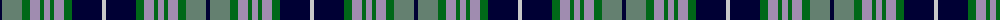

In pattern [KGGRGRGRGKW](/patterns/kggrgrgrgkw/).

This was sourced from register-of-tartans.  It is a [11 stripes tartan](/stripes/stripes11/).

Original link https://www.tartanregister.gov.uk/tartanDetails.aspx?ref=1107

## Attestations

This cloth appears in 2 source records; the oldest owns this page.

- 01/01/1996 — Elwyn Glen (Scottish Borders) (register-of-tartans, [record](https://www.tartanregister.gov.uk/tartanDetails.aspx?ref=1107))
- 1996 — Elwyn Glen (Corporate) (tartans-authority, [record](http://www.tartansauthority.com/tartan-ferret/display/4810/))

## Thread count
DB/4 Nb20 G8 Na10 G4 Na6 G4 Na10 G8 DB30 N/4

## Palette
Each colour and its ΔE from the base-6 reference it is a variant of.

| Colour | Shade | Base | ΔE (OKLab) |
|---|---|---|---|
| DB | <code style="background-color:#000034;">#000034</code> `#000034` | K <code style="background-color:#000000;">#000000</code> | 0.18 |
| G | <code style="background-color:#006818;">#006818</code> `#006818` | G <code style="background-color:#006400;">#006400</code> | 0.02 |
| N | <code style="background-color:#C8C8C8;">#C8C8C8</code> `#C8C8C8` | W <code style="background-color:#F4F4F0;">#F4F4F0</code> | 0.13 |
| Na | <code style="background-color:#A08CB0;">#A08CB0</code> `#A08CB0` | R <code style="background-color:#C80000;">#C80000</code> | 0.26 |
| Nb | <code style="background-color:#648070;">#648070</code> `#648070` | G <code style="background-color:#006400;">#006400</code> | 0.18 |

## Nearest tartans

The nearest existing variants by ΔTartan distance.

1. [Bowlers (Commemorative)](/setts/s11/w8b40g10k12g4w6g4k12g26ba16g4-b2c2c80-ba780078-g006818-k101010-wfcfcfc/) — ΔT 0.56
1. [Bowlers](/setts/s11/w8b40g10k12g4w6g4k12g26ba16g4-b304080-ba800080-g008000-k000000-we0e0e0/) — ΔT 0.75
1. [Gordon Dress #2](/setts/s13/w40k6w6k6w6k32g34y10g34k32b32k6b6-b2c4084-g005020-k101010-we0e0e0-ye8c000/) — ΔT 0.88
1. [Morgan Mackenzie (Personal?)](/setts/s15/b24k4b4k4b4k24g24w4r4w4g24k24b24r6b4-b1474b4-g285800-k101010-rc80000-wfcfcfc/) — ΔT 0.90
1. [Scottish National Dress](/setts/s14/b24w4b4r4b6k22g24k4g6k4g24b24w26r4-b1c1c50-g006818-k101010-rc80000-wfcfcfc/) — ΔT 0.90
1. [Royal College of Surgeons of Edinburgh, The](/setts/s9/b8ba32k4ba4k4ba4k26r40w8-b5c8ca8-ba305870-k101010-r888888-wfcfcfc/) — ΔT 0.91
1. [Denovan, The Lairdship of..](/setts/s12/b20ba4b6r8b28r4k28g28r8g6ba4g20-b304080-ba800080-g008000-k000000-rc00000/) — ΔT 0.92
1. [Scotland's National Dress](/setts/s14/b28w4b4r4b6k24g28k4g8k4g28b28w28r4-b003c64-g006818-k101010-r880000-wc0c0c0/) — ΔT 0.95
1. [MacMillan Hunting Clan Tartan Tartan Number: 668. Earliest known date: 1906 The Setts No: 160. W & A K Johnston See products available Copyright © Blair Urquhart, Comrie, 2015](/setts/s10/b12y4b36k12y6k12g28r6g20r4-b2c2c80-g006818-k101010-rc80000-ye8c000/) — ΔT 0.95
1. [Trinity Presbyterian Church](/setts/s12/b6k12g6k8ba32k8g6k12b24r6b6r6-b2888c4-ba2c2c80-g289c18-k101010-rc80000/) — ΔT 0.95

## Neighbour map

Every grey dot is one of 15726 variants placed by the first two principal components of the ΔTartan feature space (44% of its variance). Red is this tartan; blue dots are its nearest — click one to open its page.

<svg viewBox="0 0 640 380" role="img" style="max-width:100%;height:auto;border:1px solid #e0e0e0;border-radius:4px;display:block" xmlns="http://www.w3.org/2000/svg"><image href="/nn/cloud.v1.png" width="640" height="380"/><a href="/setts/s11/w8b40g10k12g4w6g4k12g26ba16g4-b2c2c80-ba780078-g006818-k101010-wfcfcfc/"><circle cx="110.4" cy="161.7" r="4" fill="#3465a4"><title>Bowlers (Commemorative)</title></circle></a><a href="/setts/s11/w8b40g10k12g4w6g4k12g26ba16g4-b304080-ba800080-g008000-k000000-we0e0e0/"><circle cx="98.6" cy="157.6" r="4" fill="#3465a4"><title>Bowlers</title></circle></a><a href="/setts/s13/w40k6w6k6w6k32g34y10g34k32b32k6b6-b2c4084-g005020-k101010-we0e0e0-ye8c000/"><circle cx="68.0" cy="171.6" r="4" fill="#3465a4"><title>Gordon Dress #2</title></circle></a><a href="/setts/s15/b24k4b4k4b4k24g24w4r4w4g24k24b24r6b4-b1474b4-g285800-k101010-rc80000-wfcfcfc/"><circle cx="100.3" cy="174.8" r="4" fill="#3465a4"><title>Morgan Mackenzie (Personal?)</title></circle></a><a href="/setts/s14/b24w4b4r4b6k22g24k4g6k4g24b24w26r4-b1c1c50-g006818-k101010-rc80000-wfcfcfc/"><circle cx="67.2" cy="166.0" r="4" fill="#3465a4"><title>Scottish National Dress</title></circle></a><a href="/setts/s9/b8ba32k4ba4k4ba4k26r40w8-b5c8ca8-ba305870-k101010-r888888-wfcfcfc/"><circle cx="129.0" cy="163.1" r="4" fill="#3465a4"><title>Royal College of Surgeons of Edinburgh, The</title></circle></a><a href="/setts/s12/b20ba4b6r8b28r4k28g28r8g6ba4g20-b304080-ba800080-g008000-k000000-rc00000/"><circle cx="96.6" cy="182.7" r="4" fill="#3465a4"><title>Denovan, The Lairdship of..</title></circle></a><a href="/setts/s14/b28w4b4r4b6k24g28k4g8k4g28b28w28r4-b003c64-g006818-k101010-r880000-wc0c0c0/"><circle cx="103.4" cy="176.9" r="4" fill="#3465a4"><title>Scotland's National Dress</title></circle></a><a href="/setts/s10/b12y4b36k12y6k12g28r6g20r4-b2c2c80-g006818-k101010-rc80000-ye8c000/"><circle cx="131.6" cy="186.5" r="4" fill="#3465a4"><title>MacMillan Hunting Clan Tartan Tartan Number: 668. Earliest known date: 1906 The Setts No: 160. W &amp; A K Johnston See products available Copyright © Blair Urquhart, Comrie, 2015</title></circle></a><a href="/setts/s12/b6k12g6k8ba32k8g6k12b24r6b6r6-b2888c4-ba2c2c80-g289c18-k101010-rc80000/"><circle cx="77.4" cy="193.0" r="4" fill="#3465a4"><title>Trinity Presbyterian Church</title></circle></a><circle cx="88.8" cy="174.7" r="5" fill="#c00000"/></svg>

ID: /setts/s11/k4g20ga8r10ga4r6ga4r10ga8k30w4-g648070-ga006818-k000034-ra08cb0-wc8c8c8/
