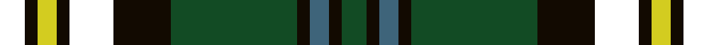

In pattern [GKBKGKKKYKK](/stripes/gkbkgkkkykk/).

This was sourced from register-of-tartans.  It is a [11 stripe tartan](/stripes/stripes11/).

Original link https://www.tartanregister.gov.uk/tartanDetails.aspx?ref=10624

## Register references

External register numbers recorded for this tartan.

- Scottish Register of Tartans: [10624](https://www.tartanregister.gov.uk/tartanDetails.aspx?ref=10624)

## Thread count
T/8 K4 Y6 K4 T14 K18 Ga40 K4 G6 K4 Ga/8

## Palette
Each colour and the base-6 reference it is a variant of.

| Colour | Shade | Base |
|---|---|---|
| G | <code style="background-color:#3E647A;">#3E647A</code> `oklch(48.4% 0.056 235.0)` <small>#3E647A</small> | B <code style="background-color:#2A418A;">#2A418A</code> |
| Ga | <code style="background-color:#124B24;">#124B24</code> `oklch(36.6% 0.088 149.9)` <small>#124B24</small> | G <code style="background-color:#006100;">#006100</code> |
| K | <code style="background-color:#120A01;">#120A01</code> `oklch(15.2% 0.028 78.6)` <small>#120A01</small> | K <code style="background-color:#000000;">#000000</code> |
| Y | <code style="background-color:#D3CC20;">#D3CC20</code> `oklch(82.5% 0.171 107.0)` <small>#D3CC20</small> | Y <code style="background-color:#F2BF00;">#F2BF00</code> |

## Nearest tartans

The nearest existing variants by ΔTartan distance.

1. [Skene N](/setts/s12/k4db24k4r3k4dg24k4ly3k4dg24r3k4/) — ΔT 0.86
1. [Skene N](/setts/s12/k4db24k4r3k4dg24k4y3k4dg24r3k4~x2/) — ΔT 0.92
1. [Skene N](/setts/s12/k4db24k4r3k4dg24k4y3k4dg24r3k4/) — ΔT 0.92
1. [Robieson, Graham Alexander (Personal)](/setts/s13/w1k1dg8k1dg1k8dg1k8dg1k1dg8k1ly1~x6/) — ΔT 1.03
1. [Dama Resort (Fashion)](/setts/s11/dp3k2n6k2n2k18g13lb2g2k6dp2~x2/) — ΔT 1.06
1. [Connolly Hunting (Name)](/setts/s10/k6r2k2r2k6db7g20ly2g3r2~x2/) — ΔT 1.10
1. [Unnamed C20th - National Archives](/setts/s13/w2k10dg4k2dg4k16dg10ly1dg3ly2dg2k2ly2~x2/) — ΔT 1.10
1. [Scottish Tartans Authority](/setts/s11/k16k2t2k4dg16r2k15k6t2k3t4~x2/) — ΔT 1.13
1. [Cochrane LC](/setts/s13/dg22r4dg2r2dg2r4dg12k12r2db10r4db4ly3/) — ΔT 1.14
1. [Lochcarron Hunting Corporate Tartan Tartan Number: 5464. Earliest known date: 01/01/2002 Woven sample. See products available Copyright © Blair Urquhart, Comrie, 2015](/setts/s14/dg3db10k3db2k2db2dg3k5dg2k5dg22r2dg3r2~x2/) — ΔT 1.16

## Neighbour map

Every grey dot is one of 14299 variants placed by the first two principal components of the ΔTartan feature space (44% of its variance). Red is this tartan; blue dots are its nearest — click one to open its page.

<svg viewBox="0 0 640 380" role="img" style="max-width:100%;height:auto;border:1px solid #e0e0e0;border-radius:4px;display:block" xmlns="http://www.w3.org/2000/svg"><image href="/nn/cloud.v1.png" width="640" height="380"/><a href="/setts/s12/k4db24k4r3k4dg24k4ly3k4dg24r3k4/"><circle cx="196.5" cy="170.0" r="4" fill="#3465a4"><title>Skene N</title></circle></a><a href="/setts/s12/k4db24k4r3k4dg24k4y3k4dg24r3k4~x2/"><circle cx="221.5" cy="182.8" r="4" fill="#3465a4"><title>Skene N</title></circle></a><a href="/setts/s12/k4db24k4r3k4dg24k4y3k4dg24r3k4/"><circle cx="221.5" cy="182.8" r="4" fill="#3465a4"><title>Skene N</title></circle></a><a href="/setts/s13/w1k1dg8k1dg1k8dg1k8dg1k1dg8k1ly1~x6/"><circle cx="225.5" cy="179.6" r="4" fill="#3465a4"><title>Robieson, Graham Alexander (Personal)</title></circle></a><a href="/setts/s11/dp3k2n6k2n2k18g13lb2g2k6dp2~x2/"><circle cx="233.2" cy="176.5" r="4" fill="#3465a4"><title>Dama Resort (Fashion)</title></circle></a><a href="/setts/s10/k6r2k2r2k6db7g20ly2g3r2~x2/"><circle cx="207.7" cy="165.5" r="4" fill="#3465a4"><title>Connolly Hunting (Name)</title></circle></a><a href="/setts/s13/w2k10dg4k2dg4k16dg10ly1dg3ly2dg2k2ly2~x2/"><circle cx="182.8" cy="146.8" r="4" fill="#3465a4"><title>Unnamed C20th - National Archives</title></circle></a><a href="/setts/s11/k16k2t2k4dg16r2k15k6t2k3t4~x2/"><circle cx="219.5" cy="195.6" r="4" fill="#3465a4"><title>Scottish Tartans Authority</title></circle></a><a href="/setts/s13/dg22r4dg2r2dg2r4dg12k12r2db10r4db4ly3/"><circle cx="187.3" cy="151.4" r="4" fill="#3465a4"><title>Cochrane LC</title></circle></a><a href="/setts/s14/dg3db10k3db2k2db2dg3k5dg2k5dg22r2dg3r2~x2/"><circle cx="249.6" cy="158.6" r="4" fill="#3465a4"><title>Lochcarron Hunting Corporate Tartan Tartan Number: 5464. Earliest known date: 01/01/2002 Woven sample. See products available Copyright © Blair Urquhart, Comrie, 2015</title></circle></a><circle cx="195.2" cy="173.0" r="5" fill="#c00000"/></svg>

ID: /setts/s11/k4k2ly3k2k7k9dg20k2n3k2dg4~x2/
