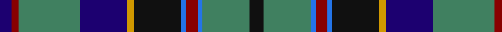

In pattern [BRGBYKBRBGK](/patterns/brgbykbrbgk/).

This was sourced from tartans-authority.  It is a [11 stripes tartan](/stripes/stripes11/).

Original link http://www.tartansauthority.com/tartan-ferret/display/517/

## Thread count
DB/10 DR6 G52 DB40 DY6 K40 B4 DR10 B4 G40 K/12

## Palette
Each colour and its ΔE from the base-6 reference it is a variant of.

| Colour | Shade | Base | ΔE (OKLab) |
|---|---|---|---|
| B | <code style="background-color:#2474E8;">#2474E8</code> `#2474E8` | B <code style="background-color:#2A418A;">#2A418A</code> | 0.19 |
| DB | <code style="background-color:#1C0070;">#1C0070</code> `#1C0070` | B <code style="background-color:#2A418A;">#2A418A</code> | 0.14 |
| DR | <code style="background-color:#880000;">#880000</code> `#880000` | R <code style="background-color:#CC0000;">#CC0000</code> | 0.15 |
| DY | <code style="background-color:#D09800;">#D09800</code> `#D09800` | Y <code style="background-color:#F2BF00;">#F2BF00</code> | 0.12 |
| G | <code style="background-color:#408060;">#408060</code> `#408060` | G <code style="background-color:#006100;">#006100</code> | 0.14 |
| K | <code style="background-color:#101010;">#101010</code> `#101010` | K <code style="background-color:#000000;">#000000</code> | 0.17 |

## Nearest tartans

The nearest existing variants by ΔTartan distance.

1. [Souza Nery (Personal)](/setts/s12/b37r3k17r3g22ka4g22r3k17r3b37w3~b2c2c80-g006818-k101010-ka000000-rc8002c-we0e0e0~x2/) — ΔT 0.66
1. [Stinson (Name)](/setts/s11/k7b20ba2r6ba2k20y3g20b27r3b6~b1474b4-ba5c8ca8-g006818-k101010-rc80000-ye8c000~x2/) — ΔT 0.71
1. [Sacramento City Fire Department (P&D](/setts/s13/y2b2w1b15k5g11k1r3k1g11k5b17w1~b2c2c80-g006818-k101010-rc80000-wfcfcfc-ye8c000~x2/) — ΔT 0.81
1. [Leung (Personal)](/setts/s9/r4k7r2b25k19w2g13k2y3~b2c2c80-g006818-k101010-rb468ac-wfcfcfc-ye8c000~x2/) — ΔT 0.81
1. [Stephenson Clan Tartan Tartan Number: 517. Earliest known date: (1870) 1975 Based on an old and un-named sett in the records of Messrs Bolingbroke and Jones of Norwich (No. 38), prior to 1870. Designed by Jack Dalgety of Forfar and R C Stephenson of Dundee c. 1975. See 1077 See products available Copyright © Blair Urquhart, Comrie, 2015](/setts/s11/k6g20b2r5b2k20y3ba20g26r3ba5~b5c8ca8-ba2c2c80-g006818-k101010-rc80000-ye8c000~x2/) — ΔT 0.81
1. [Stinson Ancient U.S.A. Tartan Tartan Number: 438. Earliest known date: 1985 A kilt in this material was brought into the Scottish Tartans Museum in Comrie which could be dated to before 1930. It belonged to a member of the Stewart Society at that time. The threadcount and the name were documented by Mackinlay, who studied and collected tartans between 1930 and 1950. See products available Copyright © Blair Urquhart, Comrie, 2015](/setts/s11/k7b20ba2r6ba2k20y3g20b27r3b6~b2c2c80-ba5c8ca8-g006818-k101010-rc80000-ye8c000~x2/) — ΔT 0.81
1. [Czech National (District)](/setts/s11/b4y2b24k2b5r3k14g14w3r3b3~b2c2c80-g006818-k101010-rc80000-we0e0e0-ye8c000~x2/) — ΔT 0.82
1. [MacComb Family Tartan Tartan Number: 2340. Earliest known date: pre 1997 STS notes: Designed for a Mr McComb to play himself in as club captain of a golf club. It is the MacThomas with the over check changed to the clubs colours. Design by Donald Fraser (Oct 2002) of Berwick upon Tweed. See products available Copyright © Blair Urquhart, Comrie, 2015](/setts/s12/b3r2b18k6g18y2ga3y2g18k6b18r2~b2c2c80-g006818-ga408060-k101010-rc80000-ye8c000~x2/) — ΔT 0.85
1. [Liberton](/setts/s13/k5y5ya2y5k5b25k5y3g5r2g5y3k5~b003c64-g003820-k101010-rc80000-ya0a0a0-yae8c000~x2/) — ΔT 0.88
1. [Shandon (Personal)](/setts/s14/k20g18k2w2k5y2k2g18k20b18ba4b4ba4b18~b2c2c80-ba1474b4-g408060-k101010-wfcfcfc-ye8c000~x2/) — ΔT 0.89

## Neighbour map

Every grey dot is one of 15726 variants placed by the first two principal components of the ΔTartan feature space (44% of its variance). Red is this tartan; blue dots are its nearest — click one to open its page.

<svg viewBox="0 0 640 380" role="img" style="max-width:100%;height:auto;border:1px solid #e0e0e0;border-radius:4px;display:block" xmlns="http://www.w3.org/2000/svg"><image href="/nn/cloud.v1.png" width="640" height="380"/><a href="/setts/s12/b37r3k17r3g22ka4g22r3k17r3b37w3~b2c2c80-g006818-k101010-ka000000-rc8002c-we0e0e0~x2/"><circle cx="189.0" cy="146.8" r="4" fill="#3465a4"><title>Souza Nery (Personal)</title></circle></a><a href="/setts/s11/k7b20ba2r6ba2k20y3g20b27r3b6~b1474b4-ba5c8ca8-g006818-k101010-rc80000-ye8c000~x2/"><circle cx="181.5" cy="144.2" r="4" fill="#3465a4"><title>Stinson (Name)</title></circle></a><a href="/setts/s13/y2b2w1b15k5g11k1r3k1g11k5b17w1~b2c2c80-g006818-k101010-rc80000-wfcfcfc-ye8c000~x2/"><circle cx="206.7" cy="123.1" r="4" fill="#3465a4"><title>Sacramento City Fire Department (P&amp;D</title></circle></a><a href="/setts/s9/r4k7r2b25k19w2g13k2y3~b2c2c80-g006818-k101010-rb468ac-wfcfcfc-ye8c000~x2/"><circle cx="148.8" cy="144.5" r="4" fill="#3465a4"><title>Leung (Personal)</title></circle></a><a href="/setts/s11/k6g20b2r5b2k20y3ba20g26r3ba5~b5c8ca8-ba2c2c80-g006818-k101010-rc80000-ye8c000~x2/"><circle cx="170.5" cy="147.6" r="4" fill="#3465a4"><title>Stephenson Clan Tartan Tartan Number: 517. Earliest known date: (1870) 1975 Based on an old and un-named sett in the records of Messrs Bolingbroke and Jones of Norwich (No. 38), prior to 1870. Designed by Jack Dalgety of Forfar and R C Stephenson of Dundee c. 1975. See 1077 See products available Copyright © Blair Urquhart, Comrie, 2015</title></circle></a><a href="/setts/s11/k7b20ba2r6ba2k20y3g20b27r3b6~b2c2c80-ba5c8ca8-g006818-k101010-rc80000-ye8c000~x2/"><circle cx="199.7" cy="150.5" r="4" fill="#3465a4"><title>Stinson Ancient U.S.A. Tartan Tartan Number: 438. Earliest known date: 1985 A kilt in this material was brought into the Scottish Tartans Museum in Comrie which could be dated to before 1930. It belonged to a member of the Stewart Society at that time. The threadcount and the name were documented by Mackinlay, who studied and collected tartans between 1930 and 1950. See products available Copyright © Blair Urquhart, Comrie, 2015</title></circle></a><a href="/setts/s11/b4y2b24k2b5r3k14g14w3r3b3~b2c2c80-g006818-k101010-rc80000-we0e0e0-ye8c000~x2/"><circle cx="196.2" cy="137.3" r="4" fill="#3465a4"><title>Czech National (District)</title></circle></a><a href="/setts/s12/b3r2b18k6g18y2ga3y2g18k6b18r2~b2c2c80-g006818-ga408060-k101010-rc80000-ye8c000~x2/"><circle cx="167.4" cy="159.5" r="4" fill="#3465a4"><title>MacComb Family Tartan Tartan Number: 2340. Earliest known date: pre 1997 STS notes: Designed for a Mr McComb to play himself in as club captain of a golf club. It is the MacThomas with the over check changed to the clubs colours. Design by Donald Fraser (Oct 2002) of Berwick upon Tweed. See products available Copyright © Blair Urquhart, Comrie, 2015</title></circle></a><a href="/setts/s13/k5y5ya2y5k5b25k5y3g5r2g5y3k5~b003c64-g003820-k101010-rc80000-ya0a0a0-yae8c000~x2/"><circle cx="127.9" cy="125.7" r="4" fill="#3465a4"><title>Liberton</title></circle></a><a href="/setts/s14/k20g18k2w2k5y2k2g18k20b18ba4b4ba4b18~b2c2c80-ba1474b4-g408060-k101010-wfcfcfc-ye8c000~x2/"><circle cx="132.2" cy="151.7" r="4" fill="#3465a4"><title>Shandon (Personal)</title></circle></a><circle cx="163.6" cy="143.7" r="5" fill="#c00000"/></svg>

ID: /setts/s11/k6g20b2r5b2k20y3ba20g26r3ba5~b2474e8-ba1c0070-g408060-k101010-r880000-yd09800~x2/
