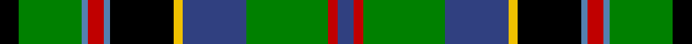

In pattern [BRGBYKBRBGK](/stripes/brgbykbrbgk/).

This was sourced from weddslist.  It is a [11 stripe tartan](/stripes/stripes11/).

Original link http://www.weddslist.com/cgi-bin/tartans/pg.pl?source=sts

## Attestations

This cloth appears in 2 source records; the oldest owns this page.

- undated — Stephenson (weddslist, [record](http://www.weddslist.com/cgi-bin/tartans/pg.pl?source=sts))
- undated — Stephenson Clan Tartan Tartan Number: 517. Earliest known date: (1870) 1975 Based on an old and un-named sett in the records of Messrs Bolingbroke and Jones of Norwich (No. 38), prior to 1870. Designed by Jack Dalgety of Forfar and R C Stephenson of Dundee c. 1975. See 1077 See products available Copyright © Blair Urquhart, Comrie, 2015 (house-of-tartan, [record](http://www.house-of-tartan.scotland.net/house/TartanViewjs.asp?colr=Def&tnam=517))

## Thread count
K/12 G40 Ba4 R10 Ba4 K40 Y6 B40 G52 R6 B/10

## Palette
Each colour and the base-6 reference it is a variant of.

| Colour | Shade | Base |
|---|---|---|
| B | <code style="background-color:#304080;">#304080</code> `oklch(39.4% 0.109 270.2)` <small>#304080</small> | B <code style="background-color:#2A418A;">#2A418A</code> |
| Ba | <code style="background-color:#5480B0;">#5480B0</code> `oklch(58.8% 0.089 251.5)` <small>#5480B0</small> | B <code style="background-color:#2A418A;">#2A418A</code> |
| G | <code style="background-color:#008000;">#008000</code> `oklch(52.0% 0.177 142.5)` <small>#008000</small> | G <code style="background-color:#006100;">#006100</code> |
| K | <code style="background-color:#000000;">#000000</code> `oklch(0.0% 0.000 0.0)` <small>#000000</small> | K <code style="background-color:#000000;">#000000</code> |
| R | <code style="background-color:#C00000;">#C00000</code> `oklch(50.7% 0.208 29.2)` <small>#C00000</small> | R <code style="background-color:#CC0000;">#CC0000</code> |
| Y | <code style="background-color:#F0C000;">#F0C000</code> `oklch(82.7% 0.169 90.5)` <small>#F0C000</small> | Y <code style="background-color:#F2BF00;">#F2BF00</code> |

## Nearest tartans

The nearest existing variants by ΔTartan distance.

1. [MacKellar](/setts/s12/g30w3g4ly5g4w3g6k14t3k14db18w4~x2/) — ΔT 0.60
1. [Princess Diana](/setts/s12/k14r2k2r2k2g18r2g18lb1db12t1r8~x2/) — ΔT 0.74
1. [Noble (South Africa) (Personal)](/setts/s10/ly4ly3dg2k6dg4w1dg12k10dg2dg3~x2/) — ΔT 0.77
1. [Stevenson](/setts/s11/k6g20t2r6t2k20ly3db20g26r3db6~x2/) — ΔT 0.77
1. [Paisley](/setts/s12/db7w2g3db18ly2k15ly2g17r5g3r2g7~x2/) — ΔT 0.80
1. [Noble (South Africa) (Personal)](/setts/s10/ly4ly3dg2k6g4w1dg12k10g2dg3~x2/) — ΔT 0.81
1. [Kelsey, William (Personal)](/setts/s12/g12r2g2r5g16db3lr2k2lr3db6k20ly3~x2/) — ΔT 0.83
1. [Esteba-Quer (Personal)](/setts/s14/g10r2g2r3g11lb2k10r2db12k1lo2r2lo2r2~x2/) — ΔT 0.87
1. [MacInnes](/setts/s13/r2g6db12k3t3k3g16k2g2k2g2k12ly2~x2/) — ΔT 0.94
1. [Roderick Dhu](/setts/s9/b3k2r2k12g10ly1k1g2lb2~x4/) — ΔT 0.95

## Neighbour map

Every grey dot is one of 14299 variants placed by the first two principal components of the ΔTartan feature space (44% of its variance). Red is this tartan; blue dots are its nearest — click one to open its page.

<svg viewBox="0 0 640 380" role="img" style="max-width:100%;height:auto;border:1px solid #e0e0e0;border-radius:4px;display:block" xmlns="http://www.w3.org/2000/svg"><image href="/nn/cloud.v1.png" width="640" height="380"/><a href="/setts/s12/g30w3g4ly5g4w3g6k14t3k14db18w4~x2/"><circle cx="127.9" cy="139.2" r="4" fill="#3465a4"><title>MacKellar</title></circle></a><a href="/setts/s12/k14r2k2r2k2g18r2g18lb1db12t1r8~x2/"><circle cx="176.2" cy="117.6" r="4" fill="#3465a4"><title>Princess Diana</title></circle></a><a href="/setts/s10/ly4ly3dg2k6dg4w1dg12k10dg2dg3~x2/"><circle cx="117.3" cy="158.7" r="4" fill="#3465a4"><title>Noble (South Africa) (Personal)</title></circle></a><a href="/setts/s11/k6g20t2r6t2k20ly3db20g26r3db6~x2/"><circle cx="140.9" cy="138.9" r="4" fill="#3465a4"><title>Stevenson</title></circle></a><a href="/setts/s12/db7w2g3db18ly2k15ly2g17r5g3r2g7~x2/"><circle cx="102.1" cy="143.1" r="4" fill="#3465a4"><title>Paisley</title></circle></a><a href="/setts/s10/ly4ly3dg2k6g4w1dg12k10g2dg3~x2/"><circle cx="118.4" cy="158.6" r="4" fill="#3465a4"><title>Noble (South Africa) (Personal)</title></circle></a><a href="/setts/s12/g12r2g2r5g16db3lr2k2lr3db6k20ly3~x2/"><circle cx="113.4" cy="127.4" r="4" fill="#3465a4"><title>Kelsey, William (Personal)</title></circle></a><a href="/setts/s14/g10r2g2r3g11lb2k10r2db12k1lo2r2lo2r2~x2/"><circle cx="105.8" cy="124.4" r="4" fill="#3465a4"><title>Esteba-Quer (Personal)</title></circle></a><a href="/setts/s13/r2g6db12k3t3k3g16k2g2k2g2k12ly2~x2/"><circle cx="117.2" cy="144.9" r="4" fill="#3465a4"><title>MacInnes</title></circle></a><a href="/setts/s9/b3k2r2k12g10ly1k1g2lb2~x4/"><circle cx="187.3" cy="145.8" r="4" fill="#3465a4"><title>Roderick Dhu</title></circle></a><circle cx="140.2" cy="137.3" r="5" fill="#c00000"/></svg>

ID: /setts/s11/k6g20t2r5t2k20ly3db20g26r3db5~x2/
