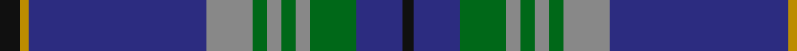

In pattern [KBGRGRGRBYK](/stripes/kbgrgrgrbyk/).

This was sourced from tartans-authority.  It is a [11 stripe tartan](/stripes/stripes11/).

Original link http://www.tartansauthority.com/tartan-ferret/display/8080/

## Thread count
K/7 DY3 DB62 N16 G5 N5 G5 N5 G16 DB16 K/4

## Palette
Each colour and its ΔE from the base-6 reference it is a variant of.

| Colour | Shade | Base | ΔE (OKLab) |
|---|---|---|---|
| DB | <code style="background-color:#2C2C80;">#2C2C80</code> `#2C2C80` | B <code style="background-color:#2A418A;">#2A418A</code> | 0.06 |
| DY | <code style="background-color:#BC8C00;">#BC8C00</code> `#BC8C00` | Y <code style="background-color:#F2BF00;">#F2BF00</code> | 0.16 |
| G | <code style="background-color:#006818;">#006818</code> `#006818` | G <code style="background-color:#006100;">#006100</code> | 0.02 |
| K | <code style="background-color:#101010;">#101010</code> `#101010` | K <code style="background-color:#000000;">#000000</code> | 0.17 |
| N | <code style="background-color:#888888;">#888888</code> `#888888` | R <code style="background-color:#CC0000;">#CC0000</code> | 0.24 |

## Nearest tartans

The nearest existing variants by ΔTartan distance.

1. [Strachan (Name)](/setts/s9/r2k3db42k3ly2k3g22k3r2~x2/) — ΔT 0.83
1. [Riyadh Caledonian (Corporate)](/setts/s13/db23g4db1w1db3g5db1dp4db3ly1g3w1g4~x4/) — ΔT 0.83
1. [Strachan](/setts/s16/k3db42k3ly2k3g22k3r2k3g22k3ly2k3db42k3r2~x2/) — ΔT 0.97
1. [Spirit of Morningside (Fashion)](/setts/s10/dp4db5dp3db50k15g3k5g32w2g3/) — ΔT 1.01
1. [Coopers & Lybrand](/setts/s11/t4g4r1db24t4k2g24r1db10t4db2~x2/) — ΔT 1.04
1. [British Caledonian Airways #1](/setts/s12/dt68o5k9o3k3lb3k3o20dt9k3dt5lb4/) — ΔT 1.04
1. [St. Andrews University (Corporate)](/setts/s10/db6ly3k2ly5db30g2k4g2db6db4~x2/) — ΔT 1.08
1. [Sinclair-Brown (Personal)](/setts/s8/db64k11r2k4r2k4g32lo4~x2/) — ΔT 1.08
1. [Leando Dress (Personal)](/setts/s13/b38do4m3dy6w2dy2w2dy2do12b6dy2b6w2~x2/) — ΔT 1.09
1. [State Seal of Ohio (Fashion)](/setts/s9/db60lo3db5lo5db9do20lo4g32lb4~x2/) — ΔT 1.10

## Neighbour map

Every grey dot is one of 14299 variants placed by the first two principal components of the ΔTartan feature space (44% of its variance). Red is this tartan; blue dots are its nearest — click one to open its page.

<svg viewBox="0 0 640 380" role="img" style="max-width:100%;height:auto;border:1px solid #e0e0e0;border-radius:4px;display:block" xmlns="http://www.w3.org/2000/svg"><image href="/nn/cloud.v1.png" width="640" height="380"/><a href="/setts/s9/r2k3db42k3ly2k3g22k3r2~x2/"><circle cx="322.3" cy="132.5" r="4" fill="#3465a4"><title>Strachan (Name)</title></circle></a><a href="/setts/s13/db23g4db1w1db3g5db1dp4db3ly1g3w1g4~x4/"><circle cx="353.0" cy="117.0" r="4" fill="#3465a4"><title>Riyadh Caledonian (Corporate)</title></circle></a><a href="/setts/s16/k3db42k3ly2k3g22k3r2k3g22k3ly2k3db42k3r2~x2/"><circle cx="319.8" cy="115.4" r="4" fill="#3465a4"><title>Strachan</title></circle></a><a href="/setts/s10/dp4db5dp3db50k15g3k5g32w2g3/"><circle cx="293.4" cy="135.4" r="4" fill="#3465a4"><title>Spirit of Morningside (Fashion)</title></circle></a><a href="/setts/s11/t4g4r1db24t4k2g24r1db10t4db2~x2/"><circle cx="291.4" cy="143.0" r="4" fill="#3465a4"><title>Coopers &amp; Lybrand</title></circle></a><a href="/setts/s12/dt68o5k9o3k3lb3k3o20dt9k3dt5lb4/"><circle cx="377.0" cy="113.5" r="4" fill="#3465a4"><title>British Caledonian Airways #1</title></circle></a><a href="/setts/s10/db6ly3k2ly5db30g2k4g2db6db4~x2/"><circle cx="301.0" cy="139.8" r="4" fill="#3465a4"><title>St. Andrews University (Corporate)</title></circle></a><a href="/setts/s8/db64k11r2k4r2k4g32lo4~x2/"><circle cx="347.9" cy="132.3" r="4" fill="#3465a4"><title>Sinclair-Brown (Personal)</title></circle></a><a href="/setts/s13/b38do4m3dy6w2dy2w2dy2do12b6dy2b6w2~x2/"><circle cx="327.3" cy="110.5" r="4" fill="#3465a4"><title>Leando Dress (Personal)</title></circle></a><a href="/setts/s9/db60lo3db5lo5db9do20lo4g32lb4~x2/"><circle cx="286.0" cy="131.7" r="4" fill="#3465a4"><title>State Seal of Ohio (Fashion)</title></circle></a><circle cx="323.1" cy="135.9" r="5" fill="#c00000"/></svg>

ID: /setts/s11/k7lo3db62o16g5o5g5o5g16db16k4/
