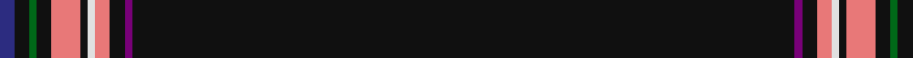

In pattern [BKGKRKWRKBK](/patterns/bkgkrkwrkbk/).

This was sourced from tartans-authority.  It is a [11 stripes tartan](/stripes/stripes11/).

Original link http://www.tartansauthority.com/tartan-ferret/display/7737/

## Attestations

This cloth appears in 2 source records; the oldest owns this page.

- September 2008 — CoVASS (Corporate) (tartans-authority, [record](http://www.tartansauthority.com/tartan-ferret/display/7737/))
- undated — CoVASS (register-of-tartans, [record](https://www.tartanregister.gov.uk/tartanDetails.aspx?ref=5720))

## Thread count
DB/4 K4 G2 K4 LR8 K2 LN2 LR4 K4 P2 K/180

## Palette
Each colour and its ΔE from the base-6 reference it is a variant of.

| Colour | Shade | Base | ΔE (OKLab) |
|---|---|---|---|
| DB | <code style="background-color:#2C2C80;">#2C2C80</code> `#2C2C80` | B <code style="background-color:#2A418A;">#2A418A</code> | 0.06 |
| G | <code style="background-color:#006818;">#006818</code> `#006818` | G <code style="background-color:#006100;">#006100</code> | 0.02 |
| K | <code style="background-color:#101010;">#101010</code> `#101010` | K <code style="background-color:#000000;">#000000</code> | 0.17 |
| LN | <code style="background-color:#E0E0E0;">#E0E0E0</code> `#E0E0E0` | W <code style="background-color:#F7F7F7;">#F7F7F7</code> | 0.07 |
| LR | <code style="background-color:#E87878;">#E87878</code> `#E87878` | R <code style="background-color:#CC0000;">#CC0000</code> | 0.19 |
| P | <code style="background-color:#780078;">#780078</code> `#780078` | B <code style="background-color:#2A418A;">#2A418A</code> | 0.17 |

## Nearest tartans

The nearest existing variants by ΔTartan distance.

1. [Modern Craft (Masonic)](/setts/s8/k108ka4y4w2y4ka1b2w2~b2c2c80-k101010-ka1c1714-wfcfcfc-ya0a0a0~x2/) — ΔT 1.70
1. [Spirit of Lanarkshire (Corporate)](/setts/s8/k83y2b4r2k8g5r4w3~b2c2c80-g006818-k101010-rc80000-we0e0e0-ye8c000~x2/) — ΔT 1.91
1. [Modern Craft (Masonic)](/setts/s8/k108b4w4wa2w4b1ba2wa2~b5c5c5c-ba202060-k101010-wc0c0c0-wafcfcfc~x2/) — ΔT 1.94
1. [Easton (2014)](/setts/s7/b3ba2w1ba50y1ba2r3~b5f749c-ba141e46-rdc0000-wffffff-yd8b000~x2/) — ΔT 2.13
1. [Magdalene](/setts/s9/y2k4y1k4r5k50g1k2r1~g787878-k101010-rc10003-yeabf00~x2/) — ΔT 2.13
1. [Magdalene (Commemorative)](/setts/s9/y2k4y1k4r5k50ra1k2r1~k101010-rc80000-ra888888-ye8c000~x2/) — ΔT 2.16
1. [Celkilt](/setts/s12/k80b2k160ba8b2ba5b3ba3b4ba2b5w2~b646464-ba1c1c1c-k000000-wffffff/) — ΔT 2.34
1. [Fettes (Personal)](/setts/s5/k50b3ba2r3w1~b004878-baa060bc-k101010-rc80000-we0e0e0~x4/) — ΔT 2.35
1. [Wcwm 9275-1572-2](/setts/s20/k112w2b4w2k6y1k2r2g2r2k2y1k6w2b4w2k6r2g6b4~b441800-g006818-k101010-r880000-wc0c0c0-yd09800~x2/) — ΔT 2.37
1. [Fettes Personal Tartan Tartan Number: 7565. Earliest known date: 2008 Designed online for four kilts by Fiona Fettes. See products available Copyright © Blair Urquhart, Comrie, 2015](/setts/s5/k50b3w2r3wa1~b003c64-k101010-rc80000-wc49cd8-wae0e0e0~x2/) — ΔT 2.38

## Neighbour map

Every grey dot is one of 15726 variants placed by the first two principal components of the ΔTartan feature space (44% of its variance). Red is this tartan; blue dots are its nearest — click one to open its page.

<svg viewBox="0 0 640 380" role="img" style="max-width:100%;height:auto;border:1px solid #e0e0e0;border-radius:4px;display:block" xmlns="http://www.w3.org/2000/svg"><image href="/nn/cloud.v1.png" width="640" height="380"/><a href="/setts/s8/k108ka4y4w2y4ka1b2w2~b2c2c80-k101010-ka1c1714-wfcfcfc-ya0a0a0~x2/"><circle cx="619.8" cy="92.0" r="4" fill="#3465a4"><title>Modern Craft (Masonic)</title></circle></a><a href="/setts/s8/k83y2b4r2k8g5r4w3~b2c2c80-g006818-k101010-rc80000-we0e0e0-ye8c000~x2/"><circle cx="562.8" cy="89.9" r="4" fill="#3465a4"><title>Spirit of Lanarkshire (Corporate)</title></circle></a><a href="/setts/s8/k108b4w4wa2w4b1ba2wa2~b5c5c5c-ba202060-k101010-wc0c0c0-wafcfcfc~x2/"><circle cx="607.4" cy="86.6" r="4" fill="#3465a4"><title>Modern Craft (Masonic)</title></circle></a><a href="/setts/s7/b3ba2w1ba50y1ba2r3~b5f749c-ba141e46-rdc0000-wffffff-yd8b000~x2/"><circle cx="626.0" cy="111.7" r="4" fill="#3465a4"><title>Easton (2014)</title></circle></a><a href="/setts/s9/y2k4y1k4r5k50g1k2r1~g787878-k101010-rc10003-yeabf00~x2/"><circle cx="626.0" cy="111.4" r="4" fill="#3465a4"><title>Magdalene</title></circle></a><a href="/setts/s9/y2k4y1k4r5k50ra1k2r1~k101010-rc80000-ra888888-ye8c000~x2/"><circle cx="626.0" cy="110.4" r="4" fill="#3465a4"><title>Magdalene (Commemorative)</title></circle></a><a href="/setts/s12/k80b2k160ba8b2ba5b3ba3b4ba2b5w2~b646464-ba1c1c1c-k000000-wffffff/"><circle cx="626.0" cy="117.2" r="4" fill="#3465a4"><title>Celkilt</title></circle></a><a href="/setts/s5/k50b3ba2r3w1~b004878-baa060bc-k101010-rc80000-we0e0e0~x4/"><circle cx="626.0" cy="138.2" r="4" fill="#3465a4"><title>Fettes (Personal)</title></circle></a><a href="/setts/s20/k112w2b4w2k6y1k2r2g2r2k2y1k6w2b4w2k6r2g6b4~b441800-g006818-k101010-r880000-wc0c0c0-yd09800~x2/"><circle cx="562.8" cy="25.7" r="4" fill="#3465a4"><title>Wcwm 9275-1572-2</title></circle></a><a href="/setts/s5/k50b3w2r3wa1~b003c64-k101010-rc80000-wc49cd8-wae0e0e0~x2/"><circle cx="622.7" cy="135.3" r="4" fill="#3465a4"><title>Fettes Personal Tartan Tartan Number: 7565. Earliest known date: 2008 Designed online for four kilts by Fiona Fettes. See products available Copyright © Blair Urquhart, Comrie, 2015</title></circle></a><circle cx="626.0" cy="65.1" r="5" fill="#c00000"/></svg>

ID: /setts/s11/k90b1k2r2w1k1r4k2g1k2ba2~b780078-ba2c2c80-g006818-k101010-re87878-we0e0e0~x2/
