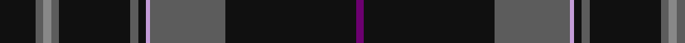

In pattern [BKBWKBKBRBK](/patterns/bkbwkbkbrbk/).

This was sourced from register-of-tartans.  It is a [11 stripes tartan](/stripes/stripes11/).

Original link https://www.tartanregister.gov.uk/tartanDetails.aspx?ref=3377

## Attestations

This cloth appears in 2 source records; the oldest owns this page.

- 01/01/2005 — Pride of Scotland Contemporary (register-of-tartans, [record](https://www.tartanregister.gov.uk/tartanDetails.aspx?ref=3377))
- pre 2005 — Pride of Scotland, Contempo. (Fashio (tartans-authority, [record](http://www.tartansauthority.com/tartan-ferret/display/6498/))

## Register references

External register numbers recorded for this tartan.

- Scottish Register of Tartans: [3377](https://www.tartanregister.gov.uk/tartanDetails.aspx?ref=3377)
- Scottish Tartans Authority (ITI): 6498

## Thread count
K/18 N4 Na4 N4 K36 N4 K4 LP2 N38 K66 P/4

## Palette
Each colour and its ΔE from the base-6 reference it is a variant of.

| Colour | Shade | Base | ΔE (OKLab) |
|---|---|---|---|
| K | <code style="background-color:#101010;">#101010</code> `#101010` | K <code style="background-color:#000000;">#000000</code> | 0.17 |
| LP | <code style="background-color:#C49CD8;">#C49CD8</code> `#C49CD8` | W <code style="background-color:#F7F7F7;">#F7F7F7</code> | 0.25 |
| N | <code style="background-color:#5C5C5C;">#5C5C5C</code> `#5C5C5C` | B <code style="background-color:#2A418A;">#2A418A</code> | 0.15 |
| Na | <code style="background-color:#888888;">#888888</code> `#888888` | R <code style="background-color:#CC0000;">#CC0000</code> | 0.24 |
| P | <code style="background-color:#6C0070;">#6C0070</code> `#6C0070` | B <code style="background-color:#2A418A;">#2A418A</code> | 0.16 |

## Nearest tartans

The nearest existing variants by ΔTartan distance.

1. [Pride of Scotland Platinum](/setts/s11/k10b2r2b2k14b2k2w1b12k24ra2~b5c5c5c-k101010-r888888-rab468ac-wc49cd8~x2/) — ΔT 0.67
1. [Martinez (2014)](/setts/s12/b6k20r3k20y1b2y1k25y1r2y1ba6~b003c64-ba2c2c80-k101010-r880000-ye8c000~x2/) — ΔT 0.84
1. [Alamudi (Corporate)](/setts/s12/k13w3r3k34g21k13g8k5g3k2g1b1~b282874-g005830-k101010-r880000-we0e0e0/) — ΔT 0.98
1. [State Seal of Wisconsin (Fashion)](/setts/s11/k49b15k2y6k33r4k3g8w3b5k3~b2c2c80-g604000-k101010-r880000-we8ccb8-ybc8c00~x2/) — ΔT 1.08
1. [Martinez (2014)](/setts/s12/b6y1r2y1k25y1y1k20b2r3k20ba6~b1870a4-ba202060-k101010-ra00000-yfccc00~x2/) — ΔT 1.15
1. [Highland Park](/setts/s9/w2k3b6r4k48r4b6k3y2~b1c0070-k101010-r880000-wc0c0c0-yd09800~x2/) — ΔT 1.18
1. [Springbank](/setts/s11/k14b2k2b5k25y1b9w3k3wa1k14~b5c5c5c-k101010-wc49cd8-wafcfcfc-ya08858~x2/) — ΔT 1.20
1. [Midnight Glen (Fashion)](/setts/s9/b3k40y3b6k10b10k3y1r3~b542050-k101010-rb45c6c-yd0c4b4~x2/) — ΔT 1.21
1. [Lochnagar Dark Fashion Tartan Tartan Number: 7327. Earliest known date: 01/01/1999 Inspired by the original works of Fenton Wyness, Dark Lochnagar tartan was designed to encapsulate Lochnagar in all its glory, including the Royal connections. Black & Grey are the primary colours of the tartan and were chosen to reflect 'The steep frowning glories of Dark Lochnagar', a line from Byron's verse. Purple was used for the Royal connections i.e. Queen Victoria's love of the district and Prince Charles book 'The Old Man of Lochnagar'. For the red we used a dye which we have called 'Red Granite' which Lochnagar has an abundance.'/Threadcount and colours aren't 100% original. Generated manually./ See products available Copyright © Blair Urquhart, Comrie, 2015](/setts/s10/k8b1k40b1k16b16ba6b3r3b6~b5c5c5c-ba3f4441-k101010-r880000~x2/) — ΔT 1.27
1. [Longmount](/setts/s12/k48b4k6w2k2r2k2b10ra6k2ra3r2~b5c5c5c-k101010-r880000-raa07c58-wc0c0c0~x2/) — ΔT 1.34

## Neighbour map

Every grey dot is one of 15726 variants placed by the first two principal components of the ΔTartan feature space (44% of its variance). Red is this tartan; blue dots are its nearest — click one to open its page.

<svg viewBox="0 0 640 380" role="img" style="max-width:100%;height:auto;border:1px solid #e0e0e0;border-radius:4px;display:block" xmlns="http://www.w3.org/2000/svg"><image href="/nn/cloud.v1.png" width="640" height="380"/><a href="/setts/s11/k10b2r2b2k14b2k2w1b12k24ra2~b5c5c5c-k101010-r888888-rab468ac-wc49cd8~x2/"><circle cx="429.3" cy="146.5" r="4" fill="#3465a4"><title>Pride of Scotland Platinum</title></circle></a><a href="/setts/s12/b6k20r3k20y1b2y1k25y1r2y1ba6~b003c64-ba2c2c80-k101010-r880000-ye8c000~x2/"><circle cx="471.1" cy="142.2" r="4" fill="#3465a4"><title>Martinez (2014)</title></circle></a><a href="/setts/s12/k13w3r3k34g21k13g8k5g3k2g1b1~b282874-g005830-k101010-r880000-we0e0e0/"><circle cx="408.7" cy="134.1" r="4" fill="#3465a4"><title>Alamudi (Corporate)</title></circle></a><a href="/setts/s11/k49b15k2y6k33r4k3g8w3b5k3~b2c2c80-g604000-k101010-r880000-we8ccb8-ybc8c00~x2/"><circle cx="412.6" cy="120.6" r="4" fill="#3465a4"><title>State Seal of Wisconsin (Fashion)</title></circle></a><a href="/setts/s12/b6y1r2y1k25y1y1k20b2r3k20ba6~b1870a4-ba202060-k101010-ra00000-yfccc00~x2/"><circle cx="449.2" cy="132.6" r="4" fill="#3465a4"><title>Martinez (2014)</title></circle></a><a href="/setts/s9/w2k3b6r4k48r4b6k3y2~b1c0070-k101010-r880000-wc0c0c0-yd09800~x2/"><circle cx="466.5" cy="130.6" r="4" fill="#3465a4"><title>Highland Park</title></circle></a><a href="/setts/s11/k14b2k2b5k25y1b9w3k3wa1k14~b5c5c5c-k101010-wc49cd8-wafcfcfc-ya08858~x2/"><circle cx="449.5" cy="147.2" r="4" fill="#3465a4"><title>Springbank</title></circle></a><a href="/setts/s9/b3k40y3b6k10b10k3y1r3~b542050-k101010-rb45c6c-yd0c4b4~x2/"><circle cx="475.0" cy="138.5" r="4" fill="#3465a4"><title>Midnight Glen (Fashion)</title></circle></a><a href="/setts/s10/k8b1k40b1k16b16ba6b3r3b6~b5c5c5c-ba3f4441-k101010-r880000~x2/"><circle cx="467.8" cy="154.7" r="4" fill="#3465a4"><title>Lochnagar Dark Fashion Tartan Tartan Number: 7327. Earliest known date: 01/01/1999 Inspired by the original works of Fenton Wyness, Dark Lochnagar tartan was designed to encapsulate Lochnagar in all its glory, including the Royal connections. Black &amp; Grey are the primary colours of the tartan and were chosen to reflect 'The steep frowning glories of Dark Lochnagar', a line from Byron's verse. Purple was used for the Royal connections i.e. Queen Victoria's love of the district and Prince Charles book 'The Old Man of Lochnagar'. For the red we used a dye which we have called 'Red Granite' which Lochnagar has an abundance.'/Threadcount and colours aren't 100% original. Generated manually./ See products available Copyright © Blair Urquhart, Comrie, 2015</title></circle></a><a href="/setts/s12/k48b4k6w2k2r2k2b10ra6k2ra3r2~b5c5c5c-k101010-r880000-raa07c58-wc0c0c0~x2/"><circle cx="429.0" cy="104.5" r="4" fill="#3465a4"><title>Longmount</title></circle></a><circle cx="453.8" cy="131.1" r="5" fill="#c00000"/></svg>

ID: /setts/s11/k9b2r2b2k18b2k2w1b19k33ba2~b5c5c5c-ba6c0070-k101010-r888888-wc49cd8~x2/
