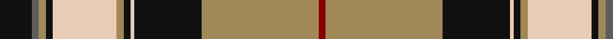

In pattern [KBYKWYKWKYR](/stripes/kbykwykwkyr/).

This was sourced from register-of-tartans.  It is a [11 stripe tartan](/stripes/stripes11/).

Original link https://www.tartanregister.gov.uk/tartanDetails.aspx?ref=3379

## Also known as

This cloth is also recorded under:

- Pride of Scotland, Gold

## Attestations

This cloth appears in 2 source records; the oldest owns this page.

- 01/01/2003 — Pride of Scotland Gold (register-of-tartans, [record](https://www.tartanregister.gov.uk/tartanDetails.aspx?ref=3379))
- 2003 — Pride of Scotland, Gold (Fashion) (tartans-authority, [record](http://www.tartansauthority.com/tartan-ferret/display/6478/))

## Register references

External register numbers recorded for this tartan.

- Scottish Register of Tartans: [3379](https://www.tartanregister.gov.uk/tartanDetails.aspx?ref=3379)
- Scottish Tartans Authority (ITI): 6478

## Thread count
K/18 N4 LT4 K4 LR36 LT4 K4 LR2 K38 LT66 DR/4

## Palette
Each colour and the base-6 reference it is a variant of.

| Colour | Shade | Base |
|---|---|---|
| DR | <code style="background-color:#880000;">#880000</code> `oklch(39.4% 0.162 29.2)` <small>#880000</small> | R <code style="background-color:#CC0000;">#CC0000</code> |
| K | <code style="background-color:#101010;">#101010</code> `oklch(17.3% 0.000 89.9)` <small>#101010</small> | K <code style="background-color:#000000;">#000000</code> |
| LR | <code style="background-color:#E8CCB8;">#E8CCB8</code> `oklch(86.3% 0.042 57.7)` <small>#E8CCB8</small> | W <code style="background-color:#F7F7F7;">#F7F7F7</code> |
| LT | <code style="background-color:#A08858;">#A08858</code> `oklch(63.7% 0.071 84.0)` <small>#A08858</small> | Y <code style="background-color:#F2BF00;">#F2BF00</code> |
| N | <code style="background-color:#5C5C5C;">#5C5C5C</code> `oklch(47.5% 0.000 89.9)` <small>#5C5C5C</small> | B <code style="background-color:#2A418A;">#2A418A</code> |

## Nearest tartans

The nearest existing variants by ΔTartan distance, with this tartan at the top so the swatches line up against it.

ΔTartan

Tartan

Sett

—

<a href="/ttd/edit/#slug=k9n2lo2k2lb18lo2k2lb1k19lo33r2~x2">Pride of Scotland Gold</a> <a class="nn-out" href="/setts/s11/k9n2lo2k2lb18lo2k2lb1k19lo33r2~x2/" title="open its dictionary page">↗</a>

0.90

<a href="/ttd/edit/#slug=r6dg2w21dg2lo2k8lo2dg32w1k3~x2">Fiander, Julian (Personal)</a> <a class="nn-out" href="/setts/s10/r6dg2w21dg2lo2k8lo2dg32w1k3~x2/" title="open its dictionary page">↗</a>

1.08

<a href="/ttd/edit/#slug=dt3lo2dt30lo1w18lg30lo2lg3~x2">Bannockbane Green</a> <a class="nn-out" href="/setts/s8/dt3lo2dt30lo1w18lg30lo2lg3~x2/" title="open its dictionary page">↗</a>

1.13

<a href="/ttd/edit/#slug=lo45t24k15w2lo2k1lo2w2t11k3lo4w8~x2">MacGill of Jura (Clan?)</a> <a class="nn-out" href="/setts/s12/lo45t24k15w2lo2k1lo2w2t11k3lo4w8~x2/" title="open its dictionary page">↗</a>

1.18

<a href="/ttd/edit/#slug=g44db2g4db2g6k16m40db2ly11">(1) Stewart, modern</a> <a class="nn-out" href="/setts/s9/g44db2g4db2g6k16m40db2ly11/" title="open its dictionary page">↗</a>

1.22

<a href="/ttd/edit/#slug=r8lo44k32w2o52k7o7w3">Golden Wedding (Fashion)</a> <a class="nn-out" href="/setts/s8/r8lo44k32w2o52k7o7w3/" title="open its dictionary page">↗</a>

1.26

<a href="/ttd/edit/#slug=lb4t1dt1lb22t2lb2dt12r2dg16r4t1r4dt2~x2">MacGillivray Dress, Janice (Personal</a> <a class="nn-out" href="/setts/s13/lb4t1dt1lb22t2lb2dt12r2dg16r4t1r4dt2~x2/" title="open its dictionary page">↗</a>

1.31

<a href="/ttd/edit/#slug=o53ly6k10w3k3ly4k10r8k3r6w3">Stevens #5</a> <a class="nn-out" href="/setts/s11/o53ly6k10w3k3ly4k10r8k3r6w3/" title="open its dictionary page">↗</a>

1.32

<a href="/ttd/edit/#slug=lr60k6lr8k2lr8w2r12k49lo4">Motherwell Football Club. Modern</a> <a class="nn-out" href="/setts/s9/lr60k6lr8k2lr8w2r12k49lo4/" title="open its dictionary page">↗</a>

1.33

<a href="/ttd/edit/#slug=ly4db7ly4k26g3k1g3w9r2w4r2~x2">Beaudoux - Amis Picards (District)</a> <a class="nn-out" href="/setts/s11/ly4db7ly4k26g3k1g3w9r2w4r2~x2/" title="open its dictionary page">↗</a>

1.34

<a href="/ttd/edit/#slug=dg50db12o7db12r10w7k2w7k2w7r10~x2">Norham and Ladykirk</a> <a class="nn-out" href="/setts/s11/dg50db12o7db12r10w7k2w7k2w7r10~x2/" title="open its dictionary page">↗</a>

## Neighbour map

Every grey dot is one of 14299 variants placed by the first two principal components of the ΔTartan feature space (44% of its variance). Red is this tartan; blue dots are its nearest — click one to open its page.

<svg viewBox="0 0 640 380" role="img" style="max-width:100%;height:auto;border:1px solid #e0e0e0;border-radius:4px;display:block" xmlns="http://www.w3.org/2000/svg"><image href="/nn/cloud.v1.png" width="640" height="380"/><a href="/setts/s10/r6dg2w21dg2lo2k8lo2dg32w1k3~x2/"><circle cx="228.6" cy="80.3" r="4" fill="#3465a4"><title>Fiander, Julian (Personal)</title></circle></a><a href="/setts/s8/dt3lo2dt30lo1w18lg30lo2lg3~x2/"><circle cx="203.1" cy="104.8" r="4" fill="#3465a4"><title>Bannockbane Green</title></circle></a><a href="/setts/s12/lo45t24k15w2lo2k1lo2w2t11k3lo4w8~x2/"><circle cx="247.4" cy="62.5" r="4" fill="#3465a4"><title>MacGill of Jura (Clan?)</title></circle></a><a href="/setts/s9/g44db2g4db2g6k16m40db2ly11/"><circle cx="215.3" cy="112.8" r="4" fill="#3465a4"><title>(1) Stewart, modern</title></circle></a><a href="/setts/s8/r8lo44k32w2o52k7o7w3/"><circle cx="208.4" cy="123.7" r="4" fill="#3465a4"><title>Golden Wedding (Fashion)</title></circle></a><a href="/setts/s13/lb4t1dt1lb22t2lb2dt12r2dg16r4t1r4dt2~x2/"><circle cx="178.5" cy="88.4" r="4" fill="#3465a4"><title>MacGillivray Dress, Janice (Personal</title></circle></a><a href="/setts/s11/o53ly6k10w3k3ly4k10r8k3r6w3/"><circle cx="247.2" cy="92.2" r="4" fill="#3465a4"><title>Stevens #5</title></circle></a><a href="/setts/s9/lr60k6lr8k2lr8w2r12k49lo4/"><circle cx="293.2" cy="97.4" r="4" fill="#3465a4"><title>Motherwell Football Club. Modern</title></circle></a><a href="/setts/s11/ly4db7ly4k26g3k1g3w9r2w4r2~x2/"><circle cx="163.2" cy="73.9" r="4" fill="#3465a4"><title>Beaudoux - Amis Picards (District)</title></circle></a><a href="/setts/s11/dg50db12o7db12r10w7k2w7k2w7r10~x2/"><circle cx="164.8" cy="84.9" r="4" fill="#3465a4"><title>Norham and Ladykirk</title></circle></a><circle cx="227.4" cy="80.6" r="5" fill="#c00000"/></svg>

ID: /setts/s11/k9n2lo2k2lb18lo2k2lb1k19lo33r2~x2/
