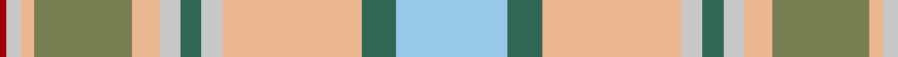

**Bands:** [RWYGYWGWYGW](/stripes/rwygywgwygw/) · **Stripes:** [R LB LR Y LR LB G LB LR G LB](/stripes/stripes11/) R LB LR Y LR LB G LB LR G LB

This was sourced from register-of-tartans.  It is a [11 band tartan](/bands/bands11/).

Original link https://www.tartanregister.gov.uk/tartanDetails.aspx?ref=11265

## Register references

External register numbers recorded for this tartan.

- Scottish Register of Tartans: [11265](https://www.tartanregister.gov.uk/tartanDetails.aspx?ref=11265)

## Thread count
LB/32 G10 LR40 N6 G6 N6 LR8 Ga28 LR4 N4 DR/2

## Palette
Each colour and its ΔE from the base-6 reference it is a variant of.

| Colour | Shade | Base | ΔE (OKLab) |
|---|---|---|---|
| DR | <code style="background-color:#A00000;">#A00000</code> `#A00000` | R <code style="background-color:#CC0000;">#CC0000</code> | 0.09 |
| G | <code style="background-color:#306754;">#306754</code> `#306754` | G <code style="background-color:#006100;">#006100</code> | 0.10 |
| Ga | <code style="background-color:#767E52;">#767E52</code> `#767E52` | G <code style="background-color:#006100;">#006100</code> | 0.17 |
| LB | <code style="background-color:#98C8E8;">#98C8E8</code> `#98C8E8` | W <code style="background-color:#F7F7F7;">#F7F7F7</code> | 0.18 |
| LR | <code style="background-color:#EBB790;">#EBB790</code> `#EBB790` | Y <code style="background-color:#F2BF00;">#F2BF00</code> | 0.11 |
| N | <code style="background-color:#C8C8C8;">#C8C8C8</code> `#C8C8C8` | W <code style="background-color:#F7F7F7;">#F7F7F7</code> | 0.14 |

## Nearest tartans

The nearest existing variants by ΔTartan distance.

1. [Rutlin (Personal)](/setts/s9/y6db2y1w17y1db2y16lo27dg2~x2/) — ΔT 1.39
1. [Sakura (Japanese Four Seasons)](/setts/s14/lp6w2lp25dy2w9lg2lg4lg2w9lg2lg15dy2lg2dy4~x2/) — ΔT 1.49
1. [Alloway Primary (Corporate)](/setts/s8/lb30db1w4o10ly18~x2/) — ΔT 1.49
1. [Delta Dental Association (Corporate)](/setts/s13/g4o1lo29o6w13o13w6o13w13o6lo29o1t4~x2/) — ΔT 1.52
1. [Pille Family (Personal)](/setts/s13/r4g1w5g1r2g1w5lb4lg20lb8ly2lb8ly4~x2/) — ΔT 1.59
1. [O'Monaghan (Personal)](/setts/s10/y25w2t4lo7t4w2lo25w2t4lo7~x2/) — ΔT 1.67
1. [Curd (2013)](/setts/s8/r1g1ly1t9ly3w3lr9t1~x4/) — ΔT 1.67
1. [O'Rourke (Estimated threadcount)](/setts/s9/t25k1dy6k1lr10w3lr10k1ly3~x4/) — ΔT 1.74
1. [Hobkirk (School)](/setts/s10/b5w1m9b5r4b5g20ly1g1ly1~x4/) — ΔT 1.74
1. [O'Monaghan (Personal)](/setts/s18/y25w2t4lo7t4w2lo25w2t4lo7~x2/) — ΔT 1.75

## Neighbour map

Every grey dot is one of 14299 variants placed by the first two principal components of the ΔTartan feature space (44% of its variance). Red is this tartan; blue dots are its nearest — click one to open its page.

<svg viewBox="0 0 640 380" role="img" style="max-width:100%;height:auto;border:1px solid #e0e0e0;border-radius:4px;display:block" xmlns="http://www.w3.org/2000/svg"><image href="/nn/cloud.v1.png" width="640" height="380"/><a href="/setts/s9/y6db2y1w17y1db2y16lo27dg2~x2/"><circle cx="252.3" cy="128.0" r="4" fill="#3465a4"><title>Rutlin (Personal)</title></circle></a><a href="/setts/s14/lp6w2lp25dy2w9lg2lg4lg2w9lg2lg15dy2lg2dy4~x2/"><circle cx="194.4" cy="136.1" r="4" fill="#3465a4"><title>Sakura (Japanese Four Seasons)</title></circle></a><a href="/setts/s8/lb30db1w4o10ly18~x2/"><circle cx="258.6" cy="145.6" r="4" fill="#3465a4"><title>Alloway Primary (Corporate)</title></circle></a><a href="/setts/s13/g4o1lo29o6w13o13w6o13w13o6lo29o1t4~x2/"><circle cx="252.3" cy="128.2" r="4" fill="#3465a4"><title>Delta Dental Association (Corporate)</title></circle></a><a href="/setts/s13/r4g1w5g1r2g1w5lb4lg20lb8ly2lb8ly4~x2/"><circle cx="137.9" cy="100.9" r="4" fill="#3465a4"><title>Pille Family (Personal)</title></circle></a><a href="/setts/s10/y25w2t4lo7t4w2lo25w2t4lo7~x2/"><circle cx="212.4" cy="171.2" r="4" fill="#3465a4"><title>O'Monaghan (Personal)</title></circle></a><a href="/setts/s8/r1g1ly1t9ly3w3lr9t1~x4/"><circle cx="164.8" cy="162.6" r="4" fill="#3465a4"><title>Curd (2013)</title></circle></a><a href="/setts/s9/t25k1dy6k1lr10w3lr10k1ly3~x4/"><circle cx="238.4" cy="115.6" r="4" fill="#3465a4"><title>O'Rourke (Estimated threadcount)</title></circle></a><a href="/setts/s10/b5w1m9b5r4b5g20ly1g1ly1~x4/"><circle cx="240.6" cy="136.8" r="4" fill="#3465a4"><title>Hobkirk (School)</title></circle></a><a href="/setts/s18/y25w2t4lo7t4w2lo25w2t4lo7~x2/"><circle cx="214.5" cy="134.0" r="4" fill="#3465a4"><title>O'Monaghan (Personal)</title></circle></a><circle cx="194.0" cy="126.5" r="5" fill="#c00000"/></svg>

ID: /setts/s11/lb16g5lr20lb3g3lb3lr4y14lr2lb2r1~x2/
