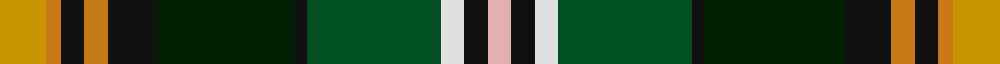

In pattern [YKWGKKKRKRY](/stripes/ykwgkkkrkry/).

This was sourced from register-of-tartans.  It is a [11 stripe tartan](/stripes/stripes11/).

Original link https://www.tartanregister.gov.uk/tartanDetails.aspx?ref=5927

## Register references

External register numbers recorded for this tartan.

- Scottish Register of Tartans: [5927](https://www.tartanregister.gov.uk/tartanDetails.aspx?ref=5927)
- Scottish Tartans World Register: 3093

## Thread count
DY/16 O5 K8 O8 K16 DG48 K4 G46 LN8 K8 LR/8

## Palette
Each colour and the base-6 reference it is a variant of.

| Colour | Shade | Base |
|---|---|---|
| DG | <code style="background-color:#001E00;">#001E00</code> `oklch(20.4% 0.069 142.5)` <small>#001E00</small> | K <code style="background-color:#000000;">#000000</code> |
| DY | <code style="background-color:#C89600;">#C89600</code> `oklch(70.2% 0.144 84.7)` <small>#C89600</small> | Y <code style="background-color:#F2BF00;">#F2BF00</code> |
| G | <code style="background-color:#005020;">#005020</code> `oklch(37.7% 0.105 149.6)` <small>#005020</small> | G <code style="background-color:#006100;">#006100</code> |
| K | <code style="background-color:#101010;">#101010</code> `oklch(17.3% 0.000 89.9)` <small>#101010</small> | K <code style="background-color:#000000;">#000000</code> |
| LN | <code style="background-color:#E0E0E0;">#E0E0E0</code> `oklch(90.7% 0.000 89.9)` <small>#E0E0E0</small> | W <code style="background-color:#F7F7F7;">#F7F7F7</code> |
| LR | <code style="background-color:#E1AFAF;">#E1AFAF</code> `oklch(79.9% 0.059 18.5)` <small>#E1AFAF</small> | Y <code style="background-color:#F2BF00;">#F2BF00</code> |
| O | <code style="background-color:#C87814;">#C87814</code> `oklch(64.5% 0.141 63.8)` <small>#C87814</small> | R <code style="background-color:#CC0000;">#CC0000</code> |

## Nearest tartans

The nearest existing variants by ΔTartan distance, with this tartan at the top so the swatches line up against it.

ΔTartan

Tartan

Sett

—

<a href="/ttd/edit/#slug=lo16o5k8o8k16k48k4dg46w8k8lr8">Louth County, Crest Range</a> <a class="nn-out" href="/setts/s11/lo16o5k8o8k16k48k4dg46w8k8lr8/" title="open its dictionary page">↗</a>

1.08

<a href="/ttd/edit/#slug=k4dg10lo4dg10k4g20dg5k2dy6k2r10k2w4~x2">Donegal County, Crest Range</a> <a class="nn-out" href="/setts/s13/k4dg10lo4dg10k4g20dg5k2dy6k2r10k2w4~x2/" title="open its dictionary page">↗</a>

1.12

<a href="/ttd/edit/#slug=r2k1m5k7w2k14db8g15w2g7r5g1lo2~x2">Nashotah House (Commemorative)</a> <a class="nn-out" href="/setts/s13/r2k1m5k7w2k14db8g15w2g7r5g1lo2~x2/" title="open its dictionary page">↗</a>

1.17

<a href="/ttd/edit/#slug=k4r1k3r2ly3k12dg10dg18db3o3db3~x2">Blake, William &amp; Agnes (Australia)</a> <a class="nn-out" href="/setts/s11/k4r1k3r2ly3k12dg10dg18db3o3db3~x2/" title="open its dictionary page">↗</a>

1.23

<a href="/ttd/edit/#slug=r3g2w2g3db3g20k20db2k2db2lo15db3lo3~x2">U.S. Ancient Order of Hibernians (Co</a> <a class="nn-out" href="/setts/s13/r3g2w2g3db3g20k20db2k2db2lo15db3lo3~x2/" title="open its dictionary page">↗</a>

1.27

<a href="/ttd/edit/#slug=k4dg10lo4dg10k4g20dg5k2lo6k2r10k2w4~x2">Donegal County Crest (Fashion)</a> <a class="nn-out" href="/setts/s13/k4dg10lo4dg10k4g20dg5k2lo6k2r10k2w4~x2/" title="open its dictionary page">↗</a>

1.29

<a href="/ttd/edit/#slug=r4dy12k12dy1o12ly1k3w2k1b4~x2">Campbell Hunting</a> <a class="nn-out" href="/setts/s10/r4dy12k12dy1o12ly1k3w2k1b4~x2/" title="open its dictionary page">↗</a>

1.29

<a href="/ttd/edit/#slug=g2ly1g13y2g1k12db10r1db1w2~x2">Bullman (Name)</a> <a class="nn-out" href="/setts/s10/g2ly1g13y2g1k12db10r1db1w2~x2/" title="open its dictionary page">↗</a>

1.33

<a href="/setts/s14/r5lb1dt10w2k10y10k1ly3~x4/">Culloden 1746 Artefact Tartan Tartan Number: 7422. Earliest known date: 1746 Count from the original Culloden coat discovered and later examined by Peter MacDonald on display at the Kelvingrove Museum, Glasgow. See products available Copyright © Blair Urquhart, Comrie, 2015</a>

1.34

<a href="/ttd/edit/#slug=r3g18r4t3r4k13r3db18g2ly3~x2">Stirling, and Bannockburn</a> <a class="nn-out" href="/setts/s10/r3g18r4t3r4k13r3db18g2ly3~x2/" title="open its dictionary page">↗</a>

1.34

<a href="/ttd/edit/#slug=r2k2dp6k10w2k14lb8g15w2g7r5g1lo2~x2">Nashotah House</a> <a class="nn-out" href="/setts/s13/r2k2dp6k10w2k14lb8g15w2g7r5g1lo2~x2/" title="open its dictionary page">↗</a>

## Neighbour map

Every grey dot is one of 14299 variants placed by the first two principal components of the ΔTartan feature space (44% of its variance). Red is this tartan; blue dots are its nearest — click one to open its page.

<svg viewBox="0 0 640 380" role="img" style="max-width:100%;height:auto;border:1px solid #e0e0e0;border-radius:4px;display:block" xmlns="http://www.w3.org/2000/svg"><image href="/nn/cloud.v1.png" width="640" height="380"/><a href="/setts/s13/k4dg10lo4dg10k4g20dg5k2dy6k2r10k2w4~x2/"><circle cx="71.9" cy="142.7" r="4" fill="#3465a4"><title>Donegal County, Crest Range</title></circle></a><a href="/setts/s13/r2k1m5k7w2k14db8g15w2g7r5g1lo2~x2/"><circle cx="91.0" cy="111.4" r="4" fill="#3465a4"><title>Nashotah House (Commemorative)</title></circle></a><a href="/setts/s11/k4r1k3r2ly3k12dg10dg18db3o3db3~x2/"><circle cx="91.6" cy="110.1" r="4" fill="#3465a4"><title>Blake, William &amp; Agnes (Australia)</title></circle></a><a href="/setts/s13/r3g2w2g3db3g20k20db2k2db2lo15db3lo3~x2/"><circle cx="114.2" cy="122.4" r="4" fill="#3465a4"><title>U.S. Ancient Order of Hibernians (Co</title></circle></a><a href="/setts/s13/k4dg10lo4dg10k4g20dg5k2lo6k2r10k2w4~x2/"><circle cx="81.5" cy="151.8" r="4" fill="#3465a4"><title>Donegal County Crest (Fashion)</title></circle></a><a href="/setts/s10/r4dy12k12dy1o12ly1k3w2k1b4~x2/"><circle cx="89.3" cy="122.2" r="4" fill="#3465a4"><title>Campbell Hunting</title></circle></a><a href="/setts/s10/g2ly1g13y2g1k12db10r1db1w2~x2/"><circle cx="137.7" cy="122.4" r="4" fill="#3465a4"><title>Bullman (Name)</title></circle></a><a href="/setts/s14/r5lb1dt10w2k10y10k1ly3~x4/"><circle cx="56.5" cy="129.2" r="4" fill="#3465a4"><title>Culloden 1746 Artefact Tartan Tartan Number: 7422. Earliest known date: 1746 Count from the original Culloden coat discovered and later examined by Peter MacDonald on display at the Kelvingrove Museum, Glasgow. See products available Copyright © Blair Urquhart, Comrie, 2015</title></circle></a><a href="/setts/s10/r3g18r4t3r4k13r3db18g2ly3~x2/"><circle cx="71.3" cy="145.1" r="4" fill="#3465a4"><title>Stirling, and Bannockburn</title></circle></a><a href="/setts/s13/r2k2dp6k10w2k14lb8g15w2g7r5g1lo2~x2/"><circle cx="85.9" cy="109.9" r="4" fill="#3465a4"><title>Nashotah House</title></circle></a><circle cx="69.2" cy="119.7" r="5" fill="#c00000"/></svg>

ID: /setts/s11/lo16o5k8o8k16k48k4dg46w8k8lr8/
