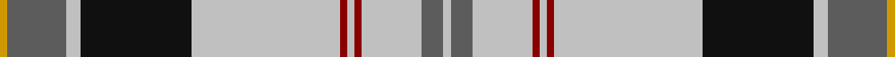

This page is one **sett** — a single exact thread-count. It belongs to the [tartan](/tartans/dy1n8na2k15na20dr1na1dr1na8n3na1/)
(the same proportion at any scale), whose colour order is pattern [WBWRWRWKWBY](/stripes/wbwrwrwkwby/).

Sourced from register-of-tartans.  It is a [11 stripe tartan](/stripes/stripes11/).

Original link https://www.tartanregister.gov.uk/tartanDetails.aspx?ref=1616

2 attestations — the source records this cloth was collapsed from (oldest owns this page)

<ul>
<li>01/01/2002 — Harris (Personal) (register-of-tartans, <a href="https://www.tartanregister.gov.uk/tartanDetails.aspx?ref=1616">record</a>)</li>
<li>pre 2002 — Harris (Personal) (tartans-authority, <a href="http://www.tartansauthority.com/tartan-ferret/display/5159/">record</a>)</li>
</ul>

## Register references

External register numbers recorded for this tartan.

- Scottish Register of Tartans: [1616](https://www.tartanregister.gov.uk/tartanDetails.aspx?ref=1616)
- Scottish Tartans Authority (ITI): 5159

## Thread count
DY/2 N16 Na4 K30 Na40 DR2 Na2 DR2 Na16 N6 Na/2

## Palette
Each colour and the base-6 reference it is a variant of.

| Colour | Shade | Base |
|---|---|---|
| DR | <code style="background-color:#880000;">#880000</code> `oklch(39.4% 0.162 29.2)` <small>#880000</small> | R <code style="background-color:#CC0000;">#CC0000</code> |
| DY | <code style="background-color:#D09800;">#D09800</code> `oklch(71.4% 0.147 82.1)` <small>#D09800</small> | Y <code style="background-color:#F2BF00;">#F2BF00</code> |
| K | <code style="background-color:#101010;">#101010</code> `oklch(17.3% 0.000 89.9)` <small>#101010</small> | K <code style="background-color:#000000;">#000000</code> |
| N | <code style="background-color:#5C5C5C;">#5C5C5C</code> `oklch(47.5% 0.000 89.9)` <small>#5C5C5C</small> | B <code style="background-color:#2A418A;">#2A418A</code> |
| Na | <code style="background-color:#C0C0C0;">#C0C0C0</code> `oklch(80.8% 0.000 89.9)` <small>#C0C0C0</small> | W <code style="background-color:#F7F7F7;">#F7F7F7</code> |

## Nearest tartans

The nearest existing variants by ΔTartan distance, with this tartan at the top so the swatches line up against it.

ΔTartan

Tartan

Sett

—

<a href="/ttd/edit/#slug=lo1n8lb2k15lb20r1lb1r1lb8n3lb1~x2">Harris (Personal)</a> <a class="nn-out" href="/setts/s11/lo1n8lb2k15lb20r1lb1r1lb8n3lb1~x2/" title="open its dictionary page">↗</a>

0.95

<a href="/ttd/edit/#slug=lb52k12r3k3lb3k3do10n8k3n3lb3~x2">Stewart Dress, Grey #1 (Fashion)</a> <a class="nn-out" href="/setts/s11/lb52k12r3k3lb3k3do10n8k3n3lb3~x2/" title="open its dictionary page">↗</a>

1.01

<a href="/ttd/edit/#slug=w60dt24o3dt5w3dt5o16o8k3o6w4">Glenmore Pink</a> <a class="nn-out" href="/setts/s11/w60dt24o3dt5w3dt5o16o8k3o6w4/" title="open its dictionary page">↗</a>

1.07

<a href="/ttd/edit/#slug=k28ly1w2ly1k3w17k5w3db2w10g2~x2">Bro-Roazhon</a> <a class="nn-out" href="/setts/s11/k28ly1w2ly1k3w17k5w3db2w10g2~x2/" title="open its dictionary page">↗</a>

1.12

<a href="/ttd/edit/#slug=w1b6w4b1w16k1g4k6ly1~x2">Henderson Dress</a> <a class="nn-out" href="/setts/s9/w1b6w4b1w16k1g4k6ly1~x2/" title="open its dictionary page">↗</a>

1.12

<a href="/ttd/edit/#slug=o53ly6k10w3k3ly4k10r8k3r6w3">Stevens #5</a> <a class="nn-out" href="/setts/s11/o53ly6k10w3k3ly4k10r8k3r6w3/" title="open its dictionary page">↗</a>

1.13

<a href="/ttd/edit/#slug=r3g2k9lr2k2lr24ly2lr2ly1~x4">Bell of the Borders</a> <a class="nn-out" href="/setts/s9/r3g2k9lr2k2lr24ly2lr2ly1~x4/" title="open its dictionary page">↗</a>

1.14

<a href="/ttd/edit/#slug=k9lb4k2lb4k2lb30k9lb4b14lo2~x2">Hannay (Clan)</a> <a class="nn-out" href="/setts/s10/k9lb4k2lb4k2lb30k9lb4b14lo2~x2/" title="open its dictionary page">↗</a>

1.14

<a href="/ttd/edit/#slug=w68lr3w3lr8w3lr3o24dt16o3dt20lr3~x2">Ben Vorlich</a> <a class="nn-out" href="/setts/s11/w68lr3w3lr8w3lr3o24dt16o3dt20lr3~x2/" title="open its dictionary page">↗</a>

1.17

<a href="/ttd/edit/#slug=g44db2g4db2g6k16m40db2ly11">(1) Stewart, modern</a> <a class="nn-out" href="/setts/s9/g44db2g4db2g6k16m40db2ly11/" title="open its dictionary page">↗</a>

1.18

<a href="/ttd/edit/#slug=lr60k6lr8k2lr8w2r12k49lo4">Motherwell Football Club. Modern</a> <a class="nn-out" href="/setts/s9/lr60k6lr8k2lr8w2r12k49lo4/" title="open its dictionary page">↗</a>

## Neighbour map

Every grey dot is one of 14299 variants placed by the first two principal components of the ΔTartan feature space (44% of its variance). Red is this tartan; blue dots are its nearest — click one to open its page.

<svg viewBox="0 0 640 380" role="img" style="max-width:100%;height:auto;border:1px solid #e0e0e0;border-radius:4px;display:block" xmlns="http://www.w3.org/2000/svg"><image href="/nn/cloud.v1.png" width="640" height="380"/><a href="/setts/s11/lb52k12r3k3lb3k3do10n8k3n3lb3~x2/"><circle cx="272.5" cy="82.9" r="4" fill="#3465a4"><title>Stewart Dress, Grey #1 (Fashion)</title></circle></a><a href="/setts/s11/w60dt24o3dt5w3dt5o16o8k3o6w4/"><circle cx="229.5" cy="79.6" r="4" fill="#3465a4"><title>Glenmore Pink</title></circle></a><a href="/setts/s11/k28ly1w2ly1k3w17k5w3db2w10g2~x2/"><circle cx="264.2" cy="81.0" r="4" fill="#3465a4"><title>Bro-Roazhon</title></circle></a><a href="/setts/s9/w1b6w4b1w16k1g4k6ly1~x2/"><circle cx="217.2" cy="114.2" r="4" fill="#3465a4"><title>Henderson Dress</title></circle></a><a href="/setts/s11/o53ly6k10w3k3ly4k10r8k3r6w3/"><circle cx="247.2" cy="92.2" r="4" fill="#3465a4"><title>Stevens #5</title></circle></a><a href="/setts/s9/r3g2k9lr2k2lr24ly2lr2ly1~x4/"><circle cx="308.9" cy="91.8" r="4" fill="#3465a4"><title>Bell of the Borders</title></circle></a><a href="/setts/s10/k9lb4k2lb4k2lb30k9lb4b14lo2~x2/"><circle cx="252.5" cy="131.2" r="4" fill="#3465a4"><title>Hannay (Clan)</title></circle></a><a href="/setts/s11/w68lr3w3lr8w3lr3o24dt16o3dt20lr3~x2/"><circle cx="233.6" cy="77.7" r="4" fill="#3465a4"><title>Ben Vorlich</title></circle></a><a href="/setts/s9/g44db2g4db2g6k16m40db2ly11/"><circle cx="215.3" cy="112.8" r="4" fill="#3465a4"><title>(1) Stewart, modern</title></circle></a><a href="/setts/s9/lr60k6lr8k2lr8w2r12k49lo4/"><circle cx="293.2" cy="97.4" r="4" fill="#3465a4"><title>Motherwell Football Club. Modern</title></circle></a><circle cx="255.5" cy="101.4" r="5" fill="#c00000"/></svg>

ID: /setts/s11/lo1n8lb2k15lb20r1lb1r1lb8n3lb1~x2/
