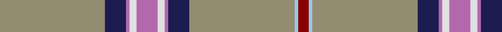

In pattern [RWYBRWRWRBY](/stripes/rwybrwrwrby/).

This was sourced from tartans-authority.  It is a [11 stripe tartan](/stripes/stripes11/).

Original link http://www.tartansauthority.com/tartan-ferret/display/10272/

## Thread count
N/60 DB12 P2 LN4 P12 LN4 P2 DB12 N60 LB2 DR/6

## Palette
Each colour and its ΔE from the base-6 reference it is a variant of.

| Colour | Shade | Base | ΔE (OKLab) |
|---|---|---|---|
| DB | <code style="background-color:#1C1C50;">#1C1C50</code> `#1C1C50` | B <code style="background-color:#2A418A;">#2A418A</code> | 0.14 |
| DR | <code style="background-color:#880000;">#880000</code> `#880000` | R <code style="background-color:#CC0000;">#CC0000</code> | 0.15 |
| LB | <code style="background-color:#98C8E8;">#98C8E8</code> `#98C8E8` | W <code style="background-color:#F7F7F7;">#F7F7F7</code> | 0.18 |
| LN | <code style="background-color:#E0E0E0;">#E0E0E0</code> `#E0E0E0` | W <code style="background-color:#F7F7F7;">#F7F7F7</code> | 0.07 |
| N | <code style="background-color:#948C70;">#948C70</code> `#948C70` | Y <code style="background-color:#F2BF00;">#F2BF00</code> | 0.23 |
| P | <code style="background-color:#B468AC;">#B468AC</code> `#B468AC` | R <code style="background-color:#CC0000;">#CC0000</code> | 0.21 |

## Nearest tartans

The nearest existing variants by ΔTartan distance.

1. [Kuehle Family (Personal)](/setts/s11/y30db6p1w2p6w2p1db6y30lb1r3~x2/) — ΔT 1.00
1. [Quigley of Knockcroghery (Hunting) (Personal)](/setts/s11/t27w2t15ly1t1ly1t15k2w2ly16r1~x2/) — ΔT 1.22
1. [Carbon (Corporate)](/setts/s9/n68k4n18o20k3w3k10lb8lo4/) — ΔT 1.32
1. [Orkney Magnus](/setts/s12/o14db1o19w1o18k3o1dt7db2dt1o1n4~x2/) — ΔT 1.36
1. [Historic Caledonian Railway Enthusiasts', The](/setts/s11/n6k1lo6k1n28w1k2w1n16w1r5~x2/) — ΔT 1.40
1. [Hebridean Fire](/setts/s9/lb4r2lb7n30lb8n7r5k1w2~x2/) — ΔT 1.43
1. [British Caledonian Airways #2](/setts/s12/n68b5k9lo3k3lb3k3n20r9k3r5lb4/) — ΔT 1.48
1. [Stuart/Stewart Authentic Grey](/setts/s12/r1y20r1y3w1k1w1k4y3k1y2ly1~x2/) — ΔT 1.51
1. [Inches, of Perth](/setts/s9/o44ly2k4p2o15r6k3t3ly2~x2/) — ΔT 1.51
1. [Stewart Grey Fancy Tartan Tartan Number: 1632. Earliest known date: pre 2003 Plain weave. See products available Copyright © Blair Urquhart, Comrie, 2015](/setts/s12/r1o20r1o3w1k1w1k4o3k1o2ly1~x2/) — ΔT 1.53

## Neighbour map

Every grey dot is one of 14299 variants placed by the first two principal components of the ΔTartan feature space (44% of its variance). Red is this tartan; blue dots are its nearest — click one to open its page.

<svg viewBox="0 0 640 380" role="img" style="max-width:100%;height:auto;border:1px solid #e0e0e0;border-radius:4px;display:block" xmlns="http://www.w3.org/2000/svg"><image href="/nn/cloud.v1.png" width="640" height="380"/><a href="/setts/s11/y30db6p1w2p6w2p1db6y30lb1r3~x2/"><circle cx="421.7" cy="100.0" r="4" fill="#3465a4"><title>Kuehle Family (Personal)</title></circle></a><a href="/setts/s11/t27w2t15ly1t1ly1t15k2w2ly16r1~x2/"><circle cx="423.2" cy="111.5" r="4" fill="#3465a4"><title>Quigley of Knockcroghery (Hunting) (Personal)</title></circle></a><a href="/setts/s9/n68k4n18o20k3w3k10lb8lo4/"><circle cx="363.6" cy="115.9" r="4" fill="#3465a4"><title>Carbon (Corporate)</title></circle></a><a href="/setts/s12/o14db1o19w1o18k3o1dt7db2dt1o1n4~x2/"><circle cx="421.3" cy="119.1" r="4" fill="#3465a4"><title>Orkney Magnus</title></circle></a><a href="/setts/s11/n6k1lo6k1n28w1k2w1n16w1r5~x2/"><circle cx="476.0" cy="117.4" r="4" fill="#3465a4"><title>Historic Caledonian Railway Enthusiasts', The</title></circle></a><a href="/setts/s9/lb4r2lb7n30lb8n7r5k1w2~x2/"><circle cx="326.1" cy="100.0" r="4" fill="#3465a4"><title>Hebridean Fire</title></circle></a><a href="/setts/s12/n68b5k9lo3k3lb3k3n20r9k3r5lb4/"><circle cx="405.0" cy="96.4" r="4" fill="#3465a4"><title>British Caledonian Airways #2</title></circle></a><a href="/setts/s12/r1y20r1y3w1k1w1k4y3k1y2ly1~x2/"><circle cx="437.7" cy="96.6" r="4" fill="#3465a4"><title>Stuart/Stewart Authentic Grey</title></circle></a><a href="/setts/s9/o44ly2k4p2o15r6k3t3ly2~x2/"><circle cx="444.9" cy="102.1" r="4" fill="#3465a4"><title>Inches, of Perth</title></circle></a><a href="/setts/s12/r1o20r1o3w1k1w1k4o3k1o2ly1~x2/"><circle cx="434.2" cy="94.3" r="4" fill="#3465a4"><title>Stewart Grey Fancy Tartan Tartan Number: 1632. Earliest known date: pre 2003 Plain weave. See products available Copyright © Blair Urquhart, Comrie, 2015</title></circle></a><circle cx="412.8" cy="88.8" r="5" fill="#c00000"/></svg>

ID: /setts/s11/lo30db6m1w2m6w2m1db6lo30lb1r3~x2/
