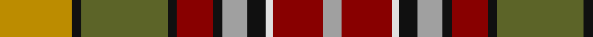

This page is one **sett** — a single exact thread-count. It belongs to the [tartan](/tartans/lo40k5y48k5r20k5lr14k10w4r28lr10/)
(the same proportion at any scale), whose colour order is pattern [YKGKRKYKWRY](/stripes/ykgkrkykwry/).

Sourced from tartans-authority.  It is a [11 stripe tartan](/stripes/stripes11/).

Original link http://www.tartansauthority.com/tartan-ferret/display/7404/

## Thread count
DY/40 K5 G48 K5 DR20 K5 N14 K10 LN4 DR28 N/10

## Palette

Palette: <strong>Tartan Register</strong>
<table><thead><tr><th>Colour</th><th>Threads</th><th>Shade</th><th>Base</th><th>OKLCh</th></tr></thead><tbody><tr><td>DY/</td><td style="text-align:right;font-variant-numeric:tabular-nums">40</td><td><code style="background-color:#BC8C00;">#BC8C00</code> <small style="color:#888">#BC8C00</small></td><td>Y <code style="background-color:#F2BF00;">#F2BF00</code></td><td><small style="color:#888">oklch(66.8% 0.137 84.1)</small></td></tr><tr><td>K</td><td style="text-align:right;font-variant-numeric:tabular-nums">5</td><td><code style="background-color:#101010;">#101010</code> <small style="color:#888">#101010</small></td><td>K <code style="background-color:#000000;">#000000</code></td><td><small style="color:#888">oklch(17.3% 0.000 89.9)</small></td></tr><tr><td>G</td><td style="text-align:right;font-variant-numeric:tabular-nums">48</td><td><code style="background-color:#5C6428;">#5C6428</code> <small style="color:#888">#5C6428</small></td><td>G <code style="background-color:#006100;">#006100</code></td><td><small style="color:#888">oklch(48.3% 0.084 116.0)</small></td></tr><tr><td>K</td><td style="text-align:right;font-variant-numeric:tabular-nums">5</td><td><code style="background-color:#101010;">#101010</code> <small style="color:#888">#101010</small></td><td>K <code style="background-color:#000000;">#000000</code></td><td><small style="color:#888">oklch(17.3% 0.000 89.9)</small></td></tr><tr><td>DR</td><td style="text-align:right;font-variant-numeric:tabular-nums">20</td><td><code style="background-color:#880000;">#880000</code> <small style="color:#888">#880000</small></td><td>R <code style="background-color:#CC0000;">#CC0000</code></td><td><small style="color:#888">oklch(39.4% 0.162 29.2)</small></td></tr><tr><td>K</td><td style="text-align:right;font-variant-numeric:tabular-nums">5</td><td><code style="background-color:#101010;">#101010</code> <small style="color:#888">#101010</small></td><td>K <code style="background-color:#000000;">#000000</code></td><td><small style="color:#888">oklch(17.3% 0.000 89.9)</small></td></tr><tr><td>N</td><td style="text-align:right;font-variant-numeric:tabular-nums">14</td><td><code style="background-color:#A0A0A0;">#A0A0A0</code> <small style="color:#888">#A0A0A0</small></td><td>Y <code style="background-color:#F2BF00;">#F2BF00</code></td><td><small style="color:#888">oklch(70.6% 0.000 89.9)</small></td></tr><tr><td>K</td><td style="text-align:right;font-variant-numeric:tabular-nums">10</td><td><code style="background-color:#101010;">#101010</code> <small style="color:#888">#101010</small></td><td>K <code style="background-color:#000000;">#000000</code></td><td><small style="color:#888">oklch(17.3% 0.000 89.9)</small></td></tr><tr><td>LN</td><td style="text-align:right;font-variant-numeric:tabular-nums">4</td><td><code style="background-color:#E0E0E0;">#E0E0E0</code> <small style="color:#888">#E0E0E0</small></td><td>W <code style="background-color:#F7F7F7;">#F7F7F7</code></td><td><small style="color:#888">oklch(90.7% 0.000 89.9)</small></td></tr><tr><td>DR</td><td style="text-align:right;font-variant-numeric:tabular-nums">28</td><td><code style="background-color:#880000;">#880000</code> <small style="color:#888">#880000</small></td><td>R <code style="background-color:#CC0000;">#CC0000</code></td><td><small style="color:#888">oklch(39.4% 0.162 29.2)</small></td></tr><tr><td>N/</td><td style="text-align:right;font-variant-numeric:tabular-nums">10</td><td><code style="background-color:#A0A0A0;">#A0A0A0</code> <small style="color:#888">#A0A0A0</small></td><td>Y <code style="background-color:#F2BF00;">#F2BF00</code></td><td><small style="color:#888">oklch(70.6% 0.000 89.9)</small></td></tr></tbody></table>

## Nearest tartans

The nearest existing variants by ΔTartan distance, with this tartan at the top so the swatches line up against it.

ΔTartan

Tartan

Sett

—

<a href="/ttd/edit/#slug=lo40k5y48k5r20k5lr14k10w4r28lr10">Kildare County Crest (Fashion)</a> <a class="nn-out" href="/setts/s11/lo40k5y48k5r20k5lr14k10w4r28lr10/" title="open its dictionary page">↗</a>

0.49

<a href="/ttd/edit/#slug=o40k5y48k5r20k5t14k10w4r28t10">Kildare County, Crest Range</a> <a class="nn-out" href="/setts/s11/o40k5y48k5r20k5t14k10w4r28t10/" title="open its dictionary page">↗</a>

1.16

<a href="/ttd/edit/#slug=t1dg8k1t2k1ly2k1t2k1r8w1t1~x4">MacWhirter</a> <a class="nn-out" href="/setts/s12/t1dg8k1t2k1ly2k1t2k1r8w1t1~x4/" title="open its dictionary page">↗</a>

1.19

<a href="/ttd/edit/#slug=r8k8r3k1lo15k3lo3o15b2o2y10o2b1y3b8y8~x2">Du Lion</a> <a class="nn-out" href="/setts/s16/r8k8r3k1lo15k3lo3o15b2o2y10o2b1y3b8y8~x2/" title="open its dictionary page">↗</a>

1.20

<a href="/ttd/edit/#slug=w3r10dy6ly8t8dg32r8r10r6w3~x4">Unidentified Silk scarf</a> <a class="nn-out" href="/setts/s10/w3r10dy6ly8t8dg32r8r10r6w3~x4/" title="open its dictionary page">↗</a>

1.21

<a href="/ttd/edit/#slug=t4dy27lo8k4lo8k4lo8r11ly3~x2">Brittany National Walking</a> <a class="nn-out" href="/setts/s9/t4dy27lo8k4lo8k4lo8r11ly3~x2/" title="open its dictionary page">↗</a>

1.23

<a href="/ttd/edit/#slug=o5k3w2r20db10g2w1r1g20k4o3~x2">MacCullough Family Tartan Tartan Number: 3214. Earliest known date: 2000 I would like to let you know that working with Peter MacDonald, he designed a tartan for me that was registered with the Scottish Tartan Authority on 5 December 2000 See products available Copyright © Blair Urquhart, Comrie, 2015</a> <a class="nn-out" href="/setts/s11/o5k3w2r20db10g2w1r1g20k4o3~x2/" title="open its dictionary page">↗</a>

1.25

<a href="/ttd/edit/#slug=k20lo4r4lo20y20lb5y2g2~x2">Hackett Hunting (Personal)</a> <a class="nn-out" href="/setts/s8/k20lo4r4lo20y20lb5y2g2~x2/" title="open its dictionary page">↗</a>

1.28

<a href="/ttd/edit/#slug=dt2lg2dt3lg8dg4dt4dg3dt8r12dg7r3dg2k1w1~x2">Jones-MacGregor</a> <a class="nn-out" href="/setts/s14/dt2lg2dt3lg8dg4dt4dg3dt8r12dg7r3dg2k1w1~x2/" title="open its dictionary page">↗</a>

1.28

<a href="/ttd/edit/#slug=lo3do2n18lb3o13lb4k3lb4do18lb3~x2">Leitrim, County</a> <a class="nn-out" href="/setts/s10/lo3do2n18lb3o13lb4k3lb4do18lb3~x2/" title="open its dictionary page">↗</a>

1.28

<a href="/ttd/edit/#slug=r22t6db10ly4r4w4g22db8ly3">Unnamed No 14</a> <a class="nn-out" href="/setts/s9/r22t6db10ly4r4w4g22db8ly3/" title="open its dictionary page">↗</a>

## Neighbour map

Every grey dot is one of 14299 variants placed by the first two principal components of the ΔTartan feature space (44% of its variance). Red is this tartan; blue dots are its nearest — click one to open its page.

<svg viewBox="0 0 640 380" role="img" style="max-width:100%;height:auto;border:1px solid #e0e0e0;border-radius:4px;display:block" xmlns="http://www.w3.org/2000/svg"><image href="/nn/cloud.v1.png" width="640" height="380"/><a href="/setts/s11/o40k5y48k5r20k5t14k10w4r28t10/"><circle cx="109.3" cy="142.9" r="4" fill="#3465a4"><title>Kildare County, Crest Range</title></circle></a><a href="/setts/s12/t1dg8k1t2k1ly2k1t2k1r8w1t1~x4/"><circle cx="88.2" cy="126.5" r="4" fill="#3465a4"><title>MacWhirter</title></circle></a><a href="/setts/s16/r8k8r3k1lo15k3lo3o15b2o2y10o2b1y3b8y8~x2/"><circle cx="55.2" cy="109.2" r="4" fill="#3465a4"><title>Du Lion</title></circle></a><a href="/setts/s10/w3r10dy6ly8t8dg32r8r10r6w3~x4/"><circle cx="93.1" cy="123.3" r="4" fill="#3465a4"><title>Unidentified Silk scarf</title></circle></a><a href="/setts/s9/t4dy27lo8k4lo8k4lo8r11ly3~x2/"><circle cx="152.5" cy="169.8" r="4" fill="#3465a4"><title>Brittany National Walking</title></circle></a><a href="/setts/s11/o5k3w2r20db10g2w1r1g20k4o3~x2/"><circle cx="150.5" cy="103.8" r="4" fill="#3465a4"><title>MacCullough Family Tartan Tartan Number: 3214. Earliest known date: 2000 I would like to let you know that working with Peter MacDonald, he designed a tartan for me that was registered with the Scottish Tartan Authority on 5 December 2000 See products available Copyright © Blair Urquhart, Comrie, 2015</title></circle></a><a href="/setts/s8/k20lo4r4lo20y20lb5y2g2~x2/"><circle cx="117.6" cy="159.1" r="4" fill="#3465a4"><title>Hackett Hunting (Personal)</title></circle></a><a href="/setts/s14/dt2lg2dt3lg8dg4dt4dg3dt8r12dg7r3dg2k1w1~x2/"><circle cx="101.5" cy="145.5" r="4" fill="#3465a4"><title>Jones-MacGregor</title></circle></a><a href="/setts/s10/lo3do2n18lb3o13lb4k3lb4do18lb3~x2/"><circle cx="114.6" cy="157.0" r="4" fill="#3465a4"><title>Leitrim, County</title></circle></a><a href="/setts/s9/r22t6db10ly4r4w4g22db8ly3/"><circle cx="89.6" cy="163.7" r="4" fill="#3465a4"><title>Unnamed No 14</title></circle></a><circle cx="96.7" cy="137.7" r="5" fill="#c00000"/></svg>

ID: /setts/s11/lo40k5y48k5r20k5lr14k10w4r28lr10/
