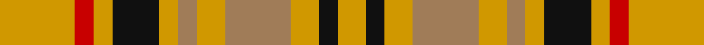

In pattern [YKYRYRYKYRY](/stripes/ykyryrykyry/).

This was sourced from register-of-tartans.  It is a [11 stripe tartan](/stripes/stripes11/).

Original link https://www.tartanregister.gov.uk/tartanDetails.aspx?ref=5227

## Register references

External register numbers recorded for this tartan.

- Scottish Register of Tartans: [5227](https://www.tartanregister.gov.uk/tartanDetails.aspx?ref=5227)
- Scottish Tartans Authority (ITI): 3056

## Thread count
DY/16 R4 DY4 K10 DY4 LT4 DY6 LT14 DY6 K4 DY/6

## Palette
Each colour and the base-6 reference it is a variant of.

| Colour | Shade | Base |
|---|---|---|
| B | <code style="background-color:#2888C4;">#2888C4</code> `oklch(60.1% 0.125 241.5)` <small>#2888C4</small> | B <code style="background-color:#2A418A;">#2A418A</code> |
| DR | <code style="background-color:#441800;">#441800</code> `oklch(27.3% 0.076 46.3)` <small>#441800</small> | B <code style="background-color:#2A418A;">#2A418A</code> |
| DY | <code style="background-color:#D09800;">#D09800</code> `oklch(71.4% 0.147 82.1)` <small>#D09800</small> | Y <code style="background-color:#F2BF00;">#F2BF00</code> |
| K | <code style="background-color:#101010;">#101010</code> `oklch(17.3% 0.000 89.9)` <small>#101010</small> | K <code style="background-color:#000000;">#000000</code> |
| LT | <code style="background-color:#A07C58;">#A07C58</code> `oklch(61.2% 0.067 66.0)` <small>#A07C58</small> | R <code style="background-color:#CC0000;">#CC0000</code> |
| R | <code style="background-color:#C80000;">#C80000</code> `oklch(52.3% 0.215 29.2)` <small>#C80000</small> | R <code style="background-color:#CC0000;">#CC0000</code> |

## Nearest tartans

The nearest existing variants by ΔTartan distance.

1. [Wilson's No.169](/setts/s16/r9g10w2g2ly2g10r9g5r9g10ly2g2w2g10r9g5~x2/) — ΔT 1.40
1. [MacRae](/setts/s12/g21r5g21r21g5r4g5r21w4r5db21r4/) — ΔT 1.46
1. [MacRurie, MacRory](/setts/s13/r10g12r3g12r12g4r5g5r12ly4r5g12r4~x2/) — ΔT 1.61
1. [Wilson's, No 169](/setts/s9/g5r9g10w2g2ly2g10r9g5~x2/) — ΔT 1.67
1. [Grant of Monymusk](/setts/s13/r12g14r4g14r4g14r4db8r5db8r12g3r12~x2/) — ΔT 1.67
1. [MacRurie/MacRory](/setts/s13/r8g10r2g10r9g3r4g4r10ly3r3g10r3~x2/) — ΔT 1.74
1. [MacQuarrie 4](/setts/s12/r1t1r6db3r1g6r1g6r6db1r1t1~x2/) — ΔT 1.74
1. [Unidentified #33](/setts/s9/dg2r3dg4w1dg1ly1dg4r3dg2~x2/) — ΔT 1.74
1. [Grant of Monymusk](/setts/s13/r12g16r3g16r3g16r4db16r5k9r12g3r12~x2/) — ΔT 1.75
1. [MacKinnon 7](/setts/s11/w2r4g8r16t2r3g16r4t2r4w2~x2/) — ΔT 1.75

## Neighbour map

Every grey dot is one of 14299 variants placed by the first two principal components of the ΔTartan feature space (44% of its variance). Red is this tartan; blue dots are its nearest — click one to open its page.

<svg viewBox="0 0 640 380" role="img" style="max-width:100%;height:auto;border:1px solid #e0e0e0;border-radius:4px;display:block" xmlns="http://www.w3.org/2000/svg"><image href="/nn/cloud.v1.png" width="640" height="380"/><a href="/setts/s16/r9g10w2g2ly2g10r9g5r9g10ly2g2w2g10r9g5~x2/"><circle cx="245.6" cy="218.0" r="4" fill="#3465a4"><title>Wilson's No.169</title></circle></a><a href="/setts/s12/g21r5g21r21g5r4g5r21w4r5db21r4/"><circle cx="203.8" cy="210.3" r="4" fill="#3465a4"><title>MacRae</title></circle></a><a href="/setts/s13/r10g12r3g12r12g4r5g5r12ly4r5g12r4~x2/"><circle cx="255.6" cy="260.4" r="4" fill="#3465a4"><title>MacRurie, MacRory</title></circle></a><a href="/setts/s9/g5r9g10w2g2ly2g10r9g5~x2/"><circle cx="275.7" cy="247.1" r="4" fill="#3465a4"><title>Wilson's, No 169</title></circle></a><a href="/setts/s13/r12g14r4g14r4g14r4db8r5db8r12g3r12~x2/"><circle cx="219.4" cy="257.2" r="4" fill="#3465a4"><title>Grant of Monymusk</title></circle></a><a href="/setts/s13/r8g10r2g10r9g3r4g4r10ly3r3g10r3~x2/"><circle cx="268.8" cy="249.3" r="4" fill="#3465a4"><title>MacRurie/MacRory</title></circle></a><a href="/setts/s12/r1t1r6db3r1g6r1g6r6db1r1t1~x2/"><circle cx="240.1" cy="200.6" r="4" fill="#3465a4"><title>MacQuarrie 4</title></circle></a><a href="/setts/s9/dg2r3dg4w1dg1ly1dg4r3dg2~x2/"><circle cx="260.0" cy="257.0" r="4" fill="#3465a4"><title>Unidentified #33</title></circle></a><a href="/setts/s13/r12g16r3g16r3g16r4db16r5k9r12g3r12~x2/"><circle cx="153.1" cy="220.4" r="4" fill="#3465a4"><title>Grant of Monymusk</title></circle></a><a href="/setts/s11/w2r4g8r16t2r3g16r4t2r4w2~x2/"><circle cx="265.2" cy="179.4" r="4" fill="#3465a4"><title>MacKinnon 7</title></circle></a><circle cx="205.9" cy="225.7" r="5" fill="#c00000"/></svg>

ID: /setts/s11/lo8r2lo2k5lo2o2lo3o7lo3k2lo3~x2/
