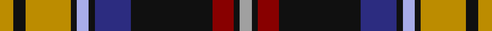

In pattern [YKRKBKWKYKY](/stripes/ykrkbkwkyky/).

This was sourced from tartans-authority.  It is a [11 stripe tartan](/stripes/stripes11/).

Original link http://www.tartansauthority.com/tartan-ferret/display/7452/

## Also known as

This cloth is also recorded under:

- Dublin County, Crest Range

## Attestations

This cloth appears in 2 source records; the oldest owns this page.

- 2004 — Dublin County Crest (Fashion) (tartans-authority, [record](http://www.tartansauthority.com/tartan-ferret/display/7452/))
- 01/05/2005 — Dublin County, Crest Range (register-of-tartans, [record](https://www.tartanregister.gov.uk/tartanDetails.aspx?ref=5050))

## Register references

External register numbers recorded for this tartan.

- Scottish Register of Tartans: [5050](https://www.tartanregister.gov.uk/tartanDetails.aspx?ref=5050)
- Scottish Tartans Authority (ITI): 7452
- Scottish Tartans World Register: 3083

## Thread count
DY/9 K8 DY30 K4 LP8 K4 DB24 K54 DR14 K4 N/8

## Palette
Each colour and the base-6 reference it is a variant of.

| Colour | Shade | Base |
|---|---|---|
| DB | <code style="background-color:#2C2C80;">#2C2C80</code> `oklch(35.0% 0.138 276.6)` <small>#2C2C80</small> | B <code style="background-color:#2A418A;">#2A418A</code> |
| DR | <code style="background-color:#880000;">#880000</code> `oklch(39.4% 0.162 29.2)` <small>#880000</small> | R <code style="background-color:#CC0000;">#CC0000</code> |
| DY | <code style="background-color:#BC8C00;">#BC8C00</code> `oklch(66.8% 0.137 84.1)` <small>#BC8C00</small> | Y <code style="background-color:#F2BF00;">#F2BF00</code> |
| K | <code style="background-color:#101010;">#101010</code> `oklch(17.3% 0.000 89.9)` <small>#101010</small> | K <code style="background-color:#000000;">#000000</code> |
| LP | <code style="background-color:#A8ACE8;">#A8ACE8</code> `oklch(76.3% 0.086 281.2)` <small>#A8ACE8</small> | W <code style="background-color:#F7F7F7;">#F7F7F7</code> |
| N | <code style="background-color:#A0A0A0;">#A0A0A0</code> `oklch(70.6% 0.000 89.9)` <small>#A0A0A0</small> | Y <code style="background-color:#F2BF00;">#F2BF00</code> |

## Nearest tartans

The nearest existing variants by ΔTartan distance.

1. [Sligo County Crest (Fashion)](/setts/s11/lo8k16lr8k52lr6k5w27r20y14k5lr6/) — ΔT 0.80
1. [Legion of Frontiersmen (Corporate)](/setts/s8/k45lo10g7r3w4db13w9r6~x2/) — ΔT 0.82
1. [Scottish Spirit](/setts/s12/n9m3n32n12k5n2k4n2k17p4k2lb2~x2/) — ΔT 0.93
1. [Royal College of General Practitioners](/setts/s8/lo11k66o32dg11o10db6o10lo4/) — ΔT 0.94
1. [Bird Family (Wales) (Personal)](/setts/s10/lo4k28lo2dp7w3k9g2w4g2k2~x2/) — ΔT 0.94
1. [Edinburgh](/setts/s9/w8db50k4r8k6r12g17p7k4/) — ΔT 0.95
1. [Bird Family (Personal)](/setts/s10/ly4k28ly2db7w3r9g2w4g2k2~x2/) — ΔT 0.96
1. [Cailean #2 (Fashion)](/setts/s12/o4k12db2k2db2k2db2o16dr3o2lr2o4~x2/) — ΔT 0.96
1. [Edinburgh](/setts/s9/w3db22k2r3k2r5g7r2k2~x2/) — ΔT 0.97
1. [Turnbull, Dress Bruce (Personal)](/setts/s8/o11k66y32dg11y10db6y10r4/) — ΔT 0.99

## Neighbour map

Every grey dot is one of 14299 variants placed by the first two principal components of the ΔTartan feature space (44% of its variance). Red is this tartan; blue dots are its nearest — click one to open its page.

<svg viewBox="0 0 640 380" role="img" style="max-width:100%;height:auto;border:1px solid #e0e0e0;border-radius:4px;display:block" xmlns="http://www.w3.org/2000/svg"><image href="/nn/cloud.v1.png" width="640" height="380"/><a href="/setts/s11/lo8k16lr8k52lr6k5w27r20y14k5lr6/"><circle cx="150.1" cy="128.0" r="4" fill="#3465a4"><title>Sligo County Crest (Fashion)</title></circle></a><a href="/setts/s8/k45lo10g7r3w4db13w9r6~x2/"><circle cx="182.8" cy="121.4" r="4" fill="#3465a4"><title>Legion of Frontiersmen (Corporate)</title></circle></a><a href="/setts/s12/n9m3n32n12k5n2k4n2k17p4k2lb2~x2/"><circle cx="204.2" cy="115.9" r="4" fill="#3465a4"><title>Scottish Spirit</title></circle></a><a href="/setts/s8/lo11k66o32dg11o10db6o10lo4/"><circle cx="206.2" cy="126.5" r="4" fill="#3465a4"><title>Royal College of General Practitioners</title></circle></a><a href="/setts/s10/lo4k28lo2dp7w3k9g2w4g2k2~x2/"><circle cx="190.2" cy="107.9" r="4" fill="#3465a4"><title>Bird Family (Wales) (Personal)</title></circle></a><a href="/setts/s9/w8db50k4r8k6r12g17p7k4/"><circle cx="167.5" cy="125.5" r="4" fill="#3465a4"><title>Edinburgh</title></circle></a><a href="/setts/s10/ly4k28ly2db7w3r9g2w4g2k2~x2/"><circle cx="184.1" cy="100.5" r="4" fill="#3465a4"><title>Bird Family (Personal)</title></circle></a><a href="/setts/s12/o4k12db2k2db2k2db2o16dr3o2lr2o4~x2/"><circle cx="136.6" cy="130.7" r="4" fill="#3465a4"><title>Cailean #2 (Fashion)</title></circle></a><a href="/setts/s9/w3db22k2r3k2r5g7r2k2~x2/"><circle cx="183.9" cy="125.3" r="4" fill="#3465a4"><title>Edinburgh</title></circle></a><a href="/setts/s8/o11k66y32dg11y10db6y10r4/"><circle cx="219.0" cy="133.6" r="4" fill="#3465a4"><title>Turnbull, Dress Bruce (Personal)</title></circle></a><circle cx="174.0" cy="122.8" r="5" fill="#c00000"/></svg>

ID: /setts/s11/lo9k8lo30k4lb8k4db24k54r14k4lr8/
