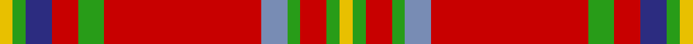

This page is one **sett** — a single exact thread-count. It belongs to the [tartan](/tartans/y1g1db2r2g2r12b2g1r2g1y1/)
(the same proportion at any scale), whose colour order is pattern [YGBRGRBGRGY](/stripes/ygbrgrbgrgy/).

Sourced from register-of-tartans.  It is a [11 stripe tartan](/stripes/stripes11/).

Original link https://www.tartanregister.gov.uk/tartanDetails.aspx?ref=4605

2 attestations — the source records this cloth was collapsed from (oldest owns this page)

<ul>
<li>01/01/1820 — West Virginia Old Shawl (register-of-tartans, <a href="https://www.tartanregister.gov.uk/tartanDetails.aspx?ref=4605">record</a>)</li>
<li>1820 — West Virginia Old Shawl (Artefact) (tartans-authority, <a href="http://www.tartansauthority.com/tartan-ferret/display/4252/">record</a>)</li>
</ul>

## Register references

External register numbers recorded for this tartan.

- Scottish Register of Tartans: [4605](https://www.tartanregister.gov.uk/tartanDetails.aspx?ref=4605)
- Scottish Tartans Authority (ITI): 4252

## Thread count
Y/4 G4 DB8 R8 G8 R48 B8 G4 R8 G4 Y/4

## Palette
Each colour and the base-6 reference it is a variant of.

| Colour | Shade | Base |
|---|---|---|
| B | <code style="background-color:#788CB4;">#788CB4</code> `oklch(63.9% 0.065 264.0)` <small>#788CB4</small> | B <code style="background-color:#2A418A;">#2A418A</code> |
| DB | <code style="background-color:#2C2C80;">#2C2C80</code> `oklch(35.0% 0.138 276.6)` <small>#2C2C80</small> | B <code style="background-color:#2A418A;">#2A418A</code> |
| G | <code style="background-color:#289C18;">#289C18</code> `oklch(60.6% 0.191 141.6)` <small>#289C18</small> | G <code style="background-color:#006100;">#006100</code> |
| R | <code style="background-color:#C80000;">#C80000</code> `oklch(52.3% 0.215 29.2)` <small>#C80000</small> | R <code style="background-color:#CC0000;">#CC0000</code> |
| Y | <code style="background-color:#E8C000;">#E8C000</code> `oklch(81.9% 0.168 93.7)` <small>#E8C000</small> | Y <code style="background-color:#F2BF00;">#F2BF00</code> |

## Nearest tartans

The nearest existing variants by ΔTartan distance, with this tartan at the top so the swatches line up against it.

ΔTartan

Tartan

Sett

—

<a href="/ttd/edit/#slug=ly1g1db2r2g2r12t2g1r2g1ly1~x4">West Virginia Old Shawl</a> <a class="nn-out" href="/setts/s11/ly1g1db2r2g2r12t2g1r2g1ly1~x4/" title="open its dictionary page">↗</a>

1.00

<a href="/ttd/edit/#slug=k2r1g8r3g3r14ly1r1w2~x2">Melieres, Michel (Personal)</a> <a class="nn-out" href="/setts/s9/k2r1g8r3g3r14ly1r1w2~x2/" title="open its dictionary page">↗</a>

1.05

<a href="/ttd/edit/#slug=lb6r5lb9db2b3db2o36r2o4r2~x2">Outpost Club</a> <a class="nn-out" href="/setts/s10/lb6r5lb9db2b3db2o36r2o4r2~x2/" title="open its dictionary page">↗</a>

1.12

<a href="/ttd/edit/#slug=r24ly2o3dy2w10r4o3dy3w2~x2">Manx Laxey (Red)</a> <a class="nn-out" href="/setts/s9/r24ly2o3dy2w10r4o3dy3w2~x2/" title="open its dictionary page">↗</a>

1.13

<a href="/ttd/edit/#slug=r24ly2y3o2w10r4y3o3w2~x2">Manx Laxey, Red</a> <a class="nn-out" href="/setts/s9/r24ly2y3o2w10r4y3o3w2~x2/" title="open its dictionary page">↗</a>

1.19

<a href="/ttd/edit/#slug=r13w1t2r2g14r2w1t2r2db4r2t2w1r16g1r2g3~x2">MacDonald of Lochmaddy</a> <a class="nn-out" href="/setts/s17/r13w1t2r2g14r2w1t2r2db4r2t2w1r16g1r2g3~x2/" title="open its dictionary page">↗</a>

1.19

<a href="/ttd/edit/#slug=r6dg8ly2dg8r6dt8r29dg3lb2r5dt3~x2">Loch Creran (District)</a> <a class="nn-out" href="/setts/s11/r6dg8ly2dg8r6dt8r29dg3lb2r5dt3~x2/" title="open its dictionary page">↗</a>

1.24

<a href="/ttd/edit/#slug=r7w2r36db6g3db3g3db3g12r4~x2">Chisholm of Strathglass</a> <a class="nn-out" href="/setts/s10/r7w2r36db6g3db3g3db3g12r4~x2/" title="open its dictionary page">↗</a>

1.25

<a href="/ttd/edit/#slug=r4g4w3g4r4g14r28k2r2g3~x2">Scott Red Clan Tartan Tartan Number: 4. Earliest known date: 1930-50 The Red Scott tartan is the sett most often seen today. The earliest recording appears to come from a sample in the MacKinlay collection at the Scottish Tartans Society. Sir Walter Scott, despite his assertion that Lowlanders never wore plaids, was largely responsible for the wide spread introduction of tartans to the Lowland families. There is also a Green Scott tartan. See products available Copyright © Blair Urquhart, Comrie, 2015</a> <a class="nn-out" href="/setts/s10/r4g4w3g4r4g14r28k2r2g3~x2/" title="open its dictionary page">↗</a>

1.26

<a href="/ttd/edit/#slug=r6lo2r32lo15r2lo3r2lo6w3db4~x2">Virginia Tech</a> <a class="nn-out" href="/setts/s10/r6lo2r32lo15r2lo3r2lo6w3db4~x2/" title="open its dictionary page">↗</a>

1.28

<a href="/ttd/edit/#slug=r12w2r37b6g3b3r4b3g21r4~x2">Chisholm, The (MacGregor-Hastie)</a> <a class="nn-out" href="/setts/s10/r12w2r37b6g3b3r4b3g21r4~x2/" title="open its dictionary page">↗</a>

## Neighbour map

Every grey dot is one of 14299 variants placed by the first two principal components of the ΔTartan feature space (44% of its variance). Red is this tartan; blue dots are its nearest — click one to open its page.

<svg viewBox="0 0 640 380" role="img" style="max-width:100%;height:auto;border:1px solid #e0e0e0;border-radius:4px;display:block" xmlns="http://www.w3.org/2000/svg"><image href="/nn/cloud.v1.png" width="640" height="380"/><a href="/setts/s9/k2r1g8r3g3r14ly1r1w2~x2/"><circle cx="300.1" cy="135.2" r="4" fill="#3465a4"><title>Melieres, Michel (Personal)</title></circle></a><a href="/setts/s10/lb6r5lb9db2b3db2o36r2o4r2~x2/"><circle cx="329.8" cy="104.7" r="4" fill="#3465a4"><title>Outpost Club</title></circle></a><a href="/setts/s9/r24ly2o3dy2w10r4o3dy3w2~x2/"><circle cx="277.6" cy="122.2" r="4" fill="#3465a4"><title>Manx Laxey (Red)</title></circle></a><a href="/setts/s9/r24ly2y3o2w10r4y3o3w2~x2/"><circle cx="281.8" cy="125.1" r="4" fill="#3465a4"><title>Manx Laxey, Red</title></circle></a><a href="/setts/s17/r13w1t2r2g14r2w1t2r2db4r2t2w1r16g1r2g3~x2/"><circle cx="310.3" cy="103.2" r="4" fill="#3465a4"><title>MacDonald of Lochmaddy</title></circle></a><a href="/setts/s11/r6dg8ly2dg8r6dt8r29dg3lb2r5dt3~x2/"><circle cx="317.3" cy="136.1" r="4" fill="#3465a4"><title>Loch Creran (District)</title></circle></a><a href="/setts/s10/r7w2r36db6g3db3g3db3g12r4~x2/"><circle cx="379.5" cy="135.1" r="4" fill="#3465a4"><title>Chisholm of Strathglass</title></circle></a><a href="/setts/s10/r4g4w3g4r4g14r28k2r2g3~x2/"><circle cx="353.9" cy="147.9" r="4" fill="#3465a4"><title>Scott Red Clan Tartan Tartan Number: 4. Earliest known date: 1930-50 The Red Scott tartan is the sett most often seen today. The earliest recording appears to come from a sample in the MacKinlay collection at the Scottish Tartans Society. Sir Walter Scott, despite his assertion that Lowlanders never wore plaids, was largely responsible for the wide spread introduction of tartans to the Lowland families. There is also a Green Scott tartan. See products available Copyright © Blair Urquhart, Comrie, 2015</title></circle></a><a href="/setts/s10/r6lo2r32lo15r2lo3r2lo6w3db4~x2/"><circle cx="369.8" cy="138.0" r="4" fill="#3465a4"><title>Virginia Tech</title></circle></a><a href="/setts/s10/r12w2r37b6g3b3r4b3g21r4~x2/"><circle cx="379.4" cy="140.2" r="4" fill="#3465a4"><title>Chisholm, The (MacGregor-Hastie)</title></circle></a><circle cx="326.7" cy="120.4" r="5" fill="#c00000"/></svg>

ID: /setts/s11/ly1g1db2r2g2r12t2g1r2g1ly1~x4/
