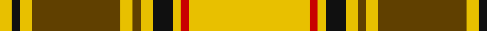

**Bands:** [YKYGYGYKYRY](/stripes/ykygygykyry/) · **Stripes:** [LY K LY DY LY DY LY K LY R LY](/stripes/stripes11/) LY K LY DY LY DY LY K LY R LY

This was sourced from house-of-tartan.  It is a [11 band tartan](/bands/bands11/).

Original link http://www.house-of-tartan.scotland.net/house/TartanViewjs.asp?colr=Def&tnam=1886

## Thread count
Y/6 K4 Y6 T44 Y6 T4 Y6 K10 Y4 R4 Y/60

## Palette
Each colour and its ΔE from the base-6 reference it is a variant of.

| Colour | Shade | Base | ΔE (OKLab) |
|---|---|---|---|
| B | <code style="background-color:#2888C4;">#2888C4</code> `#2888C4` | B <code style="background-color:#2A418A;">#2A418A</code> | 0.21 |
| K | <code style="background-color:#101010;">#101010</code> `#101010` | K <code style="background-color:#000000;">#000000</code> | 0.17 |
| R | <code style="background-color:#C80000;">#C80000</code> `#C80000` | R <code style="background-color:#CC0000;">#CC0000</code> | 0.01 |
| T | <code style="background-color:#604000;">#604000</code> `#604000` | G <code style="background-color:#006100;">#006100</code> | 0.14 |
| Y | <code style="background-color:#E8C000;">#E8C000</code> `#E8C000` | Y <code style="background-color:#F2BF00;">#F2BF00</code> | 0.02 |

## Nearest tartans

The nearest existing variants by ΔTartan distance.

1. [Dunbarton](/setts/s11/ly30r2ly2k5ly3o2ly3o22ly3k2ly3~x2/) — ΔT 0.43
1. [Dunbarton (Quebec)](/setts/s11/ly30r2ly2k5ly3y2ly3y22ly3k2ly3~x2/) — ΔT 0.73
1. [Morgan of Wales](/setts/s11/r4ly34do20ly4do8ly6r2ly5do2ly3r4/) — ΔT 0.75
1. [Ulster Irish District Tartan Tartan Number: 1196. Earliest known date: c.1590-1650 The Dungiven costume was discovered in 1956 by Mr William Dixon, a farmer at 'The Hill', Flanders Townland, Dungiven, County Derry, Northern Ireland. The tartan cloth was probably green but had been stained brown and tan by the peat. See products available Copyright © Blair Urquhart, Comrie, 2015](/setts/s10/ly28k2ly28k2ly2k2lo29k2r2k2~x2/) — ΔT 1.01
1. [MacLeod (Snuffbox)](/setts/s9/k1ly12r1ly2k4r1k4ly2k1~x4/) — ΔT 1.44
1. [Bracken](/setts/s9/ly5db9r3db5ly2db4ly26t3r4~x2/) — ΔT 1.52
1. [MacDonald of Kingsburgh](/setts/s9/ly3g1ly1g21w1r18ly1g3r3~x2/) — ΔT 1.57
1. [Wilbers #2 (Personal)](/setts/s8/ly5k9ly2k7o10r4o35k4~x2/) — ΔT 1.64
1. [Ulster](/setts/s12/g13k1g13r1g1k1g1k1r13k1ly1k1~x3/) — ΔT 1.65
1. [Baillieville Family Tartan Tartan Number: 2326. Earliest known date: Oct. 1882 By David R Gurney of Russell Gurney Weavers, Turiff, Aberdeen for Charles D. Fitzhardinge Bailey of Baileville. See products available Copyright © Blair Urquhart, Comrie, 2015](/setts/s12/k4ly1k4ly11r1ly1r1ly11k4ly1k4ly1~x4/) — ΔT 1.66

## Neighbour map

Every grey dot is one of 14313 variants placed by the first two principal components of the ΔTartan feature space (44% of its variance). Red is this tartan; blue dots are its nearest — click one to open its page.

<svg viewBox="0 0 640 380" role="img" style="max-width:100%;height:auto;border:1px solid #e0e0e0;border-radius:4px;display:block" xmlns="http://www.w3.org/2000/svg"><image href="/nn/cloud.v1.png" width="640" height="380"/><a href="/setts/s11/ly30r2ly2k5ly3o2ly3o22ly3k2ly3~x2/"><circle cx="314.4" cy="110.6" r="4" fill="#3465a4"><title>Dunbarton</title></circle></a><a href="/setts/s11/ly30r2ly2k5ly3y2ly3y22ly3k2ly3~x2/"><circle cx="333.0" cy="120.5" r="4" fill="#3465a4"><title>Dunbarton (Quebec)</title></circle></a><a href="/setts/s11/r4ly34do20ly4do8ly6r2ly5do2ly3r4/"><circle cx="309.2" cy="116.5" r="4" fill="#3465a4"><title>Morgan of Wales</title></circle></a><a href="/setts/s10/ly28k2ly28k2ly2k2lo29k2r2k2~x2/"><circle cx="337.8" cy="131.6" r="4" fill="#3465a4"><title>Ulster Irish District Tartan Tartan Number: 1196. Earliest known date: c.1590-1650 The Dungiven costume was discovered in 1956 by Mr William Dixon, a farmer at 'The Hill', Flanders Townland, Dungiven, County Derry, Northern Ireland. The tartan cloth was probably green but had been stained brown and tan by the peat. See products available Copyright © Blair Urquhart, Comrie, 2015</title></circle></a><a href="/setts/s9/k1ly12r1ly2k4r1k4ly2k1~x4/"><circle cx="313.5" cy="156.7" r="4" fill="#3465a4"><title>MacLeod (Snuffbox)</title></circle></a><a href="/setts/s9/ly5db9r3db5ly2db4ly26t3r4~x2/"><circle cx="270.5" cy="139.6" r="4" fill="#3465a4"><title>Bracken</title></circle></a><a href="/setts/s9/ly3g1ly1g21w1r18ly1g3r3~x2/"><circle cx="326.1" cy="131.0" r="4" fill="#3465a4"><title>MacDonald of Kingsburgh</title></circle></a><a href="/setts/s8/ly5k9ly2k7o10r4o35k4~x2/"><circle cx="331.4" cy="141.7" r="4" fill="#3465a4"><title>Wilbers #2 (Personal)</title></circle></a><a href="/setts/s12/g13k1g13r1g1k1g1k1r13k1ly1k1~x3/"><circle cx="326.9" cy="136.3" r="4" fill="#3465a4"><title>Ulster</title></circle></a><a href="/setts/s12/k4ly1k4ly11r1ly1r1ly11k4ly1k4ly1~x4/"><circle cx="311.0" cy="157.1" r="4" fill="#3465a4"><title>Baillieville Family Tartan Tartan Number: 2326. Earliest known date: Oct. 1882 By David R Gurney of Russell Gurney Weavers, Turiff, Aberdeen for Charles D. Fitzhardinge Bailey of Baileville. See products available Copyright © Blair Urquhart, Comrie, 2015</title></circle></a><circle cx="318.5" cy="114.6" r="5" fill="#c00000"/></svg>

ID: /setts/s11/ly30r2ly2k5ly3dy2ly3dy22ly3k2ly3~x2/
