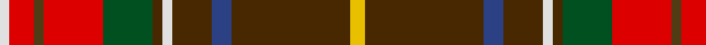

**Bands:** [WRGRGGWGBGY](/stripes/wrgrggwgbgy/) · **Stripes:** [W R DY R DG DY W DY DB DY LY](/stripes/stripes11/) W R DY R DG DY W DY DB DY LY

This was sourced from register-of-tartans.  It is a [11 band tartan](/bands/bands11/).

Original link https://www.tartanregister.gov.uk/tartanDetails.aspx?ref=4269

## Register references

External register numbers recorded for this tartan.

- Scottish Register of Tartans: [4269](https://www.tartanregister.gov.uk/tartanDetails.aspx?ref=4269)
- Scottish Tartans World Register: 1862

## Thread count
LN/4 R10 T4 R24 G20 Ta4 LN4 Ta16 B8 Ta48 Y/6

## Palette
Each colour and its ΔE from the base-6 reference it is a variant of.

| Colour | Shade | Base | ΔE (OKLab) |
|---|---|---|---|
| B | <code style="background-color:#2C4084;">#2C4084</code> `#2C4084` | B <code style="background-color:#2A418A;">#2A418A</code> | 0.01 |
| G | <code style="background-color:#005020;">#005020</code> `#005020` | G <code style="background-color:#006100;">#006100</code> | 0.07 |
| LN | <code style="background-color:#E0E0E0;">#E0E0E0</code> `#E0E0E0` | W <code style="background-color:#F7F7F7;">#F7F7F7</code> | 0.07 |
| R | <code style="background-color:#DC0000;">#DC0000</code> `#DC0000` | R <code style="background-color:#CC0000;">#CC0000</code> | 0.03 |
| T | <code style="background-color:#503C14;">#503C14</code> `#503C14` | G <code style="background-color:#006100;">#006100</code> | 0.14 |
| Ta | <code style="background-color:#482800;">#482800</code> `#482800` | G <code style="background-color:#006100;">#006100</code> | 0.19 |
| Y | <code style="background-color:#E8C000;">#E8C000</code> `#E8C000` | Y <code style="background-color:#F2BF00;">#F2BF00</code> | 0.02 |

## Nearest tartans

The nearest existing variants by ΔTartan distance.

1. [Unidentified 31](/setts/s11/ly3o24db4o8w2o2g10r12o2r5w2~x2/) — ΔT 0.82
1. [Canfield (Personal)](/setts/s11/r5w1r18dg4r6lo4r1g6k13db5lo2~x2/) — ΔT 0.99
1. [MacLean of Duart #6](/setts/s12/db4t1k3ly1k1w1k1g8r12t1r2k1~x4/) — ΔT 1.07
1. [Ogg of Tarragann](/setts/s12/k2t6w1r14k1r14w1k6dg10lo1dg2lo2~x2/) — ΔT 1.07
1. [Ogg of Tarragann (Personal)](/setts/s12/k2t6w1r14k1r14w1k6g10lo1g2lo2~x2/) — ΔT 1.08
1. [Wilson's No.132](/setts/s14/r18w2g21y2dp7y5w2y5dp7y2g21w2r18k3~x2/) — ΔT 1.16
1. [Angels' Share, The](/setts/s11/o40ly10w6lo10dy6lo4dy6lo4dy60k34t11/) — ΔT 1.17
1. [Wilson's No.121](/setts/s12/t4dp3y1g9lb1r8k1r8lb1g9y1dp3~x4/) — ΔT 1.19
1. [Unidentified #31](/setts/s14/r12w1k1dg12ly2db5t6r2t2r4dg2r2k2dg2~x2/) — ΔT 1.22
1. [Moray of Abercairney](/setts/s9/db3t1k1r12r1g9r1t1db3~x4/) — ΔT 1.23

## Neighbour map

Every grey dot is one of 14313 variants placed by the first two principal components of the ΔTartan feature space (44% of its variance). Red is this tartan; blue dots are its nearest — click one to open its page.

<svg viewBox="0 0 640 380" role="img" style="max-width:100%;height:auto;border:1px solid #e0e0e0;border-radius:4px;display:block" xmlns="http://www.w3.org/2000/svg"><image href="/nn/cloud.v1.png" width="640" height="380"/><a href="/setts/s11/ly3o24db4o8w2o2g10r12o2r5w2~x2/"><circle cx="202.2" cy="121.2" r="4" fill="#3465a4"><title>Unidentified 31</title></circle></a><a href="/setts/s11/r5w1r18dg4r6lo4r1g6k13db5lo2~x2/"><circle cx="197.7" cy="117.4" r="4" fill="#3465a4"><title>Canfield (Personal)</title></circle></a><a href="/setts/s12/db4t1k3ly1k1w1k1g8r12t1r2k1~x4/"><circle cx="142.7" cy="91.3" r="4" fill="#3465a4"><title>MacLean of Duart #6</title></circle></a><a href="/setts/s12/k2t6w1r14k1r14w1k6dg10lo1dg2lo2~x2/"><circle cx="202.2" cy="112.9" r="4" fill="#3465a4"><title>Ogg of Tarragann</title></circle></a><a href="/setts/s12/k2t6w1r14k1r14w1k6g10lo1g2lo2~x2/"><circle cx="203.6" cy="112.5" r="4" fill="#3465a4"><title>Ogg of Tarragann (Personal)</title></circle></a><a href="/setts/s14/r18w2g21y2dp7y5w2y5dp7y2g21w2r18k3~x2/"><circle cx="123.0" cy="112.9" r="4" fill="#3465a4"><title>Wilson's No.132</title></circle></a><a href="/setts/s11/o40ly10w6lo10dy6lo4dy6lo4dy60k34t11/"><circle cx="133.9" cy="90.7" r="4" fill="#3465a4"><title>Angels' Share, The</title></circle></a><a href="/setts/s12/t4dp3y1g9lb1r8k1r8lb1g9y1dp3~x4/"><circle cx="125.1" cy="137.3" r="4" fill="#3465a4"><title>Wilson's No.121</title></circle></a><a href="/setts/s14/r12w1k1dg12ly2db5t6r2t2r4dg2r2k2dg2~x2/"><circle cx="122.1" cy="103.2" r="4" fill="#3465a4"><title>Unidentified #31</title></circle></a><a href="/setts/s9/db3t1k1r12r1g9r1t1db3~x4/"><circle cx="196.9" cy="131.0" r="4" fill="#3465a4"><title>Moray of Abercairney</title></circle></a><circle cx="184.7" cy="116.1" r="5" fill="#c00000"/></svg>

ID: /setts/s11/ly3dy24db4dy8w2dy2dg10r12dy2r5w2~x2/
