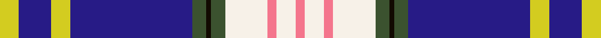

This page is one **sett** — a single exact thread-count. It belongs to the [tartan](/tartans/y4db7y4db26g3k1g3w9lr2w4lr2/)
(the same proportion at any scale), whose colour order is pattern [RWRWGKGBYBY](/stripes/rwrwgkgbyby/).

Sourced from register-of-tartans.  It is a [11 stripe tartan](/stripes/stripes11/).

Original link https://www.tartanregister.gov.uk/tartanDetails.aspx?ref=10619

## Register references

External register numbers recorded for this tartan.

- Scottish Register of Tartans: [10619](https://www.tartanregister.gov.uk/tartanDetails.aspx?ref=10619)

## Thread count
Y/8 DB14 Y8 DB52 G6 K2 G6 W18 LR4 W8 LR/4

## Palette
Each colour and the base-6 reference it is a variant of.

| Colour | Shade | Base |
|---|---|---|
| DB | <code style="background-color:#271B86;">#271B86</code> `oklch(32.6% 0.166 276.9)` <small>#271B86</small> | B <code style="background-color:#2A418A;">#2A418A</code> |
| G | <code style="background-color:#3B522F;">#3B522F</code> `oklch(41.0% 0.063 135.5)` <small>#3B522F</small> | G <code style="background-color:#006100;">#006100</code> |
| K | <code style="background-color:#120A01;">#120A01</code> `oklch(15.2% 0.028 78.6)` <small>#120A01</small> | K <code style="background-color:#000000;">#000000</code> |
| LR | <code style="background-color:#F4758C;">#F4758C</code> `oklch(71.7% 0.157 10.6)` <small>#F4758C</small> | R <code style="background-color:#CC0000;">#CC0000</code> |
| W | <code style="background-color:#F7F1E8;">#F7F1E8</code> `oklch(96.0% 0.014 78.3)` <small>#F7F1E8</small> | W <code style="background-color:#F7F7F7;">#F7F7F7</code> |
| Y | <code style="background-color:#D3CC20;">#D3CC20</code> `oklch(82.5% 0.171 107.0)` <small>#D3CC20</small> | Y <code style="background-color:#F2BF00;">#F2BF00</code> |

## Nearest tartans

The nearest existing variants by ΔTartan distance, with this tartan at the top so the swatches line up against it.

ΔTartan

Tartan

Sett

—

<a href="/ttd/edit/#slug=ly4db7ly4db26dg3k1dg3w9r2w4r2~x2">Baudoux et amis picards</a> <a class="nn-out" href="/setts/s11/ly4db7ly4db26dg3k1dg3w9r2w4r2~x2/" title="open its dictionary page">↗</a>

0.69

<a href="/ttd/edit/#slug=w6n2db6n2db25n2r1n2ly3db5w6n4~x2">Mead of Poetry, The</a> <a class="nn-out" href="/setts/s12/w6n2db6n2db25n2r1n2ly3db5w6n4~x2/" title="open its dictionary page">↗</a>

0.76

<a href="/ttd/edit/#slug=w6n2db6n2db25n2r1n2ly3t5w6n4~x2">Mead of Poetry (Fashion)</a> <a class="nn-out" href="/setts/s12/w6n2db6n2db25n2r1n2ly3t5w6n4~x2/" title="open its dictionary page">↗</a>

0.89

<a href="/ttd/edit/#slug=r1w16o6db2w1r8w1db28k3db3k3db3k1lb1~x2">Russian Arctic Convoy</a> <a class="nn-out" href="/setts/s14/r1w16o6db2w1r8w1db28k3db3k3db3k1lb1~x2/" title="open its dictionary page">↗</a>

0.99

<a href="/ttd/edit/#slug=w3k2t30k5r5ly5t5db12w1~x2">Wiegratz Alba (Personal)</a> <a class="nn-out" href="/setts/s9/w3k2t30k5r5ly5t5db12w1~x2/" title="open its dictionary page">↗</a>

1.01

<a href="/ttd/edit/#slug=dp4db20ly1db2ly1db4ly4g4w4r4~x2">Yukon District Tartan Tartan Number: 1907. Earliest known date: 1984 Lord Lyon records a symetrical version. See products available Copyright © Blair Urquhart, Comrie, 2015</a> <a class="nn-out" href="/setts/s10/dp4db20ly1db2ly1db4ly4g4w4r4~x2/" title="open its dictionary page">↗</a>

1.04

<a href="/ttd/edit/#slug=dp4db20ly1db2ly1db4ly4dg4w4r4~x2">Yukon (asymmetric)</a> <a class="nn-out" href="/setts/s10/dp4db20ly1db2ly1db4ly4dg4w4r4~x2/" title="open its dictionary page">↗</a>

1.11

<a href="/ttd/edit/#slug=r4w4g4ly4db4ly1db2ly1db20p4~x2">Yukon</a> <a class="nn-out" href="/setts/s10/r4w4g4ly4db4ly1db2ly1db20p4~x2/" title="open its dictionary page">↗</a>

1.14

<a href="/ttd/edit/#slug=lo2w3k1db9k1t6g1t3g1t19k2w7lo1~x2">Cahaba Memorial</a> <a class="nn-out" href="/setts/s13/lo2w3k1db9k1t6g1t3g1t19k2w7lo1~x2/" title="open its dictionary page">↗</a>

1.17

<a href="/ttd/edit/#slug=w4dt1db12dt1r8w8dt8w2dt1w2dt24ly4dt1r2~x2">Submariners (Unofficial)</a> <a class="nn-out" href="/setts/s14/w4dt1db12dt1r8w8dt8w2dt1w2dt24ly4dt1r2~x2/" title="open its dictionary page">↗</a>

1.25

<a href="/ttd/edit/#slug=g12db1dp4db30lo3w2lo3w2lo3w10r4~x2">Rosslyn Chapel</a> <a class="nn-out" href="/setts/s11/g12db1dp4db30lo3w2lo3w2lo3w10r4~x2/" title="open its dictionary page">↗</a>

## Neighbour map

Every grey dot is one of 14299 variants placed by the first two principal components of the ΔTartan feature space (44% of its variance). Red is this tartan; blue dots are its nearest — click one to open its page.

<svg viewBox="0 0 640 380" role="img" style="max-width:100%;height:auto;border:1px solid #e0e0e0;border-radius:4px;display:block" xmlns="http://www.w3.org/2000/svg"><image href="/nn/cloud.v1.png" width="640" height="380"/><a href="/setts/s12/w6n2db6n2db25n2r1n2ly3db5w6n4~x2/"><circle cx="205.8" cy="76.0" r="4" fill="#3465a4"><title>Mead of Poetry, The</title></circle></a><a href="/setts/s12/w6n2db6n2db25n2r1n2ly3t5w6n4~x2/"><circle cx="221.9" cy="83.2" r="4" fill="#3465a4"><title>Mead of Poetry (Fashion)</title></circle></a><a href="/setts/s14/r1w16o6db2w1r8w1db28k3db3k3db3k1lb1~x2/"><circle cx="211.3" cy="48.9" r="4" fill="#3465a4"><title>Russian Arctic Convoy</title></circle></a><a href="/setts/s9/w3k2t30k5r5ly5t5db12w1~x2/"><circle cx="245.3" cy="93.4" r="4" fill="#3465a4"><title>Wiegratz Alba (Personal)</title></circle></a><a href="/setts/s10/dp4db20ly1db2ly1db4ly4g4w4r4~x2/"><circle cx="245.5" cy="101.9" r="4" fill="#3465a4"><title>Yukon District Tartan Tartan Number: 1907. Earliest known date: 1984 Lord Lyon records a symetrical version. See products available Copyright © Blair Urquhart, Comrie, 2015</title></circle></a><a href="/setts/s10/dp4db20ly1db2ly1db4ly4dg4w4r4~x2/"><circle cx="248.8" cy="104.7" r="4" fill="#3465a4"><title>Yukon (asymmetric)</title></circle></a><a href="/setts/s10/r4w4g4ly4db4ly1db2ly1db20p4~x2/"><circle cx="249.1" cy="103.3" r="4" fill="#3465a4"><title>Yukon</title></circle></a><a href="/setts/s13/lo2w3k1db9k1t6g1t3g1t19k2w7lo1~x2/"><circle cx="206.5" cy="82.1" r="4" fill="#3465a4"><title>Cahaba Memorial</title></circle></a><a href="/setts/s14/w4dt1db12dt1r8w8dt8w2dt1w2dt24ly4dt1r2~x2/"><circle cx="206.7" cy="87.3" r="4" fill="#3465a4"><title>Submariners (Unofficial)</title></circle></a><a href="/setts/s11/g12db1dp4db30lo3w2lo3w2lo3w10r4~x2/"><circle cx="191.4" cy="72.4" r="4" fill="#3465a4"><title>Rosslyn Chapel</title></circle></a><circle cx="220.0" cy="75.4" r="5" fill="#c00000"/></svg>

ID: /setts/s11/ly4db7ly4db26dg3k1dg3w9r2w4r2~x2/
