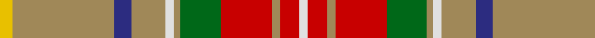

This page is one **sett** — a single exact thread-count. It belongs to the [tartan](/tartans/ly6lo48db8lo16w4lo3g19r24lo4r9w4/)
(the same proportion at any scale), whose colour order is pattern [WRYRGYWYBYY](/stripes/wryrgywybyy/).

Sourced from register-of-tartans.  It is a [11 stripe tartan](/stripes/stripes11/).

Original link https://www.tartanregister.gov.uk/tartanDetails.aspx?ref=3040

## Register references

External register numbers recorded for this tartan.

- Scottish Register of Tartans: [3040](https://www.tartanregister.gov.uk/tartanDetails.aspx?ref=3040)
- Scottish Tartans Authority (ITI): 6001

## Thread count
Y/6 LT48 DB8 LT16 LN4 LT3 G19 R24 LT4 R9 LN/4

## Palette

Palette: <strong>Tartan Register</strong>
<table><thead><tr><th>Colour</th><th>Threads</th><th>Shade</th><th>Base</th><th>OKLCh</th></tr></thead><tbody><tr><td>Y/</td><td style="text-align:right;font-variant-numeric:tabular-nums">6</td><td><code style="background-color:#E8C000;">#E8C000</code> <small style="color:#888">#E8C000</small></td><td>Y <code style="background-color:#F2BF00;">#F2BF00</code></td><td><small style="color:#888">oklch(81.9% 0.168 93.7)</small></td></tr><tr><td>LT</td><td style="text-align:right;font-variant-numeric:tabular-nums">48</td><td><code style="background-color:#A08858;">#A08858</code> <small style="color:#888">#A08858</small></td><td>Y <code style="background-color:#F2BF00;">#F2BF00</code></td><td><small style="color:#888">oklch(63.7% 0.071 84.0)</small></td></tr><tr><td>DB</td><td style="text-align:right;font-variant-numeric:tabular-nums">8</td><td><code style="background-color:#2C2C80;">#2C2C80</code> <small style="color:#888">#2C2C80</small></td><td>B <code style="background-color:#2A418A;">#2A418A</code></td><td><small style="color:#888">oklch(35.0% 0.138 276.6)</small></td></tr><tr><td>LT</td><td style="text-align:right;font-variant-numeric:tabular-nums">16</td><td><code style="background-color:#A08858;">#A08858</code> <small style="color:#888">#A08858</small></td><td>Y <code style="background-color:#F2BF00;">#F2BF00</code></td><td><small style="color:#888">oklch(63.7% 0.071 84.0)</small></td></tr><tr><td>LN</td><td style="text-align:right;font-variant-numeric:tabular-nums">4</td><td><code style="background-color:#E0E0E0;">#E0E0E0</code> <small style="color:#888">#E0E0E0</small></td><td>W <code style="background-color:#F7F7F7;">#F7F7F7</code></td><td><small style="color:#888">oklch(90.7% 0.000 89.9)</small></td></tr><tr><td>LT</td><td style="text-align:right;font-variant-numeric:tabular-nums">3</td><td><code style="background-color:#A08858;">#A08858</code> <small style="color:#888">#A08858</small></td><td>Y <code style="background-color:#F2BF00;">#F2BF00</code></td><td><small style="color:#888">oklch(63.7% 0.071 84.0)</small></td></tr><tr><td>G</td><td style="text-align:right;font-variant-numeric:tabular-nums">19</td><td><code style="background-color:#006818;">#006818</code> <small style="color:#888">#006818</small></td><td>G <code style="background-color:#006100;">#006100</code></td><td><small style="color:#888">oklch(45.0% 0.142 145.0)</small></td></tr><tr><td>R</td><td style="text-align:right;font-variant-numeric:tabular-nums">24</td><td><code style="background-color:#C80000;">#C80000</code> <small style="color:#888">#C80000</small></td><td>R <code style="background-color:#CC0000;">#CC0000</code></td><td><small style="color:#888">oklch(52.3% 0.215 29.2)</small></td></tr><tr><td>LT</td><td style="text-align:right;font-variant-numeric:tabular-nums">4</td><td><code style="background-color:#A08858;">#A08858</code> <small style="color:#888">#A08858</small></td><td>Y <code style="background-color:#F2BF00;">#F2BF00</code></td><td><small style="color:#888">oklch(63.7% 0.071 84.0)</small></td></tr><tr><td>R</td><td style="text-align:right;font-variant-numeric:tabular-nums">9</td><td><code style="background-color:#C80000;">#C80000</code> <small style="color:#888">#C80000</small></td><td>R <code style="background-color:#CC0000;">#CC0000</code></td><td><small style="color:#888">oklch(52.3% 0.215 29.2)</small></td></tr><tr><td>LN/</td><td style="text-align:right;font-variant-numeric:tabular-nums">4</td><td><code style="background-color:#E0E0E0;">#E0E0E0</code> <small style="color:#888">#E0E0E0</small></td><td>W <code style="background-color:#F7F7F7;">#F7F7F7</code></td><td><small style="color:#888">oklch(90.7% 0.000 89.9)</small></td></tr></tbody></table>

## Nearest tartans

The nearest existing variants by ΔTartan distance, with this tartan at the top so the swatches line up against it.

ΔTartan

Tartan

Sett

—

<a href="/ttd/edit/#slug=ly6lo48db8lo16w4lo3g19r24lo4r9w4">Muirhead (Original)</a> <a class="nn-out" href="/setts/s11/ly6lo48db8lo16w4lo3g19r24lo4r9w4/" title="open its dictionary page">↗</a>

1.17

<a href="/ttd/edit/#slug=g28lo18db4lo18r3ri2r3ri2r3ri2r3~x2">Commonwealth Games - 2014</a> <a class="nn-out" href="/setts/s11/g28lo18db4lo18r3ri2r3ri2r3ri2r3~x2/" title="open its dictionary page">↗</a>

1.38

<a href="/ttd/edit/#slug=dr11g3dr4ly3dr3ly4dr3y13o34g3o4n3~x2">Harmony 1</a> <a class="nn-out" href="/setts/s12/dr11g3dr4ly3dr3ly4dr3y13o34g3o4n3~x2/" title="open its dictionary page">↗</a>

1.39

<a href="/ttd/edit/#slug=y2k1y9loi3lb1k3lb1r3loi9lo1loi2~x4">Asman, Day Tan (Name)</a> <a class="nn-out" href="/setts/s11/y2k1y9loi3lb1k3lb1r3loi9lo1loi2~x4/" title="open its dictionary page">↗</a>

1.44

<a href="/ttd/edit/#slug=w10db3g30r4t12r30t6r6t6r6t6r30g30dt4">MacGuire Irish Family Tartan Tartan Number: 2427. Earliest known date: 1985 MacGuire is an Irish Family tartan See products available Copyright © Blair Urquhart, Comrie, 2015</a> <a class="nn-out" href="/setts/s14/w10db3g30r4t12r30t6r6t6r6t6r30g30dt4/" title="open its dictionary page">↗</a>

1.45

<a href="/ttd/edit/#slug=r3ri4g3p3ri11g30ri3p7g3r2ri4w2~x2">MacKinnon 1</a> <a class="nn-out" href="/setts/s12/r3ri4g3p3ri11g30ri3p7g3r2ri4w2~x2/" title="open its dictionary page">↗</a>

1.45

<a href="/ttd/edit/#slug=t3y1k1ri12r1g9r1y1t3~x2">Murray of Abercairney</a> <a class="nn-out" href="/setts/s9/t3y1k1ri12r1g9r1y1t3~x2/" title="open its dictionary page">↗</a>

1.45

<a href="/ttd/edit/#slug=r1do1r9g6t2b3r2lo1~x4">Battle of Bannockburn, The</a> <a class="nn-out" href="/setts/s8/r1do1r9g6t2b3r2lo1~x4/" title="open its dictionary page">↗</a>

1.46

<a href="/ttd/edit/#slug=k2o30g4w2g14m13ly2~x2">Red Rum</a> <a class="nn-out" href="/setts/s7/k2o30g4w2g14m13ly2~x2/" title="open its dictionary page">↗</a>

1.47

<a href="/ttd/edit/#slug=dy11dg3dy4ly3dy3ly4dy3lo13o34dg3o4dr3~x2">Harmony 1</a> <a class="nn-out" href="/setts/s12/dy11dg3dy4ly3dy3ly4dy3lo13o34dg3o4dr3~x2/" title="open its dictionary page">↗</a>

1.48

<a href="/ttd/edit/#slug=ly3oi24db4oi8w2oi2g10r12o2r5w2~x2">Unidentified 31</a> <a class="nn-out" href="/setts/s11/ly3oi24db4oi8w2oi2g10r12o2r5w2~x2/" title="open its dictionary page">↗</a>

## Neighbour map

Every grey dot is one of 14359 variants placed by the first two principal components of the ΔTartan feature space (44% of its variance). Red is this tartan; blue dots are its nearest — click one to open its page.

<svg viewBox="0 0 640 380" role="img" style="max-width:100%;height:auto;border:1px solid #e0e0e0;border-radius:4px;display:block" xmlns="http://www.w3.org/2000/svg"><image href="/nn/cloud.v1.png" width="640" height="380"/><a href="/setts/s11/g28lo18db4lo18r3ri2r3ri2r3ri2r3~x2/"><circle cx="252.4" cy="139.2" r="4" fill="#3465a4"><title>Commonwealth Games - 2014</title></circle></a><a href="/setts/s12/dr11g3dr4ly3dr3ly4dr3y13o34g3o4n3~x2/"><circle cx="217.6" cy="127.3" r="4" fill="#3465a4"><title>Harmony 1</title></circle></a><a href="/setts/s11/y2k1y9loi3lb1k3lb1r3loi9lo1loi2~x4/"><circle cx="178.4" cy="157.0" r="4" fill="#3465a4"><title>Asman, Day Tan (Name)</title></circle></a><a href="/setts/s14/w10db3g30r4t12r30t6r6t6r6t6r30g30dt4/"><circle cx="174.1" cy="136.9" r="4" fill="#3465a4"><title>MacGuire Irish Family Tartan Tartan Number: 2427. Earliest known date: 1985 MacGuire is an Irish Family tartan See products available Copyright © Blair Urquhart, Comrie, 2015</title></circle></a><a href="/setts/s12/r3ri4g3p3ri11g30ri3p7g3r2ri4w2~x2/"><circle cx="265.2" cy="121.1" r="4" fill="#3465a4"><title>MacKinnon 1</title></circle></a><a href="/setts/s9/t3y1k1ri12r1g9r1y1t3~x2/"><circle cx="183.2" cy="132.7" r="4" fill="#3465a4"><title>Murray of Abercairney</title></circle></a><a href="/setts/s8/r1do1r9g6t2b3r2lo1~x4/"><circle cx="222.2" cy="166.5" r="4" fill="#3465a4"><title>Battle of Bannockburn, The</title></circle></a><a href="/setts/s7/k2o30g4w2g14m13ly2~x2/"><circle cx="243.9" cy="155.5" r="4" fill="#3465a4"><title>Red Rum</title></circle></a><a href="/setts/s12/dy11dg3dy4ly3dy3ly4dy3lo13o34dg3o4dr3~x2/"><circle cx="192.2" cy="110.6" r="4" fill="#3465a4"><title>Harmony 1</title></circle></a><a href="/setts/s11/ly3oi24db4oi8w2oi2g10r12o2r5w2~x2/"><circle cx="201.2" cy="121.8" r="4" fill="#3465a4"><title>Unidentified 31</title></circle></a><circle cx="247.8" cy="124.7" r="5" fill="#c00000"/></svg>

ID: /setts/s11/ly6lo48db8lo16w4lo3g19r24lo4r9w4/
