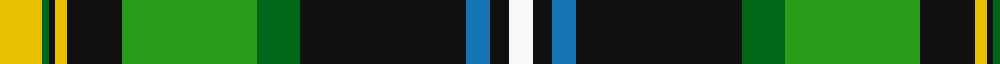

In pattern [WKBKGGKYKGY](/stripes/wkbkggkykgy/).

This was sourced from tartans-authority.  It is a [11 stripe tartan](/stripes/stripes11/).

Original link http://www.tartansauthority.com/tartan-ferret/display/6700/

## Attestations

This cloth appears in 2 source records; the oldest owns this page.

- pre 2005 — Gilhooley (Name) (tartans-authority, [record](http://www.tartansauthority.com/tartan-ferret/display/6700/))
- undated — Gilhooley (Personal) (register-of-tartans, [record](https://www.tartanregister.gov.uk/tartanDetails.aspx?ref=4893))

## Register references

External register numbers recorded for this tartan.

- Scottish Register of Tartans: [4893](https://www.tartanregister.gov.uk/tartanDetails.aspx?ref=4893)
- Scottish Tartans Authority (ITI): 6700
- Scottish Tartans World Register: 3041

## Thread count
Y/14 Ga2 K2 Y4 K18 G44 Ga14 K54 B8 K6 W/8

## Palette
Each colour and the base-6 reference it is a variant of.

| Colour | Shade | Base |
|---|---|---|
| B | <code style="background-color:#1474B4;">#1474B4</code> `oklch(54.0% 0.129 245.1)` <small>#1474B4</small> | B <code style="background-color:#2A418A;">#2A418A</code> |
| G | <code style="background-color:#289C18;">#289C18</code> `oklch(60.6% 0.191 141.6)` <small>#289C18</small> | G <code style="background-color:#006100;">#006100</code> |
| Ga | <code style="background-color:#006818;">#006818</code> `oklch(45.0% 0.142 145.0)` <small>#006818</small> | G <code style="background-color:#006100;">#006100</code> |
| K | <code style="background-color:#101010;">#101010</code> `oklch(17.3% 0.000 89.9)` <small>#101010</small> | K <code style="background-color:#000000;">#000000</code> |
| W | <code style="background-color:#F8F8F8;">#F8F8F8</code> `oklch(97.9% 0.000 89.9)` <small>#F8F8F8</small> | W <code style="background-color:#F7F7F7;">#F7F7F7</code> |
| Y | <code style="background-color:#E8C000;">#E8C000</code> `oklch(81.9% 0.168 93.7)` <small>#E8C000</small> | Y <code style="background-color:#F2BF00;">#F2BF00</code> |

## Nearest tartans

The nearest existing variants by ΔTartan distance, with this tartan at the top so the swatches line up against it.

ΔTartan

Tartan

Sett

—

<a href="/ttd/edit/#slug=ly7g1k1ly2k9g22g7k27b4k3w4~x2">Gilhooley (Name)</a> <a class="nn-out" href="/setts/s11/ly7g1k1ly2k9g22g7k27b4k3w4~x2/" title="open its dictionary page">↗</a>

0.78

<a href="/ttd/edit/#slug=lt11k2lt2k2ly2k11g30r2g3k1w5~x2">Labrador</a> <a class="nn-out" href="/setts/s11/lt11k2lt2k2ly2k11g30r2g3k1w5~x2/" title="open its dictionary page">↗</a>

0.84

<a href="/ttd/edit/#slug=g3dp2g25k6r2k6t20k1lb2~x2">Birch (Name)</a> <a class="nn-out" href="/setts/s9/g3dp2g25k6r2k6t20k1lb2~x2/" title="open its dictionary page">↗</a>

0.92

<a href="/ttd/edit/#slug=g5ly1r2g25k14db19w4g2~x2">Tooth</a> <a class="nn-out" href="/setts/s8/g5ly1r2g25k14db19w4g2~x2/" title="open its dictionary page">↗</a>

0.95

<a href="/ttd/edit/#slug=w2k4db16lo12g36k1k6lo2w2~x2">National Millennium (Commemorative)</a> <a class="nn-out" href="/setts/s9/w2k4db16lo12g36k1k6lo2w2~x2/" title="open its dictionary page">↗</a>

1.04

<a href="/ttd/edit/#slug=b4k1db28k16g10r2g10r4g10r2g10k1ly4~x2">California</a> <a class="nn-out" href="/setts/s13/b4k1db28k16g10r2g10r4g10r2g10k1ly4~x2/" title="open its dictionary page">↗</a>

1.05

<a href="/ttd/edit/#slug=g32w2g2ly3g2w2g2k16t2db16w3~x2">MacKellar</a> <a class="nn-out" href="/setts/s11/g32w2g2ly3g2w2g2k16t2db16w3~x2/" title="open its dictionary page">↗</a>

1.11

<a href="/ttd/edit/#slug=r4w6k10db5k3lo16k3g33k1w4~x2">Fermanagh County Crest (Fashion)</a> <a class="nn-out" href="/setts/s10/r4w6k10db5k3lo16k3g33k1w4~x2/" title="open its dictionary page">↗</a>

1.14

<a href="/ttd/edit/#slug=lb11k2lb2k2lo2k11dg30r2dg3k1w5~x2">Labrador (District)</a> <a class="nn-out" href="/setts/s11/lb11k2lb2k2lo2k11dg30r2dg3k1w5~x2/" title="open its dictionary page">↗</a>

1.16

<a href="/ttd/edit/#slug=k14r2k2r2k2g18r2g18lb1db12t1r8~x2">Princess Diana</a> <a class="nn-out" href="/setts/s12/k14r2k2r2k2g18r2g18lb1db12t1r8~x2/" title="open its dictionary page">↗</a>

1.22

<a href="/ttd/edit/#slug=k4g34ly1k18g3db18r3g3r3~x2">John.W.Mackay, Restricted</a> <a class="nn-out" href="/setts/s9/k4g34ly1k18g3db18r3g3r3~x2/" title="open its dictionary page">↗</a>

## Neighbour map

Every grey dot is one of 14299 variants placed by the first two principal components of the ΔTartan feature space (44% of its variance). Red is this tartan; blue dots are its nearest — click one to open its page.

<svg viewBox="0 0 640 380" role="img" style="max-width:100%;height:auto;border:1px solid #e0e0e0;border-radius:4px;display:block" xmlns="http://www.w3.org/2000/svg"><image href="/nn/cloud.v1.png" width="640" height="380"/><a href="/setts/s11/lt11k2lt2k2ly2k11g30r2g3k1w5~x2/"><circle cx="205.5" cy="71.5" r="4" fill="#3465a4"><title>Labrador</title></circle></a><a href="/setts/s9/g3dp2g25k6r2k6t20k1lb2~x2/"><circle cx="193.6" cy="102.0" r="4" fill="#3465a4"><title>Birch (Name)</title></circle></a><a href="/setts/s8/g5ly1r2g25k14db19w4g2~x2/"><circle cx="194.4" cy="120.7" r="4" fill="#3465a4"><title>Tooth</title></circle></a><a href="/setts/s9/w2k4db16lo12g36k1k6lo2w2~x2/"><circle cx="219.3" cy="86.0" r="4" fill="#3465a4"><title>National Millennium (Commemorative)</title></circle></a><a href="/setts/s13/b4k1db28k16g10r2g10r4g10r2g10k1ly4~x2/"><circle cx="163.0" cy="96.8" r="4" fill="#3465a4"><title>California</title></circle></a><a href="/setts/s11/g32w2g2ly3g2w2g2k16t2db16w3~x2/"><circle cx="186.8" cy="99.6" r="4" fill="#3465a4"><title>MacKellar</title></circle></a><a href="/setts/s10/r4w6k10db5k3lo16k3g33k1w4~x2/"><circle cx="176.0" cy="86.9" r="4" fill="#3465a4"><title>Fermanagh County Crest (Fashion)</title></circle></a><a href="/setts/s11/lb11k2lb2k2lo2k11dg30r2dg3k1w5~x2/"><circle cx="223.5" cy="78.1" r="4" fill="#3465a4"><title>Labrador (District)</title></circle></a><a href="/setts/s12/k14r2k2r2k2g18r2g18lb1db12t1r8~x2/"><circle cx="176.2" cy="117.6" r="4" fill="#3465a4"><title>Princess Diana</title></circle></a><a href="/setts/s9/k4g34ly1k18g3db18r3g3r3~x2/"><circle cx="245.6" cy="113.3" r="4" fill="#3465a4"><title>John.W.Mackay, Restricted</title></circle></a><circle cx="194.7" cy="92.9" r="5" fill="#c00000"/></svg>

ID: /setts/s11/ly7g1k1ly2k9g22g7k27b4k3w4~x2/
