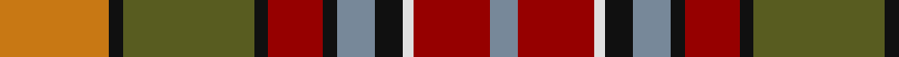

**Bands:** [RKGKRKBKWRB](/stripes/rkgkrkbkwrb/) · **Stripes:** [O K Y K R K T K W R T](/stripes/stripes11/) O K Y K R K T K W R T

This was sourced from register-of-tartans.  It is a [11 band tartan](/bands/bands11/).

Original link https://www.tartanregister.gov.uk/tartanDetails.aspx?ref=5918

## Register references

External register numbers recorded for this tartan.

- Scottish Register of Tartans: [5918](https://www.tartanregister.gov.uk/tartanDetails.aspx?ref=5918)
- Scottish Tartans World Register: 3087

## Thread count
O/40 K5 G48 K5 DR20 K5 N14 K10 LN4 DR28 N/10

## Palette
Each colour and its ΔE from the base-6 reference it is a variant of.

| Colour | Shade | Base | ΔE (OKLab) |
|---|---|---|---|
| DR | <code style="background-color:#960000;">#960000</code> `#960000` | R <code style="background-color:#CC0000;">#CC0000</code> | 0.12 |
| G | <code style="background-color:#585C20;">#585C20</code> `#585C20` | G <code style="background-color:#006100;">#006100</code> | 0.09 |
| K | <code style="background-color:#101010;">#101010</code> `#101010` | K <code style="background-color:#000000;">#000000</code> | 0.17 |
| LN | <code style="background-color:#E0E0E0;">#E0E0E0</code> `#E0E0E0` | W <code style="background-color:#F7F7F7;">#F7F7F7</code> | 0.07 |
| N | <code style="background-color:#778899;">#778899</code> `#778899` | B <code style="background-color:#2A418A;">#2A418A</code> | 0.24 |
| O | <code style="background-color:#C87814;">#C87814</code> `#C87814` | R <code style="background-color:#CC0000;">#CC0000</code> | 0.17 |

## Nearest tartans

The nearest existing variants by ΔTartan distance.

1. [Kildare County Crest (Fashion)](/setts/s11/lo40k5y48k5r20k5lr14k10w4r28lr10/) — ΔT 0.49
1. [Caledonian (WCWM)](/setts/s11/r4lb2r6k2r6do16lo2k12o10k2o1~x2/) — ΔT 1.12
1. [Leitrim, County](/setts/s10/lo3do2n18lb3o13lb4k3lb4do18lb3~x2/) — ΔT 1.14
1. [Brittany National Walking](/setts/s9/t4dy27lo8k4lo8k4lo8r11ly3~x2/) — ΔT 1.14
1. [Bridge of Weir Leather Co. (Corp)](/setts/s12/r3ly14y3ly3y3ly4y11dt11r11r11ly1dt1~x2/) — ΔT 1.15
1. [Bruce of Kinnaird (Vivienne Westwood Design)](/setts/s10/dy22y22dr2lb6dr2lo2dr16g5dy8lb2~x2/) — ΔT 1.16
1. [Fitzsimmons Red (Name)](/setts/s10/dy3y2lo18k4r15k4dy6k4lo2y3~x2/) — ΔT 1.22
1. [Goddin mab Gododdin (Personal)](/setts/s8/r4lo3dt24dy26g3lo21dp2lo4~x2/) — ΔT 1.33
1. [MacPherson #9](/setts/s15/r13lr4r13dg28lr3dy26lr10dy2dy2dy2lr10r14lr4dy4r4~x2/) — ΔT 1.33
1. [MacCullough Family Tartan Tartan Number: 3214. Earliest known date: 2000 I would like to let you know that working with Peter MacDonald, he designed a tartan for me that was registered with the Scottish Tartan Authority on 5 December 2000 See products available Copyright © Blair Urquhart, Comrie, 2015](/setts/s11/o5k3w2r20db10g2w1r1g20k4o3~x2/) — ΔT 1.34

## Neighbour map

Every grey dot is one of 14299 variants placed by the first two principal components of the ΔTartan feature space (44% of its variance). Red is this tartan; blue dots are its nearest — click one to open its page.

<svg viewBox="0 0 640 380" role="img" style="max-width:100%;height:auto;border:1px solid #e0e0e0;border-radius:4px;display:block" xmlns="http://www.w3.org/2000/svg"><image href="/nn/cloud.v1.png" width="640" height="380"/><a href="/setts/s11/lo40k5y48k5r20k5lr14k10w4r28lr10/"><circle cx="96.7" cy="137.7" r="4" fill="#3465a4"><title>Kildare County Crest (Fashion)</title></circle></a><a href="/setts/s11/r4lb2r6k2r6do16lo2k12o10k2o1~x2/"><circle cx="125.4" cy="141.2" r="4" fill="#3465a4"><title>Caledonian (WCWM)</title></circle></a><a href="/setts/s10/lo3do2n18lb3o13lb4k3lb4do18lb3~x2/"><circle cx="114.6" cy="157.0" r="4" fill="#3465a4"><title>Leitrim, County</title></circle></a><a href="/setts/s9/t4dy27lo8k4lo8k4lo8r11ly3~x2/"><circle cx="152.5" cy="169.8" r="4" fill="#3465a4"><title>Brittany National Walking</title></circle></a><a href="/setts/s12/r3ly14y3ly3y3ly4y11dt11r11r11ly1dt1~x2/"><circle cx="136.1" cy="156.8" r="4" fill="#3465a4"><title>Bridge of Weir Leather Co. (Corp)</title></circle></a><a href="/setts/s10/dy22y22dr2lb6dr2lo2dr16g5dy8lb2~x2/"><circle cx="170.3" cy="160.0" r="4" fill="#3465a4"><title>Bruce of Kinnaird (Vivienne Westwood Design)</title></circle></a><a href="/setts/s10/dy3y2lo18k4r15k4dy6k4lo2y3~x2/"><circle cx="156.5" cy="174.7" r="4" fill="#3465a4"><title>Fitzsimmons Red (Name)</title></circle></a><a href="/setts/s8/r4lo3dt24dy26g3lo21dp2lo4~x2/"><circle cx="175.5" cy="159.9" r="4" fill="#3465a4"><title>Goddin mab Gododdin (Personal)</title></circle></a><a href="/setts/s15/r13lr4r13dg28lr3dy26lr10dy2dy2dy2lr10r14lr4dy4r4~x2/"><circle cx="162.7" cy="140.7" r="4" fill="#3465a4"><title>MacPherson #9</title></circle></a><a href="/setts/s11/o5k3w2r20db10g2w1r1g20k4o3~x2/"><circle cx="150.5" cy="103.8" r="4" fill="#3465a4"><title>MacCullough Family Tartan Tartan Number: 3214. Earliest known date: 2000 I would like to let you know that working with Peter MacDonald, he designed a tartan for me that was registered with the Scottish Tartan Authority on 5 December 2000 See products available Copyright © Blair Urquhart, Comrie, 2015</title></circle></a><circle cx="109.3" cy="142.9" r="5" fill="#c00000"/></svg>

ID: /setts/s11/o40k5y48k5r20k5t14k10w4r28t10/
