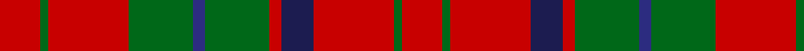

In pattern [RGRBRGBGRGR](/stripes/rgrbrgbgrgr/).

This was sourced from tartans-authority.  It is a [11 stripe tartan](/stripes/stripes11/).

Original link http://www.tartansauthority.com/tartan-ferret/display/7896/

## Thread count
R/20 G4 R40 G32 DB6 G32 R6 DBa16 R40 G4 R/20

## Palette
Each colour and its ΔE from the base-6 reference it is a variant of.

| Colour | Shade | Base | ΔE (OKLab) |
|---|---|---|---|
| DB | <code style="background-color:#2C2C80;">#2C2C80</code> `#2C2C80` | B <code style="background-color:#2A418A;">#2A418A</code> | 0.06 |
| DBa | <code style="background-color:#1C1C50;">#1C1C50</code> `#1C1C50` | B <code style="background-color:#2A418A;">#2A418A</code> | 0.14 |
| G | <code style="background-color:#006818;">#006818</code> `#006818` | G <code style="background-color:#006100;">#006100</code> | 0.02 |
| R | <code style="background-color:#C80000;">#C80000</code> `#C80000` | R <code style="background-color:#CC0000;">#CC0000</code> | 0.01 |

## Nearest tartans

The nearest existing variants by ΔTartan distance.

1. [Nicolson (McIan)](/setts/s12/r6g1r6k4r1t1r1g8r6k1r6g1~x6/) — ΔT 0.78
1. [Bruce (Vestiarium)](/setts/s11/w1r8g2r2g6r1g6r2g2r8ly1~x4/) — ΔT 0.85
1. [Morrison](/setts/s9/g5w2g8r9k3r4k3r17g3~x2/) — ΔT 0.89
1. [Bruce](/setts/s11/lr1r8dg2r2dg6r1dg6r2dg2r8ly1~x2/) — ΔT 0.93
1. [Burns 1930](/setts/s12/r2g2r2g8r2g2r2db2r11ly1r4ly1~x4/) — ΔT 0.96
1. [MacQuarrie Ancient](/setts/s12/r2db1r10k4r2dg8r2dg8r7k1r2db1~x2/) — ΔT 0.97
1. [Burns](/setts/s12/r3g3r3g14r3g3r3db5r18ly2r8ly2~x2/) — ΔT 1.02
1. [Morrison Ancient](/setts/s10/dg6w3dg12r12k4r6k4r24dg4r6/) — ΔT 1.09
1. [Cameron of Lochiel](/setts/s9/r6g3r6db1w1db1r2db8r4~x2/) — ΔT 1.13
1. [Bruce](/setts/s10/r8dg2r2dg6r1dg6r2dg2r8ly1/) — ΔT 1.14

## Neighbour map

Every grey dot is one of 14299 variants placed by the first two principal components of the ΔTartan feature space (44% of its variance). Red is this tartan; blue dots are its nearest — click one to open its page.

<svg viewBox="0 0 640 380" role="img" style="max-width:100%;height:auto;border:1px solid #e0e0e0;border-radius:4px;display:block" xmlns="http://www.w3.org/2000/svg"><image href="/nn/cloud.v1.png" width="640" height="380"/><a href="/setts/s12/r6g1r6k4r1t1r1g8r6k1r6g1~x6/"><circle cx="328.6" cy="190.1" r="4" fill="#3465a4"><title>Nicolson (McIan)</title></circle></a><a href="/setts/s11/w1r8g2r2g6r1g6r2g2r8ly1~x4/"><circle cx="304.8" cy="195.4" r="4" fill="#3465a4"><title>Bruce (Vestiarium)</title></circle></a><a href="/setts/s9/g5w2g8r9k3r4k3r17g3~x2/"><circle cx="286.1" cy="194.9" r="4" fill="#3465a4"><title>Morrison</title></circle></a><a href="/setts/s11/lr1r8dg2r2dg6r1dg6r2dg2r8ly1~x2/"><circle cx="327.4" cy="211.0" r="4" fill="#3465a4"><title>Bruce</title></circle></a><a href="/setts/s12/r2g2r2g8r2g2r2db2r11ly1r4ly1~x4/"><circle cx="342.4" cy="166.6" r="4" fill="#3465a4"><title>Burns 1930</title></circle></a><a href="/setts/s12/r2db1r10k4r2dg8r2dg8r7k1r2db1~x2/"><circle cx="276.1" cy="175.4" r="4" fill="#3465a4"><title>MacQuarrie Ancient</title></circle></a><a href="/setts/s12/r3g3r3g14r3g3r3db5r18ly2r8ly2~x2/"><circle cx="310.9" cy="173.3" r="4" fill="#3465a4"><title>Burns</title></circle></a><a href="/setts/s10/dg6w3dg12r12k4r6k4r24dg4r6/"><circle cx="301.3" cy="186.8" r="4" fill="#3465a4"><title>Morrison Ancient</title></circle></a><a href="/setts/s9/r6g3r6db1w1db1r2db8r4~x2/"><circle cx="300.7" cy="209.2" r="4" fill="#3465a4"><title>Cameron of Lochiel</title></circle></a><a href="/setts/s10/r8dg2r2dg6r1dg6r2dg2r8ly1/"><circle cx="334.7" cy="221.2" r="4" fill="#3465a4"><title>Bruce</title></circle></a><circle cx="316.2" cy="198.3" r="5" fill="#c00000"/></svg>

ID: /setts/s11/r10g2r20g16db3g16r3db8r20g2r10~x2/
