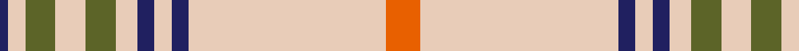

In pattern [BWGWGWBWBWR](/patterns/bwgwgwbwbwr/).

This was sourced from tartans-authority.  It is a [11 stripes tartan](/stripes/stripes11/).

Original link http://www.tartansauthority.com/tartan-ferret/display/8893/

## Thread count
DB/4 LR8 G14 LR14 G14 LR10 DB8 LR8 DB8 LR92 O/16

## Palette
Each colour and its ΔE from the base-6 reference it is a variant of.

| Colour | Shade | Base | ΔE (OKLab) |
|---|---|---|---|
| DB | <code style="background-color:#202060;">#202060</code> `#202060` | B <code style="background-color:#2C4084;">#2C4084</code> | 0.11 |
| G | <code style="background-color:#5C6428;">#5C6428</code> `#5C6428` | G <code style="background-color:#006400;">#006400</code> | 0.09 |
| LR | <code style="background-color:#E8CCB8;">#E8CCB8</code> `#E8CCB8` | W <code style="background-color:#F4F4F0;">#F4F4F0</code> | 0.11 |
| O | <code style="background-color:#E86000;">#E86000</code> `#E86000` | R <code style="background-color:#C80000;">#C80000</code> | 0.14 |

## Nearest tartans

The nearest existing variants by ΔTartan distance.

1. [Loch Skene (Fashion)](/setts/s10/w96g30y4g6w4g6ya24w16g4w12-g604000-we8ccb8-yfcb464-yaa08858/) — ΔT 0.68
1. [Anthony Plaid Ecru](/setts/s9/y72k4ya12k4y8r8k8r8y8-k101010-r880000-yb8b8b8-yae8c000/) — ΔT 0.88
1. [Elvan](/setts/s11/y84g20b4g4w4g4y20w12g4w6y4-b00008c-g604000-wc8c8c8-yd8c0a4/) — ΔT 0.88
1. [Rothesay, Dress (VS)](/setts/s10/r4w56b8w4k12w4r8k2r4w2-b2c2c80-k101010-rc80000-we0e0e0/) — ΔT 1.26
1. [Glen Moy Tartan Tartan Number: 1293. Earliest known date: pre 1986 A colour variation of the Royal Stewart woven by Edgars, Pitlochry around 1986, named after the place in Angus described as follows: Its mainly Sheep farming in Glen Moy. Off the beaten track, its a very quiet area of the Angus glens close to Cortachy castle and great for walking if you like it to yourself! See products available Copyright © Blair Urquhart, Comrie, 2015](/setts/s12/w98b12k16wa5k5wa5k5b28w16k5w16wa6-b5c5c5c-k101010-wc0c0c0-wae0e0e0/) — ΔT 1.44
1. [Grant of Acharrow](/setts/s12/w18r8w80g18b2w6k6w40r36g8r12w6-b304080-g30a010-k000000-rd03030-we0e0e0/) — ΔT 1.47
1. [London Fog Camel (Fashion)](/setts/s12/y144k9y13w9y4k9y4b13w13y4w13k4-b2888c4-k101010-wd4d4c4-yccc0a4/) — ΔT 1.55
1. [Ivanka Trump (Personal)](/setts/s15/r24w4k8w8k2w48r4w4r4w4b2w2ra6k4w24-b2888c4-k101010-re87878-ra9c68a4-wf8f8f8/) — ΔT 1.57
1. [Glen Moy](/setts/s12/w98g12k16wa5k5wa5k5g28w16k5w16wa6-g808080-k000000-wc0c0c0-wae0e0e0/) — ΔT 1.58
1. [Stuart/Stewart variant #2](/setts/s11/w92g10w2k6w2k10g8r12g4r8w4-g005020-k101010-rdc0000-we0e0e0/) — ΔT 1.60

## Neighbour map

Every grey dot is one of 15726 variants placed by the first two principal components of the ΔTartan feature space (44% of its variance). Red is this tartan; blue dots are its nearest — click one to open its page.

<svg viewBox="0 0 640 380" role="img" style="max-width:100%;height:auto;border:1px solid #e0e0e0;border-radius:4px;display:block" xmlns="http://www.w3.org/2000/svg"><image href="/nn/cloud.v1.png" width="640" height="380"/><a href="/setts/s10/w96g30y4g6w4g6ya24w16g4w12-g604000-we8ccb8-yfcb464-yaa08858/"><circle cx="388.6" cy="108.9" r="4" fill="#3465a4"><title>Loch Skene (Fashion)</title></circle></a><a href="/setts/s9/y72k4ya12k4y8r8k8r8y8-k101010-r880000-yb8b8b8-yae8c000/"><circle cx="382.2" cy="117.5" r="4" fill="#3465a4"><title>Anthony Plaid Ecru</title></circle></a><a href="/setts/s11/y84g20b4g4w4g4y20w12g4w6y4-b00008c-g604000-wc8c8c8-yd8c0a4/"><circle cx="407.0" cy="107.2" r="4" fill="#3465a4"><title>Elvan</title></circle></a><a href="/setts/s10/r4w56b8w4k12w4r8k2r4w2-b2c2c80-k101010-rc80000-we0e0e0/"><circle cx="360.6" cy="81.1" r="4" fill="#3465a4"><title>Rothesay, Dress (VS)</title></circle></a><a href="/setts/s12/w98b12k16wa5k5wa5k5b28w16k5w16wa6-b5c5c5c-k101010-wc0c0c0-wae0e0e0/"><circle cx="328.2" cy="102.3" r="4" fill="#3465a4"><title>Glen Moy Tartan Tartan Number: 1293. Earliest known date: pre 1986 A colour variation of the Royal Stewart woven by Edgars, Pitlochry around 1986, named after the place in Angus described as follows: Its mainly Sheep farming in Glen Moy. Off the beaten track, its a very quiet area of the Angus glens close to Cortachy castle and great for walking if you like it to yourself! See products available Copyright © Blair Urquhart, Comrie, 2015</title></circle></a><a href="/setts/s12/w18r8w80g18b2w6k6w40r36g8r12w6-b304080-g30a010-k000000-rd03030-we0e0e0/"><circle cx="347.5" cy="72.9" r="4" fill="#3465a4"><title>Grant of Acharrow</title></circle></a><a href="/setts/s12/y144k9y13w9y4k9y4b13w13y4w13k4-b2888c4-k101010-wd4d4c4-yccc0a4/"><circle cx="471.2" cy="71.4" r="4" fill="#3465a4"><title>London Fog Camel (Fashion)</title></circle></a><a href="/setts/s15/r24w4k8w8k2w48r4w4r4w4b2w2ra6k4w24-b2888c4-k101010-re87878-ra9c68a4-wf8f8f8/"><circle cx="327.1" cy="64.3" r="4" fill="#3465a4"><title>Ivanka Trump (Personal)</title></circle></a><a href="/setts/s12/w98g12k16wa5k5wa5k5g28w16k5w16wa6-g808080-k000000-wc0c0c0-wae0e0e0/"><circle cx="316.7" cy="97.8" r="4" fill="#3465a4"><title>Glen Moy</title></circle></a><a href="/setts/s11/w92g10w2k6w2k10g8r12g4r8w4-g005020-k101010-rdc0000-we0e0e0/"><circle cx="383.7" cy="51.5" r="4" fill="#3465a4"><title>Stuart/Stewart variant #2</title></circle></a><circle cx="395.8" cy="102.1" r="5" fill="#c00000"/></svg>

ID: /setts/s11/r16w92b8w8b8w10g14w14g14w8b4-b202060-g5c6428-re86000-we8ccb8/
