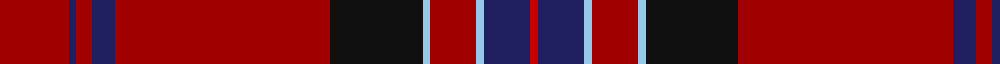

In pattern [RBRBRKWRWBR](/patterns/rbrbrkwrwbr/).

This was sourced from tartans-authority.  It is a [11 stripes tartan](/stripes/stripes11/).

Original link http://www.tartansauthority.com/tartan-ferret/display/11281/

## Thread count
DR/18 DB2 DR4 DB6 DR56 K24 LB2 DR12 LB2 DB12 R/2

## Palette
Each colour and its ΔE from the base-6 reference it is a variant of.

| Colour | Shade | Base | ΔE (OKLab) |
|---|---|---|---|
| DB | <code style="background-color:#202060;">#202060</code> `#202060` | B <code style="background-color:#2C4084;">#2C4084</code> | 0.11 |
| DR | <code style="background-color:#A00000;">#A00000</code> `#A00000` | R <code style="background-color:#C80000;">#C80000</code> | 0.09 |
| K | <code style="background-color:#101010;">#101010</code> `#101010` | K <code style="background-color:#000000;">#000000</code> | 0.17 |
| LB | <code style="background-color:#98C8E8;">#98C8E8</code> `#98C8E8` | W <code style="background-color:#F4F4F0;">#F4F4F0</code> | 0.17 |
| R | <code style="background-color:#C80000;">#C80000</code> `#C80000` | R <code style="background-color:#C80000;">#C80000</code> | 0.00 |

## Nearest tartans

The nearest existing variants by ΔTartan distance.

1. [New York Caledonian Club Dress](/setts/s11/r18b2r4b6r56k24w2r12w2b12ra2-b1c1c50-k101010-r960028-radc0000-w98c8e8/) — ΔT 0.50
1. [Mair Family Tartan Tartan Number: 1406. Earliest known date: 1985 Based on an unnamed tartan from South Uist, the yellow represents the gold and red of the original sett form the colours of the 'Mair' coat of arms registered with Lord Lyon. Head of the family, Duine Usail, Robert George Alexander Mair esq. F.S.A. Scot, Sunshine, Melbourne, Victoria, Australia. He is the son of Alexander Smith Mair who arrived in Australia in 1924 from Govan, Glasgow. See products available Copyright © Blair Urquhart, Comrie, 2015](/setts/s12/r46g6y2g6r4b36r4w2g6r4b4r46-b2c2c80-g006818-rc80000-we0e0e0-ye8c000/) — ΔT 0.95
1. [Mair (Personal)](/setts/s12/r46g6y2g6r4b36r4w2g6r4b4r46-b2c2c80-g006818-rc80000-wfcfcfc-yd8b000/) — ΔT 0.96
1. [Mair](/setts/s12/r46g6y2g6r4b36r4w2g6r4b4r46-b304080-g008000-rc00000-we0e0e0-yf0c000/) — ΔT 0.98
1. [Chang-Miller (Personal)](/setts/s10/r46b4r2ra4r2b4r8b20k4y4-b000048-k000000-ra00000-rab84c00-yd87c00/) — ΔT 1.08
1. [Seton](/setts/s10/g12y2g24r8b8r4k8r64g2r4-b000052-g11450d-k000000-raa0000-yaaaaaa/) — ΔT 1.09
1. [Motherwell Football Club 1991](/setts/s10/r12y2r12k6r24k30ra2r60k2w4-k101010-r880000-rae87878-we0e0e0-ye8c000/) — ΔT 1.09
1. [Methodist Church](/setts/s12/r12g4r4g6k4r4b32k6g8r68y4r4-b1c1c50-g285800-k101010-rb00000-ybc8c00/) — ΔT 1.17
1. [Stewart/Stuart of Rothesay (Sobieski)](/setts/s11/g4r52b8r4k8r4g16r8k2r2w4-b202060-g003820-k101010-rc80000-wfcfcfc/) — ΔT 1.20
1. [Tyrone Irish County Tartan Tartan Number: 2264. Earliest known date: 1993 One of a series of Irish District tartans designed by Polly Wittering of the House of Edgar, with colours reminiscent of the Country with soft warm colours dominating. See products available Copyright © Blair Urquhart, Comrie, 2015](/setts/s12/b100r12ba14g4ba4y4ba4r28b16ba4b18g6-b5c0014-ba28200c-g005448-r9c7c28-yc4c4a4/) — ΔT 1.20

## Neighbour map

Every grey dot is one of 15726 variants placed by the first two principal components of the ΔTartan feature space (44% of its variance). Red is this tartan; blue dots are its nearest — click one to open its page.

<svg viewBox="0 0 640 380" role="img" style="max-width:100%;height:auto;border:1px solid #e0e0e0;border-radius:4px;display:block" xmlns="http://www.w3.org/2000/svg"><image href="/nn/cloud.v1.png" width="640" height="380"/><a href="/setts/s11/r18b2r4b6r56k24w2r12w2b12ra2-b1c1c50-k101010-r960028-radc0000-w98c8e8/"><circle cx="424.3" cy="114.6" r="4" fill="#3465a4"><title>New York Caledonian Club Dress</title></circle></a><a href="/setts/s12/r46g6y2g6r4b36r4w2g6r4b4r46-b2c2c80-g006818-rc80000-we0e0e0-ye8c000/"><circle cx="390.1" cy="102.7" r="4" fill="#3465a4"><title>Mair Family Tartan Tartan Number: 1406. Earliest known date: 1985 Based on an unnamed tartan from South Uist, the yellow represents the gold and red of the original sett form the colours of the 'Mair' coat of arms registered with Lord Lyon. Head of the family, Duine Usail, Robert George Alexander Mair esq. F.S.A. Scot, Sunshine, Melbourne, Victoria, Australia. He is the son of Alexander Smith Mair who arrived in Australia in 1924 from Govan, Glasgow. See products available Copyright © Blair Urquhart, Comrie, 2015</title></circle></a><a href="/setts/s12/r46g6y2g6r4b36r4w2g6r4b4r46-b2c2c80-g006818-rc80000-wfcfcfc-yd8b000/"><circle cx="389.1" cy="102.3" r="4" fill="#3465a4"><title>Mair (Personal)</title></circle></a><a href="/setts/s12/r46g6y2g6r4b36r4w2g6r4b4r46-b304080-g008000-rc00000-we0e0e0-yf0c000/"><circle cx="397.4" cy="106.9" r="4" fill="#3465a4"><title>Mair</title></circle></a><a href="/setts/s10/r46b4r2ra4r2b4r8b20k4y4-b000048-k000000-ra00000-rab84c00-yd87c00/"><circle cx="368.0" cy="106.0" r="4" fill="#3465a4"><title>Chang-Miller (Personal)</title></circle></a><a href="/setts/s10/g12y2g24r8b8r4k8r64g2r4-b000052-g11450d-k000000-raa0000-yaaaaaa/"><circle cx="385.3" cy="100.6" r="4" fill="#3465a4"><title>Seton</title></circle></a><a href="/setts/s10/r12y2r12k6r24k30ra2r60k2w4-k101010-r880000-rae87878-we0e0e0-ye8c000/"><circle cx="471.0" cy="120.9" r="4" fill="#3465a4"><title>Motherwell Football Club 1991</title></circle></a><a href="/setts/s12/r12g4r4g6k4r4b32k6g8r68y4r4-b1c1c50-g285800-k101010-rb00000-ybc8c00/"><circle cx="367.2" cy="112.1" r="4" fill="#3465a4"><title>Methodist Church</title></circle></a><a href="/setts/s11/g4r52b8r4k8r4g16r8k2r2w4-b202060-g003820-k101010-rc80000-wfcfcfc/"><circle cx="378.4" cy="88.6" r="4" fill="#3465a4"><title>Stewart/Stuart of Rothesay (Sobieski)</title></circle></a><a href="/setts/s12/b100r12ba14g4ba4y4ba4r28b16ba4b18g6-b5c0014-ba28200c-g005448-r9c7c28-yc4c4a4/"><circle cx="422.1" cy="110.3" r="4" fill="#3465a4"><title>Tyrone Irish County Tartan Tartan Number: 2264. Earliest known date: 1993 One of a series of Irish District tartans designed by Polly Wittering of the House of Edgar, with colours reminiscent of the Country with soft warm colours dominating. See products available Copyright © Blair Urquhart, Comrie, 2015</title></circle></a><circle cx="417.2" cy="110.3" r="5" fill="#c00000"/></svg>

ID: /setts/s11/r18b2r4b6r56k24w2r12w2b12ra2-b202060-k101010-ra00000-rac80000-w98c8e8/
