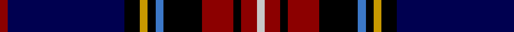

In pattern [RBKYKBKRKRW](/patterns/rbkykbkrkrw/).

This was sourced from register-of-tartans.  It is a [11 stripes tartan](/stripes/stripes11/).

Original link https://www.tartanregister.gov.uk/tartanDetails.aspx?ref=1398

## Attestations

This cloth appears in 2 source records; the oldest owns this page.

- 01/01/1985 — Glen Stewart (register-of-tartans, [record](https://www.tartanregister.gov.uk/tartanDetails.aspx?ref=1398))
- 1985 — Glen Stewart (Fashion) (tartans-authority, [record](http://www.tartansauthority.com/tartan-ferret/display/5025/))

## Thread count
DR/4 DB60 K8 DY4 K4 B4 K20 DR16 K4 DR8 N/4

## Palette
Each colour and its ΔE from the base-6 reference it is a variant of.

| Colour | Shade | Base | ΔE (OKLab) |
|---|---|---|---|
| B | <code style="background-color:#3C78C8;">#3C78C8</code> `#3C78C8` | B <code style="background-color:#2A418A;">#2A418A</code> | 0.17 |
| DB | <code style="background-color:#000050;">#000050</code> `#000050` | B <code style="background-color:#2A418A;">#2A418A</code> | 0.21 |
| DR | <code style="background-color:#8C0000;">#8C0000</code> `#8C0000` | R <code style="background-color:#CC0000;">#CC0000</code> | 0.14 |
| DY | <code style="background-color:#C89800;">#C89800</code> `#C89800` | Y <code style="background-color:#F2BF00;">#F2BF00</code> | 0.12 |
| K | <code style="background-color:#000000;">#000000</code> `#000000` | K <code style="background-color:#000000;">#000000</code> | 0.00 |
| N | <code style="background-color:#C8C8C8;">#C8C8C8</code> `#C8C8C8` | W <code style="background-color:#F7F7F7;">#F7F7F7</code> | 0.14 |

## Nearest tartans

The nearest existing variants by ΔTartan distance.

1. [Heart of Oak](/setts/s10/b3g3w1k25ba25k2ba2g1r3w2x2~b440044-ba000064-g006400-k101010-rdc0000-wffffff/) — ΔT 1.25
1. [Scottish Spirit](/setts/s12/b9r3b32ba12k5ba2k4ba2k17bb4k2w2x2~b505050-ba646464-bb9058d8-k000000-r781c38-wc8c8c8/) — ΔT 1.27
1. [Scottish Hockey Union (Sports)](/setts/s11/b50k10b6k10b6g5w5g5ba8g23wa5x2~b202060-ba944090-g004c00-k000000-wc49cd8-wafcfcfc/) — ΔT 1.30
1. [Héritage Séquane](/setts/s12/b5r2y7r2b42g28k5b10k15g5w3r3~b2b0064-g004a2f-k101010-raf011c-wffffff-yd5aa02/) — ΔT 1.30
1. [St Andrews Golf Club](/setts/s9/r1g3b1g5k1g1k9ba12w1x4~b5c8898-ba141c50-g40584c-k000000-rec5c28-we0e0d8/) — ΔT 1.34
1. [Astrobiology](/setts/s15/k23b1g1r3b2r1b12y1k1w1k6b4g2k2g3x2~b1c0070-g00643c-k101010-rff0000-wffffff-yffff00/) — ΔT 1.35
1. [Broager (Name)](/setts/s12/b53g10k20y5k5w5k7r18b10k6b6w6~b1c0070-g006818-k101010-rc80000-wf8f8f8-ye8c000/) — ΔT 1.38
1. [Fitzgerald Hunting](/setts/s10/r2ra3k16b4r2b4ka36ba3ka3w2x2~b0000dc-ba306084-k001c04-ka000030-rc80000-rae02cb8-wfcfcfc/) — ΔT 1.43
1. [United Arrows House Check](/setts/s9/b40r4k16w3g8ra4g3ra8k10x2~b1c0070-g603800-k101010-rc80000-ra880000-wfcfcfc/) — ΔT 1.44
1. [Sidey (Dundee) Dress (Personal)](/setts/s10/b4w1k2b25k12ba1k2r16k2y1x2~b000080-ba0000cd-k101010-rff0000-wffffff-yffa500/) — ΔT 1.47

## Neighbour map

Every grey dot is one of 15726 variants placed by the first two principal components of the ΔTartan feature space (44% of its variance). Red is this tartan; blue dots are its nearest — click one to open its page.

<svg viewBox="0 0 640 380" role="img" style="max-width:100%;height:auto;border:1px solid #e0e0e0;border-radius:4px;display:block" xmlns="http://www.w3.org/2000/svg"><image href="/nn/cloud.v1.png" width="640" height="380"/><a href="/setts/s10/b3g3w1k25ba25k2ba2g1r3w2x2~b440044-ba000064-g006400-k101010-rdc0000-wffffff/"><circle cx="245.0" cy="101.7" r="4" fill="#3465a4"><title>Heart of Oak</title></circle></a><a href="/setts/s12/b9r3b32ba12k5ba2k4ba2k17bb4k2w2x2~b505050-ba646464-bb9058d8-k000000-r781c38-wc8c8c8/"><circle cx="201.1" cy="113.6" r="4" fill="#3465a4"><title>Scottish Spirit</title></circle></a><a href="/setts/s11/b50k10b6k10b6g5w5g5ba8g23wa5x2~b202060-ba944090-g004c00-k000000-wc49cd8-wafcfcfc/"><circle cx="188.8" cy="137.8" r="4" fill="#3465a4"><title>Scottish Hockey Union (Sports)</title></circle></a><a href="/setts/s12/b5r2y7r2b42g28k5b10k15g5w3r3~b2b0064-g004a2f-k101010-raf011c-wffffff-yd5aa02/"><circle cx="227.2" cy="108.8" r="4" fill="#3465a4"><title>Héritage Séquane</title></circle></a><a href="/setts/s9/r1g3b1g5k1g1k9ba12w1x4~b5c8898-ba141c50-g40584c-k000000-rec5c28-we0e0d8/"><circle cx="154.1" cy="144.0" r="4" fill="#3465a4"><title>St Andrews Golf Club</title></circle></a><a href="/setts/s15/k23b1g1r3b2r1b12y1k1w1k6b4g2k2g3x2~b1c0070-g00643c-k101010-rff0000-wffffff-yffff00/"><circle cx="277.6" cy="85.5" r="4" fill="#3465a4"><title>Astrobiology</title></circle></a><a href="/setts/s12/b53g10k20y5k5w5k7r18b10k6b6w6~b1c0070-g006818-k101010-rc80000-wf8f8f8-ye8c000/"><circle cx="170.4" cy="123.7" r="4" fill="#3465a4"><title>Broager (Name)</title></circle></a><a href="/setts/s10/r2ra3k16b4r2b4ka36ba3ka3w2x2~b0000dc-ba306084-k001c04-ka000030-rc80000-rae02cb8-wfcfcfc/"><circle cx="244.8" cy="95.3" r="4" fill="#3465a4"><title>Fitzgerald Hunting</title></circle></a><a href="/setts/s9/b40r4k16w3g8ra4g3ra8k10x2~b1c0070-g603800-k101010-rc80000-ra880000-wfcfcfc/"><circle cx="204.0" cy="143.0" r="4" fill="#3465a4"><title>United Arrows House Check</title></circle></a><a href="/setts/s10/b4w1k2b25k12ba1k2r16k2y1x2~b000080-ba0000cd-k101010-rff0000-wffffff-yffa500/"><circle cx="223.7" cy="90.9" r="4" fill="#3465a4"><title>Sidey (Dundee) Dress (Personal)</title></circle></a><circle cx="214.2" cy="111.8" r="5" fill="#c00000"/></svg>

ID: /setts/s11/r1b15k2y1k1ba1k5r4k1r2w1x4~b000050-ba3c78c8-k000000-r8c0000-wc8c8c8-yc89800/
