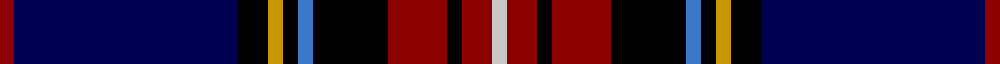

In pattern [RBKYKBKRKRW](/stripes/rbkykbkrkrw/).

This was sourced from register-of-tartans.  It is a [11 stripe tartan](/stripes/stripes11/).

Original link https://www.tartanregister.gov.uk/tartanDetails.aspx?ref=1398

## Attestations

This cloth appears in 2 source records; the oldest owns this page.

- 01/01/1985 — Glen Stewart (register-of-tartans, [record](https://www.tartanregister.gov.uk/tartanDetails.aspx?ref=1398))
- 1985 — Glen Stewart (Fashion) (tartans-authority, [record](http://www.tartansauthority.com/tartan-ferret/display/5025/))

## Register references

External register numbers recorded for this tartan.

- Scottish Register of Tartans: [1398](https://www.tartanregister.gov.uk/tartanDetails.aspx?ref=1398)
- Scottish Tartans Authority (ITI): 5025

## Thread count
DR/4 DB60 K8 DY4 K4 B4 K20 DR16 K4 DR8 N/4

## Palette
Each colour and the base-6 reference it is a variant of.

| Colour | Shade | Base |
|---|---|---|
| B | <code style="background-color:#3C78C8;">#3C78C8</code> `oklch(57.2% 0.139 256.5)` <small>#3C78C8</small> | B <code style="background-color:#2A418A;">#2A418A</code> |
| DB | <code style="background-color:#000050;">#000050</code> `oklch(19.5% 0.135 264.1)` <small>#000050</small> | B <code style="background-color:#2A418A;">#2A418A</code> |
| DR | <code style="background-color:#8C0000;">#8C0000</code> `oklch(40.2% 0.165 29.2)` <small>#8C0000</small> | R <code style="background-color:#CC0000;">#CC0000</code> |
| DY | <code style="background-color:#C89800;">#C89800</code> `oklch(70.6% 0.144 85.9)` <small>#C89800</small> | Y <code style="background-color:#F2BF00;">#F2BF00</code> |
| K | <code style="background-color:#000000;">#000000</code> `oklch(0.0% 0.000 0.0)` <small>#000000</small> | K <code style="background-color:#000000;">#000000</code> |
| N | <code style="background-color:#C8C8C8;">#C8C8C8</code> `oklch(83.3% 0.000 89.9)` <small>#C8C8C8</small> | W <code style="background-color:#F7F7F7;">#F7F7F7</code> |

## Nearest tartans

The nearest existing variants by ΔTartan distance, with this tartan at the top so the swatches line up against it.

ΔTartan

Tartan

Sett

—

<a href="/ttd/edit/#slug=r1db15k2ly1k1b1k5r4k1r2lb1~x4">Glen Stewart</a> <a class="nn-out" href="/setts/s11/r1db15k2ly1k1b1k5r4k1r2lb1~x4/" title="open its dictionary page">↗</a>

1.25

<a href="/ttd/edit/#slug=dp3g3w1k25db25k2db2g1r3w2~x2">Heart of Oak</a> <a class="nn-out" href="/setts/s10/dp3g3w1k25db25k2db2g1r3w2~x2/" title="open its dictionary page">↗</a>

1.27

<a href="/ttd/edit/#slug=n9m3n32n12k5n2k4n2k17p4k2lb2~x2">Scottish Spirit</a> <a class="nn-out" href="/setts/s12/n9m3n32n12k5n2k4n2k17p4k2lb2~x2/" title="open its dictionary page">↗</a>

1.30

<a href="/ttd/edit/#slug=db5r2ly7r2db42dg28k5db10k15dg5w3r3">Héritage Séquane</a> <a class="nn-out" href="/setts/s12/db5r2ly7r2db42dg28k5db10k15dg5w3r3/" title="open its dictionary page">↗</a>

1.31

<a href="/ttd/edit/#slug=db50k10db6k10db6dg5lp5dg5p8dg23w5~x2">Scottish Hockey Union (Sports)</a> <a class="nn-out" href="/setts/s11/db50k10db6k10db6dg5lp5dg5p8dg23w5~x2/" title="open its dictionary page">↗</a>

1.34

<a href="/ttd/edit/#slug=r1dg3t1dg5k1dg1k9db12w1~x4">St Andrews Golf Club</a> <a class="nn-out" href="/setts/s9/r1dg3t1dg5k1dg1k9db12w1~x4/" title="open its dictionary page">↗</a>

1.35

<a href="/ttd/edit/#slug=k23db1g1r3db2r1db12ly1k1w1k6db4g2k2g3~x2">Astrobiology</a> <a class="nn-out" href="/setts/s15/k23db1g1r3db2r1db12ly1k1w1k6db4g2k2g3~x2/" title="open its dictionary page">↗</a>

1.39

<a href="/ttd/edit/#slug=db53g10k20ly5k5w5k7r18db10k6db6w6">Broager (Name)</a> <a class="nn-out" href="/setts/s12/db53g10k20ly5k5w5k7r18db10k6db6w6/" title="open its dictionary page">↗</a>

1.44

<a href="/ttd/edit/#slug=r2m3k16db4r2db4k36n3k3w2~x2">Fitzgerald Hunting</a> <a class="nn-out" href="/setts/s10/r2m3k16db4r2db4k36n3k3w2~x2/" title="open its dictionary page">↗</a>

1.44

<a href="/ttd/edit/#slug=db40r4k16w3dy8r4dy3r8k10~x2">United Arrows House Check</a> <a class="nn-out" href="/setts/s9/db40r4k16w3dy8r4dy3r8k10~x2/" title="open its dictionary page">↗</a>

1.48

<a href="/ttd/edit/#slug=db4w1k2db25k12db1k2r16k2lo1~x2">Sidey (Dundee) Dress (Personal)</a> <a class="nn-out" href="/setts/s10/db4w1k2db25k12db1k2r16k2lo1~x2/" title="open its dictionary page">↗</a>

## Neighbour map

Every grey dot is one of 14299 variants placed by the first two principal components of the ΔTartan feature space (44% of its variance). Red is this tartan; blue dots are its nearest — click one to open its page.

<svg viewBox="0 0 640 380" role="img" style="max-width:100%;height:auto;border:1px solid #e0e0e0;border-radius:4px;display:block" xmlns="http://www.w3.org/2000/svg"><image href="/nn/cloud.v1.png" width="640" height="380"/><a href="/setts/s10/dp3g3w1k25db25k2db2g1r3w2~x2/"><circle cx="248.8" cy="106.3" r="4" fill="#3465a4"><title>Heart of Oak</title></circle></a><a href="/setts/s12/n9m3n32n12k5n2k4n2k17p4k2lb2~x2/"><circle cx="204.2" cy="115.9" r="4" fill="#3465a4"><title>Scottish Spirit</title></circle></a><a href="/setts/s12/db5r2ly7r2db42dg28k5db10k15dg5w3r3/"><circle cx="230.2" cy="113.2" r="4" fill="#3465a4"><title>Héritage Séquane</title></circle></a><a href="/setts/s11/db50k10db6k10db6dg5lp5dg5p8dg23w5~x2/"><circle cx="192.4" cy="140.4" r="4" fill="#3465a4"><title>Scottish Hockey Union (Sports)</title></circle></a><a href="/setts/s9/r1dg3t1dg5k1dg1k9db12w1~x4/"><circle cx="158.0" cy="147.4" r="4" fill="#3465a4"><title>St Andrews Golf Club</title></circle></a><a href="/setts/s15/k23db1g1r3db2r1db12ly1k1w1k6db4g2k2g3~x2/"><circle cx="280.7" cy="88.7" r="4" fill="#3465a4"><title>Astrobiology</title></circle></a><a href="/setts/s12/db53g10k20ly5k5w5k7r18db10k6db6w6/"><circle cx="173.7" cy="124.5" r="4" fill="#3465a4"><title>Broager (Name)</title></circle></a><a href="/setts/s10/r2m3k16db4r2db4k36n3k3w2~x2/"><circle cx="248.7" cy="98.9" r="4" fill="#3465a4"><title>Fitzgerald Hunting</title></circle></a><a href="/setts/s9/db40r4k16w3dy8r4dy3r8k10~x2/"><circle cx="206.8" cy="147.8" r="4" fill="#3465a4"><title>United Arrows House Check</title></circle></a><a href="/setts/s10/db4w1k2db25k12db1k2r16k2lo1~x2/"><circle cx="226.6" cy="90.7" r="4" fill="#3465a4"><title>Sidey (Dundee) Dress (Personal)</title></circle></a><circle cx="217.7" cy="114.0" r="5" fill="#c00000"/></svg>

ID: /setts/s11/r1db15k2ly1k1b1k5r4k1r2lb1~x4/
