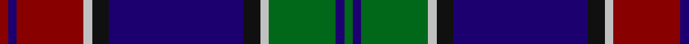

This page is one **sett** — a single exact thread-count. It belongs to the [tartan](/tartans/r1db1r8lb1k2db16k2lb1g8db1g1/)
(the same proportion at any scale), whose colour order is pattern [GBGWKBKWRBR](/stripes/gbgwkbkwrbr/).

Sourced from register-of-tartans.  It is a [11 stripe tartan](/stripes/stripes11/).

Original link https://www.tartanregister.gov.uk/tartanDetails.aspx?ref=2655

2 attestations — the source records this cloth was collapsed from (oldest owns this page)

<ul>
<li>01/01/1991 — MacMichael (register-of-tartans, <a href="https://www.tartanregister.gov.uk/tartanDetails.aspx?ref=2655">record</a>)</li>
<li>1991 — MacMichael (tartans-authority, <a href="http://www.tartansauthority.com/tartan-ferret/display/2063/">record</a>)</li>
</ul>

## Register references

External register numbers recorded for this tartan.

- Scottish Register of Tartans: [2655](https://www.tartanregister.gov.uk/tartanDetails.aspx?ref=2655)
- Scottish Tartans Authority (ITI): 2063
- Scottish Tartans World Register: 2063

## Thread count
DR/4 DB4 DR32 N4 K8 DB64 K8 N4 G32 DB4 G/4

## Palette

Palette: <strong>Tartan Register</strong>
<table><thead><tr><th>Colour</th><th>Threads</th><th>Shade</th><th>Base</th><th>OKLCh</th></tr></thead><tbody><tr><td>DR/</td><td style="text-align:right;font-variant-numeric:tabular-nums">4</td><td><code style="background-color:#880000;">#880000</code> <small style="color:#888">#880000</small></td><td>R <code style="background-color:#CC0000;">#CC0000</code></td><td><small style="color:#888">oklch(39.4% 0.162 29.2)</small></td></tr><tr><td>DB</td><td style="text-align:right;font-variant-numeric:tabular-nums">4</td><td><code style="background-color:#1C0070;">#1C0070</code> <small style="color:#888">#1C0070</small></td><td>B <code style="background-color:#2A418A;">#2A418A</code></td><td><small style="color:#888">oklch(26.3% 0.162 277.1)</small></td></tr><tr><td>DR</td><td style="text-align:right;font-variant-numeric:tabular-nums">32</td><td><code style="background-color:#880000;">#880000</code> <small style="color:#888">#880000</small></td><td>R <code style="background-color:#CC0000;">#CC0000</code></td><td><small style="color:#888">oklch(39.4% 0.162 29.2)</small></td></tr><tr><td>N</td><td style="text-align:right;font-variant-numeric:tabular-nums">4</td><td><code style="background-color:#C0C0C0;">#C0C0C0</code> <small style="color:#888">#C0C0C0</small></td><td>W <code style="background-color:#F7F7F7;">#F7F7F7</code></td><td><small style="color:#888">oklch(80.8% 0.000 89.9)</small></td></tr><tr><td>K</td><td style="text-align:right;font-variant-numeric:tabular-nums">8</td><td><code style="background-color:#101010;">#101010</code> <small style="color:#888">#101010</small></td><td>K <code style="background-color:#000000;">#000000</code></td><td><small style="color:#888">oklch(17.3% 0.000 89.9)</small></td></tr><tr><td>DB</td><td style="text-align:right;font-variant-numeric:tabular-nums">64</td><td><code style="background-color:#1C0070;">#1C0070</code> <small style="color:#888">#1C0070</small></td><td>B <code style="background-color:#2A418A;">#2A418A</code></td><td><small style="color:#888">oklch(26.3% 0.162 277.1)</small></td></tr><tr><td>K</td><td style="text-align:right;font-variant-numeric:tabular-nums">8</td><td><code style="background-color:#101010;">#101010</code> <small style="color:#888">#101010</small></td><td>K <code style="background-color:#000000;">#000000</code></td><td><small style="color:#888">oklch(17.3% 0.000 89.9)</small></td></tr><tr><td>N</td><td style="text-align:right;font-variant-numeric:tabular-nums">4</td><td><code style="background-color:#C0C0C0;">#C0C0C0</code> <small style="color:#888">#C0C0C0</small></td><td>W <code style="background-color:#F7F7F7;">#F7F7F7</code></td><td><small style="color:#888">oklch(80.8% 0.000 89.9)</small></td></tr><tr><td>G</td><td style="text-align:right;font-variant-numeric:tabular-nums">32</td><td><code style="background-color:#006818;">#006818</code> <small style="color:#888">#006818</small></td><td>G <code style="background-color:#006100;">#006100</code></td><td><small style="color:#888">oklch(45.0% 0.142 145.0)</small></td></tr><tr><td>DB</td><td style="text-align:right;font-variant-numeric:tabular-nums">4</td><td><code style="background-color:#1C0070;">#1C0070</code> <small style="color:#888">#1C0070</small></td><td>B <code style="background-color:#2A418A;">#2A418A</code></td><td><small style="color:#888">oklch(26.3% 0.162 277.1)</small></td></tr><tr><td>G/</td><td style="text-align:right;font-variant-numeric:tabular-nums">4</td><td><code style="background-color:#006818;">#006818</code> <small style="color:#888">#006818</small></td><td>G <code style="background-color:#006100;">#006100</code></td><td><small style="color:#888">oklch(45.0% 0.142 145.0)</small></td></tr></tbody></table>

## Nearest tartans

The nearest existing variants by ΔTartan distance, with this tartan at the top so the swatches line up against it.

ΔTartan

Tartan

Sett

—

<a href="/ttd/edit/#slug=r1db1r8lb1k2db16k2lb1g8db1g1~x4">MacMichael</a> <a class="nn-out" href="/setts/s11/r1db1r8lb1k2db16k2lb1g8db1g1~x4/" title="open its dictionary page">↗</a>

0.87

<a href="/ttd/edit/#slug=dbi4r4db44w6db5dy4db3dy8db3dy16dbi4r22w4">Largs District Tartan Tartan Number: 478. Earliest known date: 1981 The Largs tartan is a new design created for the town and officially adopted in 1981. There is also a dress version. See products available Copyright © Blair Urquhart, Comrie, 2015</a> <a class="nn-out" href="/setts/s13/dbi4r4db44w6db5dy4db3dy8db3dy16dbi4r22w4/" title="open its dictionary page">↗</a>

0.95

<a href="/ttd/edit/#slug=g4r4db44w6db5o4db3o8db3o16g4r22w4">Largs</a> <a class="nn-out" href="/setts/s13/g4r4db44w6db5o4db3o8db3o16g4r22w4/" title="open its dictionary page">↗</a>

0.98

<a href="/ttd/edit/#slug=db4k3db23k9g2t2g2t2g8k2ly3~x2">Forth</a> <a class="nn-out" href="/setts/s11/db4k3db23k9g2t2g2t2g8k2ly3~x2/" title="open its dictionary page">↗</a>

0.98

<a href="/ttd/edit/#slug=w2db2r18db2dg20r2db40r2dg12db3r9ly2~x2">Kormylo (Personal)</a> <a class="nn-out" href="/setts/s12/w2db2r18db2dg20r2db40r2dg12db3r9ly2~x2/" title="open its dictionary page">↗</a>

0.99

<a href="/ttd/edit/#slug=db6k2db24k10g2m2g2m2g10k2lb3~x2">Scottish Rugby Union (Sports)</a> <a class="nn-out" href="/setts/s11/db6k2db24k10g2m2g2m2g10k2lb3~x2/" title="open its dictionary page">↗</a>

0.99

<a href="/ttd/edit/#slug=db20r2db2r5db30r2k32w2dg30r5dg4r2dg4w2">MacDonald of Clanranald #5</a> <a class="nn-out" href="/setts/s14/db20r2db2r5db30r2k32w2dg30r5dg4r2dg4w2/" title="open its dictionary page">↗</a>

1.00

<a href="/ttd/edit/#slug=o14k2db3k1ly2k1db3k14db3k1w1~x2">McGuffey (School)</a> <a class="nn-out" href="/setts/s11/o14k2db3k1ly2k1db3k14db3k1w1~x2/" title="open its dictionary page">↗</a>

1.02

<a href="/ttd/edit/#slug=g40k8g4k8g4r14db64t9db3">West Lothian</a> <a class="nn-out" href="/setts/s9/g40k8g4k8g4r14db64t9db3/" title="open its dictionary page">↗</a>

1.04

<a href="/ttd/edit/#slug=db24k2db2r2db2k20g16ly2g2ly3~x2">Watson (Name)</a> <a class="nn-out" href="/setts/s10/db24k2db2r2db2k20g16ly2g2ly3~x2/" title="open its dictionary page">↗</a>

1.04

<a href="/ttd/edit/#slug=db5r2ly7r2db42dg28k5db10k15dg5w3r3">Héritage Séquane</a> <a class="nn-out" href="/setts/s12/db5r2ly7r2db42dg28k5db10k15dg5w3r3/" title="open its dictionary page">↗</a>

## Neighbour map

Every grey dot is one of 14359 variants placed by the first two principal components of the ΔTartan feature space (44% of its variance). Red is this tartan; blue dots are its nearest — click one to open its page.

<svg viewBox="0 0 640 380" role="img" style="max-width:100%;height:auto;border:1px solid #e0e0e0;border-radius:4px;display:block" xmlns="http://www.w3.org/2000/svg"><image href="/nn/cloud.v1.png" width="640" height="380"/><a href="/setts/s13/dbi4r4db44w6db5dy4db3dy8db3dy16dbi4r22w4/"><circle cx="232.5" cy="131.8" r="4" fill="#3465a4"><title>Largs District Tartan Tartan Number: 478. Earliest known date: 1981 The Largs tartan is a new design created for the town and officially adopted in 1981. There is also a dress version. See products available Copyright © Blair Urquhart, Comrie, 2015</title></circle></a><a href="/setts/s13/g4r4db44w6db5o4db3o8db3o16g4r22w4/"><circle cx="200.8" cy="118.4" r="4" fill="#3465a4"><title>Largs</title></circle></a><a href="/setts/s11/db4k3db23k9g2t2g2t2g8k2ly3~x2/"><circle cx="225.1" cy="157.3" r="4" fill="#3465a4"><title>Forth</title></circle></a><a href="/setts/s12/w2db2r18db2dg20r2db40r2dg12db3r9ly2~x2/"><circle cx="248.8" cy="120.8" r="4" fill="#3465a4"><title>Kormylo (Personal)</title></circle></a><a href="/setts/s11/db6k2db24k10g2m2g2m2g10k2lb3~x2/"><circle cx="239.9" cy="159.7" r="4" fill="#3465a4"><title>Scottish Rugby Union (Sports)</title></circle></a><a href="/setts/s14/db20r2db2r5db30r2k32w2dg30r5dg4r2dg4w2/"><circle cx="203.3" cy="132.1" r="4" fill="#3465a4"><title>MacDonald of Clanranald #5</title></circle></a><a href="/setts/s11/o14k2db3k1ly2k1db3k14db3k1w1~x2/"><circle cx="209.6" cy="129.9" r="4" fill="#3465a4"><title>McGuffey (School)</title></circle></a><a href="/setts/s9/g40k8g4k8g4r14db64t9db3/"><circle cx="261.1" cy="146.5" r="4" fill="#3465a4"><title>West Lothian</title></circle></a><a href="/setts/s10/db24k2db2r2db2k20g16ly2g2ly3~x2/"><circle cx="193.7" cy="155.0" r="4" fill="#3465a4"><title>Watson (Name)</title></circle></a><a href="/setts/s12/db5r2ly7r2db42dg28k5db10k15dg5w3r3/"><circle cx="230.0" cy="113.8" r="4" fill="#3465a4"><title>Héritage Séquane</title></circle></a><circle cx="232.6" cy="133.6" r="5" fill="#c00000"/></svg>

ID: /setts/s11/r1db1r8lb1k2db16k2lb1g8db1g1~x4/
