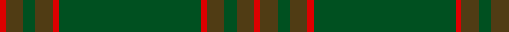

This page is one **sett** — a single exact thread-count. It belongs to the [tartan](/tartans/r1t3g2t3r1g24r1t3g2t3r1/)
(the same proportion at any scale), whose colour order is pattern [RGGGRGRGGGR](/stripes/rgggrgrgggr/).

Sourced from register-of-tartans.  It is a [11 stripe tartan](/stripes/stripes11/).

Original link https://www.tartanregister.gov.uk/tartanDetails.aspx?ref=4427

## Register references

External register numbers recorded for this tartan.

- Scottish Register of Tartans: [4427](https://www.tartanregister.gov.uk/tartanDetails.aspx?ref=4427)
- Scottish Tartans World Register: 2556

## Thread count
R/2 T6 G4 T6 R2 G48 R2 T6 G4 T6 R/2

## Palette
Each colour and the base-6 reference it is a variant of.

| Colour | Shade | Base |
|---|---|---|
| G | <code style="background-color:#005020;">#005020</code> `oklch(37.7% 0.105 149.6)` <small>#005020</small> | G <code style="background-color:#006100;">#006100</code> |
| R | <code style="background-color:#DC0000;">#DC0000</code> `oklch(56.2% 0.230 29.2)` <small>#DC0000</small> | R <code style="background-color:#CC0000;">#CC0000</code> |
| T | <code style="background-color:#503C14;">#503C14</code> `oklch(37.0% 0.062 81.8)` <small>#503C14</small> | G <code style="background-color:#006100;">#006100</code> |

## Nearest tartans

The nearest existing variants by ΔTartan distance, with this tartan at the top so the swatches line up against it.

ΔTartan

Tartan

Sett

—

<a href="/ttd/edit/#slug=r1dy3dg2dy3r1dg24r1dy3dg2dy3r1~x2">Unnamed Green (Teddy Bear)</a> <a class="nn-out" href="/setts/s11/r1dy3dg2dy3r1dg24r1dy3dg2dy3r1~x2/" title="open its dictionary page">↗</a>

1.24

<a href="/ttd/edit/#slug=g20dy3g6dy6g6dy8db2dy2g20dy2db2dy46db3dy8~x2">MacAlister of Glenbarr Hunting</a> <a class="nn-out" href="/setts/s14/g20dy3g6dy6g6dy8db2dy2g20dy2db2dy46db3dy8~x2/" title="open its dictionary page">↗</a>

1.90

<a href="/ttd/edit/#slug=g6w1g12dy4r4dy2r4dy32g1dy2~x2">Seton Hunting Family Tartan Tartan Number: 938. Earliest known date: pre 1930 Based on Vestiarium Scoticum - D.C.S. James Cant was a noted authority on tartans around 1930. See products available Copyright © Blair Urquhart, Comrie, 2015</a> <a class="nn-out" href="/setts/s10/g6w1g12dy4r4dy2r4dy32g1dy2~x2/" title="open its dictionary page">↗</a>

1.92

<a href="/ttd/edit/#slug=dg27dg39db3dg3db4dg3db3dg39db3dg3db4dg3~x2">Montgomerie/Montgomery</a> <a class="nn-out" href="/setts/s12/dg27dg39db3dg3db4dg3db3dg39db3dg3db4dg3~x2/" title="open its dictionary page">↗</a>

1.92

<a href="/ttd/edit/#slug=dy42do10t2do2lo2do2dy10lo6do2lo3dy2~x2">Yarrow</a> <a class="nn-out" href="/setts/s11/dy42do10t2do2lo2do2dy10lo6do2lo3dy2~x2/" title="open its dictionary page">↗</a>

1.96

<a href="/ttd/edit/#slug=r1o3g2o3r1g24r1o3g2o3r1~x2">Unnamed Green (Teddy Bear)</a> <a class="nn-out" href="/setts/s11/r1o3g2o3r1g24r1o3g2o3r1~x2/" title="open its dictionary page">↗</a>

1.97

<a href="/ttd/edit/#slug=y3dy3y4k4dy14k3y41g2~x2">Huntsman</a> <a class="nn-out" href="/setts/s8/y3dy3y4k4dy14k3y41g2~x2/" title="open its dictionary page">↗</a>

1.97

<a href="/ttd/edit/#slug=g4dy2g2dy2g2dy3db1dy1g4dy1db1dy12db2dy3~x2">MacAlister of Glenbarr Clan Tartan Tartan Number: 910. Earliest known date: pre 1984 This version of the MacAlister of Glenbarr tartan is the same as the MacGillivray hunting tartan. This sample was taken from a piece woven by Lochcarron Weavers around 1984. See products available Copyright © Blair Urquhart, Comrie, 2015</a> <a class="nn-out" href="/setts/s14/g4dy2g2dy2g2dy3db1dy1g4dy1db1dy12db2dy3~x2/" title="open its dictionary page">↗</a>

1.99

<a href="/ttd/edit/#slug=k2y7k1y9dy21o2dy1o1dy2~x2">Historic Scotland Corporate Tartan Tartan Number: 2122. Earliest known date: 1988 Custodians at Historic Scotland properties throughout Scotland, including Edinburgh Castle, wear this distinctive tartan. See products available Copyright © Blair Urquhart, Comrie, 2015</a> <a class="nn-out" href="/setts/s9/k2y7k1y9dy21o2dy1o1dy2~x2/" title="open its dictionary page">↗</a>

2.01

<a href="/ttd/edit/#slug=y24r2y2dg40y25dg2y2r2y2dg20~x2">Donachie of Brockloch Htg (Clan)</a> <a class="nn-out" href="/setts/s10/y24r2y2dg40y25dg2y2r2y2dg20~x2/" title="open its dictionary page">↗</a>

2.12

<a href="/ttd/edit/#slug=dg3g1lo2dg3g1lo2dy21dg18dy2dg3dy2dg18dy21g1lo2~x2">Prince David Royal Family Tartan Tartan Number: 2125. Earliest known date: 1930 Mackinlay suggests that David was the pet name of the Duke of Windsor when he was a boy and that the tartan was designed for his personal use. See products available Copyright © Blair Urquhart, Comrie, 2015</a> <a class="nn-out" href="/setts/s15/dg3g1lo2dg3g1lo2dy21dg18dy2dg3dy2dg18dy21g1lo2~x2/" title="open its dictionary page">↗</a>

## Neighbour map

Every grey dot is one of 14299 variants placed by the first two principal components of the ΔTartan feature space (44% of its variance). Red is this tartan; blue dots are its nearest — click one to open its page.

<svg viewBox="0 0 640 380" role="img" style="max-width:100%;height:auto;border:1px solid #e0e0e0;border-radius:4px;display:block" xmlns="http://www.w3.org/2000/svg"><image href="/nn/cloud.v1.png" width="640" height="380"/><a href="/setts/s14/g20dy3g6dy6g6dy8db2dy2g20dy2db2dy46db3dy8~x2/"><circle cx="498.7" cy="208.2" r="4" fill="#3465a4"><title>MacAlister of Glenbarr Hunting</title></circle></a><a href="/setts/s10/g6w1g12dy4r4dy2r4dy32g1dy2~x2/"><circle cx="473.1" cy="165.9" r="4" fill="#3465a4"><title>Seton Hunting Family Tartan Tartan Number: 938. Earliest known date: pre 1930 Based on Vestiarium Scoticum - D.C.S. James Cant was a noted authority on tartans around 1930. See products available Copyright © Blair Urquhart, Comrie, 2015</title></circle></a><a href="/setts/s12/dg27dg39db3dg3db4dg3db3dg39db3dg3db4dg3~x2/"><circle cx="549.2" cy="255.2" r="4" fill="#3465a4"><title>Montgomerie/Montgomery</title></circle></a><a href="/setts/s11/dy42do10t2do2lo2do2dy10lo6do2lo3dy2~x2/"><circle cx="505.9" cy="169.0" r="4" fill="#3465a4"><title>Yarrow</title></circle></a><a href="/setts/s11/r1o3g2o3r1g24r1o3g2o3r1~x2/"><circle cx="508.4" cy="174.5" r="4" fill="#3465a4"><title>Unnamed Green (Teddy Bear)</title></circle></a><a href="/setts/s8/y3dy3y4k4dy14k3y41g2~x2/"><circle cx="499.9" cy="192.6" r="4" fill="#3465a4"><title>Huntsman</title></circle></a><a href="/setts/s14/g4dy2g2dy2g2dy3db1dy1g4dy1db1dy12db2dy3~x2/"><circle cx="467.8" cy="247.7" r="4" fill="#3465a4"><title>MacAlister of Glenbarr Clan Tartan Tartan Number: 910. Earliest known date: pre 1984 This version of the MacAlister of Glenbarr tartan is the same as the MacGillivray hunting tartan. This sample was taken from a piece woven by Lochcarron Weavers around 1984. See products available Copyright © Blair Urquhart, Comrie, 2015</title></circle></a><a href="/setts/s9/k2y7k1y9dy21o2dy1o1dy2~x2/"><circle cx="457.3" cy="212.9" r="4" fill="#3465a4"><title>Historic Scotland Corporate Tartan Tartan Number: 2122. Earliest known date: 1988 Custodians at Historic Scotland properties throughout Scotland, including Edinburgh Castle, wear this distinctive tartan. See products available Copyright © Blair Urquhart, Comrie, 2015</title></circle></a><a href="/setts/s10/y24r2y2dg40y25dg2y2r2y2dg20~x2/"><circle cx="446.0" cy="223.6" r="4" fill="#3465a4"><title>Donachie of Brockloch Htg (Clan)</title></circle></a><a href="/setts/s15/dg3g1lo2dg3g1lo2dy21dg18dy2dg3dy2dg18dy21g1lo2~x2/"><circle cx="407.7" cy="187.5" r="4" fill="#3465a4"><title>Prince David Royal Family Tartan Tartan Number: 2125. Earliest known date: 1930 Mackinlay suggests that David was the pet name of the Duke of Windsor when he was a boy and that the tartan was designed for his personal use. See products available Copyright © Blair Urquhart, Comrie, 2015</title></circle></a><circle cx="545.1" cy="198.6" r="5" fill="#c00000"/></svg>

ID: /setts/s11/r1dy3dg2dy3r1dg24r1dy3dg2dy3r1~x2/
