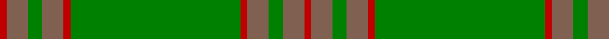

In pattern [RRGRRGRRGRR](/patterns/rrgrrgrrgrr/).

This was sourced from weddslist.  It is a [11 stripes tartan](/stripes/stripes11/).

Original link http://www.weddslist.com/cgi-bin/tartans/pg.pl?source=sts

## Thread count
R/2 LT6 G4 LT6 R2 G48 R2 LT6 G4 LT6 R/2

## Palette
Each colour and its ΔE from the base-6 reference it is a variant of.

| Colour | Shade | Base | ΔE (OKLab) |
|---|---|---|---|
| G | <code style="background-color:#008000;">#008000</code> `#008000` | G <code style="background-color:#006100;">#006100</code> | 0.10 |
| LT | <code style="background-color:#806050;">#806050</code> `#806050` | R <code style="background-color:#CC0000;">#CC0000</code> | 0.17 |
| R | <code style="background-color:#C00000;">#C00000</code> `#C00000` | R <code style="background-color:#CC0000;">#CC0000</code> | 0.03 |

## Nearest tartans

The nearest existing variants by ΔTartan distance.

1. [Montreal](/setts/s10/y78g10r2g1r2g6y2g3y2g43~g006818-rc80000-ya08858~x2/) — ΔT 1.50
1. [Ridgeback (Corporate)](/setts/s12/g74r6g3r24k1g9r12b2g2b2g2b2~b2c2c80-g006818-k101010-r98481c~x2/) — ΔT 1.59
1. [Unidentified Plaid 11](/setts/s10/g32r2g2r2g2r12g22w1g1w3~g008000-r806050-we0e0e0~x2/) — ΔT 1.85
1. [Montgomerie Artifact Tartan Tartan Number: 692. Earliest known date: c.1815 The sample does not show a complete sett. The broad mid green stripe is narrower in the weft. See products available Copyright © Blair Urquhart, Comrie, 2015](/setts/s12/g27ga39b3ga3b4ga3b3ga39b3ga3b4ga3~b2c2c80-g003820-ga006818~x2/) — ΔT 1.90
1. [Seton, hunting](/setts/s10/g6w1g12r4ra4r2ra4r32g1r2~g008000-r806050-rac00000-we0e0e0~x2/) — ΔT 1.96
1. [Unnamed Green (Teddy Bear)](/setts/s11/r1g3ga2g3r1ga24r1g3ga2g3r1~g503c14-ga005020-rdc0000~x2/) — ΔT 1.96
1. [O'Brien (Scotch Corner)](/setts/s9/g36ga19g4ga31b2r3b2r3ga12~b1474b4-g5c6428-ga289c18-ra00000~x2/) — ΔT 1.98
1. [Glenlivet](/setts/s8/g18r6g75b6g13ra35g12b6~b304080-g008000-rc00000-ra806050/) — ΔT 2.02
1. [ASDA Wal-Mart](/setts/s14/g68r4g6b4ga34b4g6r4g68b4ga16r4ga19b4~b202060-g289c18-ga006428-rc80000~x2/) — ΔT 2.04
1. [Unidentified Plaid #2](/setts/s10/g32ga2g2ga2g2ga12g22w1g1w3~g005020-ga503c14-we0e0e0~x2/) — ΔT 2.04

## Neighbour map

Every grey dot is one of 15726 variants placed by the first two principal components of the ΔTartan feature space (44% of its variance). Red is this tartan; blue dots are its nearest — click one to open its page.

<svg viewBox="0 0 640 380" role="img" style="max-width:100%;height:auto;border:1px solid #e0e0e0;border-radius:4px;display:block" xmlns="http://www.w3.org/2000/svg"><image href="/nn/cloud.v1.png" width="640" height="380"/><a href="/setts/s10/y78g10r2g1r2g6y2g3y2g43~g006818-rc80000-ya08858~x2/"><circle cx="502.2" cy="135.0" r="4" fill="#3465a4"><title>Montreal</title></circle></a><a href="/setts/s12/g74r6g3r24k1g9r12b2g2b2g2b2~b2c2c80-g006818-k101010-r98481c~x2/"><circle cx="539.8" cy="120.6" r="4" fill="#3465a4"><title>Ridgeback (Corporate)</title></circle></a><a href="/setts/s10/g32r2g2r2g2r12g22w1g1w3~g008000-r806050-we0e0e0~x2/"><circle cx="566.7" cy="176.6" r="4" fill="#3465a4"><title>Unidentified Plaid 11</title></circle></a><a href="/setts/s12/g27ga39b3ga3b4ga3b3ga39b3ga3b4ga3~b2c2c80-g003820-ga006818~x2/"><circle cx="497.2" cy="216.6" r="4" fill="#3465a4"><title>Montgomerie Artifact Tartan Tartan Number: 692. Earliest known date: c.1815 The sample does not show a complete sett. The broad mid green stripe is narrower in the weft. See products available Copyright © Blair Urquhart, Comrie, 2015</title></circle></a><a href="/setts/s10/g6w1g12r4ra4r2ra4r32g1r2~g008000-r806050-rac00000-we0e0e0~x2/"><circle cx="464.2" cy="149.4" r="4" fill="#3465a4"><title>Seton, hunting</title></circle></a><a href="/setts/s11/r1g3ga2g3r1ga24r1g3ga2g3r1~g503c14-ga005020-rdc0000~x2/"><circle cx="544.6" cy="186.0" r="4" fill="#3465a4"><title>Unnamed Green (Teddy Bear)</title></circle></a><a href="/setts/s9/g36ga19g4ga31b2r3b2r3ga12~b1474b4-g5c6428-ga289c18-ra00000~x2/"><circle cx="409.5" cy="202.4" r="4" fill="#3465a4"><title>O'Brien (Scotch Corner)</title></circle></a><a href="/setts/s8/g18r6g75b6g13ra35g12b6~b304080-g008000-rc00000-ra806050/"><circle cx="471.5" cy="220.9" r="4" fill="#3465a4"><title>Glenlivet</title></circle></a><a href="/setts/s14/g68r4g6b4ga34b4g6r4g68b4ga16r4ga19b4~b202060-g289c18-ga006428-rc80000~x2/"><circle cx="392.6" cy="156.2" r="4" fill="#3465a4"><title>ASDA Wal-Mart</title></circle></a><a href="/setts/s10/g32ga2g2ga2g2ga12g22w1g1w3~g005020-ga503c14-we0e0e0~x2/"><circle cx="580.8" cy="186.9" r="4" fill="#3465a4"><title>Unidentified Plaid #2</title></circle></a><circle cx="507.6" cy="166.5" r="5" fill="#c00000"/></svg>

ID: /setts/s11/r1ra3g2ra3r1g24r1ra3g2ra3r1~g008000-rc00000-ra806050~x2/
