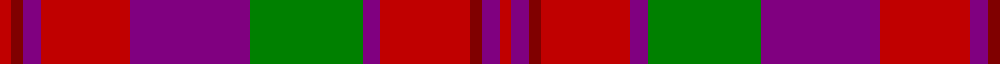

In pattern [RBRRBGBRBRR](/patterns/rbrrbgbrbrr/).

This was sourced from weddslist.  It is a [11 stripes tartan](/stripes/stripes11/).

Original link http://www.weddslist.com/cgi-bin/tartans/pg.pl?source=sts

## Thread count
R/4 DR4 P6 R30 P40 G38 P6 R30 DR4 P6 R/4

## Palette
Each colour and its ΔE from the base-6 reference it is a variant of.

| Colour | Shade | Base | ΔE (OKLab) |
|---|---|---|---|
| DR | <code style="background-color:#800000;">#800000</code> `#800000` | R <code style="background-color:#CC0000;">#CC0000</code> | 0.17 |
| G | <code style="background-color:#008000;">#008000</code> `#008000` | G <code style="background-color:#006100;">#006100</code> | 0.10 |
| P | <code style="background-color:#800080;">#800080</code> `#800080` | B <code style="background-color:#2A418A;">#2A418A</code> | 0.17 |
| R | <code style="background-color:#C00000;">#C00000</code> `#C00000` | R <code style="background-color:#CC0000;">#CC0000</code> | 0.03 |

## Nearest tartans

The nearest existing variants by ΔTartan distance.

1. [Drumlithie](/setts/s11/r2b3ra2r15b2g20b20r15b3ra2r2~b780078-g006818-rc80000-rad05054~x2/) — ΔT 0.19
1. [Drumlithie Rock and Wheel Tartan Tartan Number: 1414. Earliest known date: pre 2003 tba See products available Copyright © Blair Urquhart, Comrie, 2015](/setts/s11/r2b3ra2r15b3g19b20r15b3ra2r2~b780078-g006818-rc80000-rad05054~x2/) — ΔT 0.24
1. [Drumlithie - 1790 (Fashion)](/setts/s11/r2b3ra2r15b2g20b20r15b3ra2r2~b440044-g285800-rc80000-rad05054~x2/) — ΔT 0.58
1. [Fiddes](/setts/s8/g12r11b12ra3r32b8g8b8~b800080-g008000-rc00000-rad03030~x2/) — ΔT 1.21
1. [Leitrim](/setts/s10/g3b18g4b3g4r13g3g18b2y3~b401000-g808080-rc00000-yff8500~x2/) — ΔT 1.22
1. [Gates](/setts/s9/b24r3b4r6g8r3g8r30k3~b2c2c80-g006818-k101010-rc80000~x2/) — ΔT 1.23
1. [FC Barcelona (Corporate)](/setts/s10/r3b3r18ra2r2ra3r2ra4b18y2~b3850c8-r880000-rac80000-ye8c000~x2/) — ΔT 1.24
1. [Bates-Dayton](/setts/s12/b3r17k3y3k3b3k3r7b8k3b1y3~b780078-k101010-rc80000-ybc8c00~x4/) — ΔT 1.25
1. [Eidart, Scotch House](/setts/s12/g4w2g2w3g20b6r3b2r2b2r17b3~b304080-g808080-rc00000-we0e0e0~x2/) — ΔT 1.28
1. [Hebridean 3](/setts/s11/g10r25b2ba25r2g2r25g2r2ba25r4~b5480b0-ba304080-g008000-rc00000~x2/) — ΔT 1.29

## Neighbour map

Every grey dot is one of 15726 variants placed by the first two principal components of the ΔTartan feature space (44% of its variance). Red is this tartan; blue dots are its nearest — click one to open its page.

<svg viewBox="0 0 640 380" role="img" style="max-width:100%;height:auto;border:1px solid #e0e0e0;border-radius:4px;display:block" xmlns="http://www.w3.org/2000/svg"><image href="/nn/cloud.v1.png" width="640" height="380"/><a href="/setts/s11/r2b3ra2r15b2g20b20r15b3ra2r2~b780078-g006818-rc80000-rad05054~x2/"><circle cx="250.4" cy="171.8" r="4" fill="#3465a4"><title>Drumlithie</title></circle></a><a href="/setts/s11/r2b3ra2r15b3g19b20r15b3ra2r2~b780078-g006818-rc80000-rad05054~x2/"><circle cx="250.8" cy="174.0" r="4" fill="#3465a4"><title>Drumlithie Rock and Wheel Tartan Tartan Number: 1414. Earliest known date: pre 2003 tba See products available Copyright © Blair Urquhart, Comrie, 2015</title></circle></a><a href="/setts/s11/r2b3ra2r15b2g20b20r15b3ra2r2~b440044-g285800-rc80000-rad05054~x2/"><circle cx="242.0" cy="171.6" r="4" fill="#3465a4"><title>Drumlithie - 1790 (Fashion)</title></circle></a><a href="/setts/s8/g12r11b12ra3r32b8g8b8~b800080-g008000-rc00000-rad03030~x2/"><circle cx="265.1" cy="204.9" r="4" fill="#3465a4"><title>Fiddes</title></circle></a><a href="/setts/s10/g3b18g4b3g4r13g3g18b2y3~b401000-g808080-rc00000-yff8500~x2/"><circle cx="246.8" cy="185.1" r="4" fill="#3465a4"><title>Leitrim</title></circle></a><a href="/setts/s9/b24r3b4r6g8r3g8r30k3~b2c2c80-g006818-k101010-rc80000~x2/"><circle cx="269.3" cy="179.6" r="4" fill="#3465a4"><title>Gates</title></circle></a><a href="/setts/s10/r3b3r18ra2r2ra3r2ra4b18y2~b3850c8-r880000-rac80000-ye8c000~x2/"><circle cx="267.8" cy="170.3" r="4" fill="#3465a4"><title>FC Barcelona (Corporate)</title></circle></a><a href="/setts/s12/b3r17k3y3k3b3k3r7b8k3b1y3~b780078-k101010-rc80000-ybc8c00~x4/"><circle cx="243.0" cy="146.3" r="4" fill="#3465a4"><title>Bates-Dayton</title></circle></a><a href="/setts/s12/g4w2g2w3g20b6r3b2r2b2r17b3~b304080-g808080-rc00000-we0e0e0~x2/"><circle cx="237.6" cy="157.1" r="4" fill="#3465a4"><title>Eidart, Scotch House</title></circle></a><a href="/setts/s11/g10r25b2ba25r2g2r25g2r2ba25r4~b5480b0-ba304080-g008000-rc00000~x2/"><circle cx="298.3" cy="170.8" r="4" fill="#3465a4"><title>Hebridean 3</title></circle></a><circle cx="244.5" cy="172.1" r="5" fill="#c00000"/></svg>

ID: /setts/s11/r2b3ra2r15b3g19b20r15b3ra2r2~b800080-g008000-rc00000-ra800000~x2/
