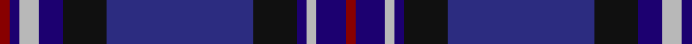

In pattern [RBYBKBKBYBR](/patterns/rbybkbkbybr/).

This was sourced from register-of-tartans.  It is a [11 stripes tartan](/stripes/stripes11/).

Original link https://www.tartanregister.gov.uk/tartanDetails.aspx?ref=3458

## Thread count
DR/4 DB4 N8 DB10 K18 DBa60 K18 DB4 N4 DB12 DR/4

## Palette
Each colour and its ΔE from the base-6 reference it is a variant of.

| Colour | Shade | Base | ΔE (OKLab) |
|---|---|---|---|
| DB | <code style="background-color:#1C0070;">#1C0070</code> `#1C0070` | B <code style="background-color:#2A418A;">#2A418A</code> | 0.14 |
| DBa | <code style="background-color:#2C2C80;">#2C2C80</code> `#2C2C80` | B <code style="background-color:#2A418A;">#2A418A</code> | 0.06 |
| DR | <code style="background-color:#880000;">#880000</code> `#880000` | R <code style="background-color:#CC0000;">#CC0000</code> | 0.15 |
| K | <code style="background-color:#101010;">#101010</code> `#101010` | K <code style="background-color:#000000;">#000000</code> | 0.17 |
| N | <code style="background-color:#B8B8B8;">#B8B8B8</code> `#B8B8B8` | Y <code style="background-color:#F2BF00;">#F2BF00</code> | 0.17 |

## Nearest tartans

The nearest existing variants by ΔTartan distance.

1. [St. Kentigern College (Corporate)](/setts/s10/b30ba3b3ba3b3ba10k10g20k2w4x2~b1c0070-ba14143c-g003820-k101010-we0e0e0/) — ΔT 1.20
1. [Scotland 1782 (Fashion)](/setts/s13/b3ba30k4g3bb2bc2bb2bc10k2bc2k4bc2g3x2~b788cb4-ba2c2c80-bb780078-bc640054-g408060-k000000/) — ΔT 1.21
1. [Wardlaw](/setts/s10/k4b30k3b2ba2r2g12k3ba18r3x2~b780078-ba2c2c80-g006818-k101010-rc80000/) — ΔT 1.28
1. [Rangers Football Club](/setts/s11/r3b16k12ba34k12b2k2b2k2b7r3x2~b000064-ba2c4084-k101010-rdc0000/) — ΔT 1.30
1. [O'Reilly Irish Fashion Tartan Tartan Number: 6747. Earliest known date: pre 2005 Scotch Corner (a company in Gateshead, England) have produced various Irish surname tartans over the years. However, it may be considered that this is how many of Scotland's clan tartans came into being so perhaps in a hundred years or so, today's inventions will be regarded as tomorrow's genuine Irish clan/family tartans. Woven by Marton Mills, Yorkshire. See products available Copyright © Blair Urquhart, Comrie, 2015](/setts/s11/b4ba2g2b2g12b2k2b1k10ba25w2x2~b582458-ba2c2c80-g409c90-k101010-we0e0e0/) — ΔT 1.32
1. [Rangers 1989 (Sports)](/setts/s11/r3b16k12ba34k12b2k2b2k2b7r3x2~b2c2c80-ba1474b4-k101010-rc80000/) — ΔT 1.32
1. [Scottish Rugby Union (Sports)](/setts/s11/b6k2b24k10g2r2g2r2g10k2w3x2~b2c2c80-g006818-k101010-r9c68a4-wc0c0c0/) — ΔT 1.37
1. [Spirit of Bannockburn (Fashion)](/setts/s13/k2b4r4b3g20b5k4b3k7b3k3ba35w2x2~b780078-ba2c2c80-g006818-k101010-rb468ac-wfcfcfc/) — ΔT 1.38
1. [Dunn (Canada) (Name)](/setts/s11/b6k2ba14k5ba14k3ka4k6ka24w2ba6x2~b2c00b0-ba60007c-k101010-ka00002c-wf8f8f8/) — ΔT 1.38
1. [Royal Highland Yacht Club (Corporate](/setts/s11/b26ba3b1r2b1ba3b3ba12g14b2w2x2~b1c1c50-ba2c2c80-g006818-ra800a8-we0e0e0/) — ΔT 1.40

## Neighbour map

Every grey dot is one of 15726 variants placed by the first two principal components of the ΔTartan feature space (44% of its variance). Red is this tartan; blue dots are its nearest — click one to open its page.

<svg viewBox="0 0 640 380" role="img" style="max-width:100%;height:auto;border:1px solid #e0e0e0;border-radius:4px;display:block" xmlns="http://www.w3.org/2000/svg"><image href="/nn/cloud.v1.png" width="640" height="380"/><a href="/setts/s10/b30ba3b3ba3b3ba10k10g20k2w4x2~b1c0070-ba14143c-g003820-k101010-we0e0e0/"><circle cx="240.9" cy="173.2" r="4" fill="#3465a4"><title>St. Kentigern College (Corporate)</title></circle></a><a href="/setts/s13/b3ba30k4g3bb2bc2bb2bc10k2bc2k4bc2g3x2~b788cb4-ba2c2c80-bb780078-bc640054-g408060-k000000/"><circle cx="231.7" cy="104.4" r="4" fill="#3465a4"><title>Scotland 1782 (Fashion)</title></circle></a><a href="/setts/s10/k4b30k3b2ba2r2g12k3ba18r3x2~b780078-ba2c2c80-g006818-k101010-rc80000/"><circle cx="247.2" cy="147.1" r="4" fill="#3465a4"><title>Wardlaw</title></circle></a><a href="/setts/s11/r3b16k12ba34k12b2k2b2k2b7r3x2~b000064-ba2c4084-k101010-rdc0000/"><circle cx="265.1" cy="174.7" r="4" fill="#3465a4"><title>Rangers Football Club</title></circle></a><a href="/setts/s11/b4ba2g2b2g12b2k2b1k10ba25w2x2~b582458-ba2c2c80-g409c90-k101010-we0e0e0/"><circle cx="239.9" cy="115.8" r="4" fill="#3465a4"><title>O'Reilly Irish Fashion Tartan Tartan Number: 6747. Earliest known date: pre 2005 Scotch Corner (a company in Gateshead, England) have produced various Irish surname tartans over the years. However, it may be considered that this is how many of Scotland's clan tartans came into being so perhaps in a hundred years or so, today's inventions will be regarded as tomorrow's genuine Irish clan/family tartans. Woven by Marton Mills, Yorkshire. See products available Copyright © Blair Urquhart, Comrie, 2015</title></circle></a><a href="/setts/s11/r3b16k12ba34k12b2k2b2k2b7r3x2~b2c2c80-ba1474b4-k101010-rc80000/"><circle cx="230.6" cy="157.7" r="4" fill="#3465a4"><title>Rangers 1989 (Sports)</title></circle></a><a href="/setts/s11/b6k2b24k10g2r2g2r2g10k2w3x2~b2c2c80-g006818-k101010-r9c68a4-wc0c0c0/"><circle cx="236.7" cy="154.1" r="4" fill="#3465a4"><title>Scottish Rugby Union (Sports)</title></circle></a><a href="/setts/s13/k2b4r4b3g20b5k4b3k7b3k3ba35w2x2~b780078-ba2c2c80-g006818-k101010-rb468ac-wfcfcfc/"><circle cx="189.8" cy="102.5" r="4" fill="#3465a4"><title>Spirit of Bannockburn (Fashion)</title></circle></a><a href="/setts/s11/b6k2ba14k5ba14k3ka4k6ka24w2ba6x2~b2c00b0-ba60007c-k101010-ka00002c-wf8f8f8/"><circle cx="213.7" cy="178.7" r="4" fill="#3465a4"><title>Dunn (Canada) (Name)</title></circle></a><a href="/setts/s11/b26ba3b1r2b1ba3b3ba12g14b2w2x2~b1c1c50-ba2c2c80-g006818-ra800a8-we0e0e0/"><circle cx="312.8" cy="134.1" r="4" fill="#3465a4"><title>Royal Highland Yacht Club (Corporate</title></circle></a><circle cx="238.2" cy="145.3" r="5" fill="#c00000"/></svg>

ID: /setts/s11/r2b6y2b2k9ba30k9b5y4b2r2x2~b1c0070-ba2c2c80-k101010-r880000-yb8b8b8/
