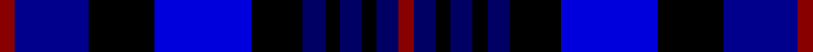

This page is one **sett** — a single exact thread-count. It belongs to the [tartan](/tartans/r2db10k9dbii13k7dbi3k2dbi3k2dbi3r2/)
(the same proportion at any scale), whose colour order is pattern [RBKBKBKBKBR](/stripes/rbkbkbkbkbr/).

Sourced from register-of-tartans.  It is a [11 stripe tartan](/stripes/stripes11/).

Original link https://www.tartanregister.gov.uk/tartanDetails.aspx?ref=1818

## Register references

External register numbers recorded for this tartan.

- Scottish Register of Tartans: [1818](https://www.tartanregister.gov.uk/tartanDetails.aspx?ref=1818)
- Scottish Tartans Authority (ITI): 5249

## Thread count
DR/4 DBa20 K18 B26 K14 DB6 K4 DB6 K4 DB6 DR/4

## Palette

Palette: <strong>Tartan Register</strong> <small style="color:#888">(4 of 5 colours)</small>
<table><thead><tr><th>Colour</th><th>Threads</th><th>Shade</th><th>Base</th><th>OKLCh</th></tr></thead><tbody><tr><td>DR/</td><td style="text-align:right;font-variant-numeric:tabular-nums">4</td><td><code style="background-color:#880000;">#880000</code> <small style="color:#888">#880000</small></td><td>R <code style="background-color:#CC0000;">#CC0000</code></td><td><small style="color:#888">oklch(39.4% 0.162 29.2)</small></td></tr><tr><td>DBa</td><td style="text-align:right;font-variant-numeric:tabular-nums">20</td><td><code style="background-color:#00008C;">#00008C</code> <small style="color:#888">#00008C</small></td><td>B <code style="background-color:#2A418A;">#2A418A</code></td><td><small style="color:#888">oklch(28.9% 0.200 264.1)</small></td></tr><tr><td>K</td><td style="text-align:right;font-variant-numeric:tabular-nums">18</td><td><code style="background-color:#000000;">#000000</code> <small style="color:#888">#000000</small></td><td>K <code style="background-color:#000000;">#000000</code></td><td><small style="color:#888">oklch(0.0% 0.000 0.0)</small></td></tr><tr><td>B</td><td style="text-align:right;font-variant-numeric:tabular-nums">26</td><td><code style="background-color:#0000DC;">#0000DC</code> <small style="color:#888">#0000DC</small></td><td>B <code style="background-color:#2A418A;">#2A418A</code></td><td><small style="color:#888">oklch(40.4% 0.280 264.1)</small></td></tr><tr><td>K</td><td style="text-align:right;font-variant-numeric:tabular-nums">14</td><td><code style="background-color:#000000;">#000000</code> <small style="color:#888">#000000</small></td><td>K <code style="background-color:#000000;">#000000</code></td><td><small style="color:#888">oklch(0.0% 0.000 0.0)</small></td></tr><tr><td>DB</td><td style="text-align:right;font-variant-numeric:tabular-nums">6</td><td><code style="background-color:#000064;">#000064</code> <small style="color:#888">#000064</small></td><td>B <code style="background-color:#2A418A;">#2A418A</code></td><td><small style="color:#888">oklch(22.7% 0.158 264.1)</small></td></tr><tr><td>K</td><td style="text-align:right;font-variant-numeric:tabular-nums">4</td><td><code style="background-color:#000000;">#000000</code> <small style="color:#888">#000000</small></td><td>K <code style="background-color:#000000;">#000000</code></td><td><small style="color:#888">oklch(0.0% 0.000 0.0)</small></td></tr><tr><td>DB</td><td style="text-align:right;font-variant-numeric:tabular-nums">6</td><td><code style="background-color:#000064;">#000064</code> <small style="color:#888">#000064</small></td><td>B <code style="background-color:#2A418A;">#2A418A</code></td><td><small style="color:#888">oklch(22.7% 0.158 264.1)</small></td></tr><tr><td>K</td><td style="text-align:right;font-variant-numeric:tabular-nums">4</td><td><code style="background-color:#000000;">#000000</code> <small style="color:#888">#000000</small></td><td>K <code style="background-color:#000000;">#000000</code></td><td><small style="color:#888">oklch(0.0% 0.000 0.0)</small></td></tr><tr><td>DB</td><td style="text-align:right;font-variant-numeric:tabular-nums">6</td><td><code style="background-color:#000064;">#000064</code> <small style="color:#888">#000064</small></td><td>B <code style="background-color:#2A418A;">#2A418A</code></td><td><small style="color:#888">oklch(22.7% 0.158 264.1)</small></td></tr><tr><td>DR/</td><td style="text-align:right;font-variant-numeric:tabular-nums">4</td><td><code style="background-color:#880000;">#880000</code> <small style="color:#888">#880000</small></td><td>R <code style="background-color:#CC0000;">#CC0000</code></td><td><small style="color:#888">oklch(39.4% 0.162 29.2)</small></td></tr></tbody></table>

## Nearest tartans

The nearest existing variants by ΔTartan distance, with this tartan at the top so the swatches line up against it.

ΔTartan

Tartan

Sett

—

<a href="/ttd/edit/#slug=r2db10k9dbii13k7dbi3k2dbi3k2dbi3r2~x2">Impulse</a> <a class="nn-out" href="/setts/s11/r2db10k9dbii13k7dbi3k2dbi3k2dbi3r2~x2/" title="open its dictionary page">↗</a>

1.59

<a href="/ttd/edit/#slug=b12db3b12db16k3db6k3db16r3db3lo3k16db4~x2">Dempster (Name)</a> <a class="nn-out" href="/setts/s13/b12db3b12db16k3db6k3db16r3db3lo3k16db4~x2/" title="open its dictionary page">↗</a>

1.60

<a href="/ttd/edit/#slug=db2dr5db8ly2dr3dbii9dr2db18dbii9dbi4w2~x2">Royal Gourock Yacht Club, The</a> <a class="nn-out" href="/setts/s11/db2dr5db8ly2dr3dbii9dr2db18dbii9dbi4w2~x2/" title="open its dictionary page">↗</a>

1.74

<a href="/ttd/edit/#slug=k16dbi8k6dbi8k6dbi20k6dbi6k14db41r4">Merchiston, Castle School</a> <a class="nn-out" href="/setts/s11/k16dbi8k6dbi8k6dbi20k6dbi6k14db41r4/" title="open its dictionary page">↗</a>

1.78

<a href="/ttd/edit/#slug=k6db3k3db33k16b21k3b3r4~x2">USCBP - Office of Field Operations</a> <a class="nn-out" href="/setts/s9/k6db3k3db33k16b21k3b3r4~x2/" title="open its dictionary page">↗</a>

1.81

<a href="/ttd/edit/#slug=k25dg29b24r2dg11r2b24dg29k25o4k5r4~x2">ABF The Soldiers' Charity</a> <a class="nn-out" href="/setts/s12/k25dg29b24r2dg11r2b24dg29k25o4k5r4~x2/" title="open its dictionary page">↗</a>

1.81

<a href="/setts/s10/ki9w2ki24k8w5k8db15k3db15k2~x2/">Scottish Claymores</a>

1.85

<a href="/ttd/edit/#slug=ly3k18dt3k3dt3k3dt17db3dt3db3dt3db12w2db12dt9db12k2w2~x2">Van Ingelgem Dress (Personal)</a> <a class="nn-out" href="/setts/s18/ly3k18dt3k3dt3k3dt17db3dt3db3dt3db12w2db12dt9db12k2w2~x2/" title="open its dictionary page">↗</a>

1.92

<a href="/ttd/edit/#slug=b8db8b4db28k12dp7k12g4dp8g4dp28p8">Kinloch Anderson Thistle</a> <a class="nn-out" href="/setts/s12/b8db8b4db28k12dp7k12g4dp8g4dp28p8/" title="open its dictionary page">↗</a>

1.92

<a href="/ttd/edit/#slug=m3db17dt13m2k20w2~x2">Commonwealth Games</a> <a class="nn-out" href="/setts/s6/m3db17dt13m2k20w2~x2/" title="open its dictionary page">↗</a>

1.99

<a href="/ttd/edit/#slug=db3k2db8k8dg8dp1dg1dp3~x2">Baird</a> <a class="nn-out" href="/setts/s8/db3k2db8k8dg8dp1dg1dp3~x2/" title="open its dictionary page">↗</a>

## Neighbour map

Every grey dot is one of 14359 variants placed by the first two principal components of the ΔTartan feature space (44% of its variance). Red is this tartan; blue dots are its nearest — click one to open its page.

<svg viewBox="0 0 640 380" role="img" style="max-width:100%;height:auto;border:1px solid #e0e0e0;border-radius:4px;display:block" xmlns="http://www.w3.org/2000/svg"><image href="/nn/cloud.v1.png" width="640" height="380"/><a href="/setts/s13/b12db3b12db16k3db6k3db16r3db3lo3k16db4~x2/"><circle cx="175.5" cy="207.7" r="4" fill="#3465a4"><title>Dempster (Name)</title></circle></a><a href="/setts/s11/db2dr5db8ly2dr3dbii9dr2db18dbii9dbi4w2~x2/"><circle cx="174.0" cy="179.8" r="4" fill="#3465a4"><title>Royal Gourock Yacht Club, The</title></circle></a><a href="/setts/s11/k16dbi8k6dbi8k6dbi20k6dbi6k14db41r4/"><circle cx="208.6" cy="209.7" r="4" fill="#3465a4"><title>Merchiston, Castle School</title></circle></a><a href="/setts/s9/k6db3k3db33k16b21k3b3r4~x2/"><circle cx="206.0" cy="186.3" r="4" fill="#3465a4"><title>USCBP - Office of Field Operations</title></circle></a><a href="/setts/s12/k25dg29b24r2dg11r2b24dg29k25o4k5r4~x2/"><circle cx="166.5" cy="177.5" r="4" fill="#3465a4"><title>ABF The Soldiers' Charity</title></circle></a><a href="/setts/s10/ki9w2ki24k8w5k8db15k3db15k2~x2/"><circle cx="169.1" cy="198.0" r="4" fill="#3465a4"><title>Scottish Claymores</title></circle></a><a href="/setts/s18/ly3k18dt3k3dt3k3dt17db3dt3db3dt3db12w2db12dt9db12k2w2~x2/"><circle cx="158.5" cy="167.7" r="4" fill="#3465a4"><title>Van Ingelgem Dress (Personal)</title></circle></a><a href="/setts/s12/b8db8b4db28k12dp7k12g4dp8g4dp28p8/"><circle cx="118.8" cy="192.8" r="4" fill="#3465a4"><title>Kinloch Anderson Thistle</title></circle></a><a href="/setts/s6/m3db17dt13m2k20w2~x2/"><circle cx="143.2" cy="201.7" r="4" fill="#3465a4"><title>Commonwealth Games</title></circle></a><a href="/setts/s8/db3k2db8k8dg8dp1dg1dp3~x2/"><circle cx="159.7" cy="240.0" r="4" fill="#3465a4"><title>Baird</title></circle></a><circle cx="121.7" cy="209.9" r="5" fill="#c00000"/></svg>

ID: /setts/s11/r2db10k9dbii13k7dbi3k2dbi3k2dbi3r2~x2/
