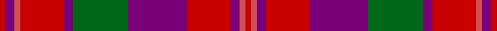

In pattern [RBRRBGBRBRR](/stripes/rbrrbgbrbrr/).

This was sourced from house-of-tartan.  It is a [11 stripe tartan](/stripes/stripes11/).

Original link http://www.house-of-tartan.scotland.net/house/TartanViewjs.asp?colr=Def&tnam=1414

## Thread count
R/4 P6 DO4 R30 P6 G38 P40 R30 P6 DO4 R/4

## Palette
Each colour and the base-6 reference it is a variant of.

| Colour | Shade | Base |
|---|---|---|
| DO | <code style="background-color:#D05054;">#D05054</code> `oklch(60.2% 0.162 21.5)` <small>#D05054</small> | R <code style="background-color:#CC0000;">#CC0000</code> |
| G | <code style="background-color:#006818;">#006818</code> `oklch(45.0% 0.142 145.0)` <small>#006818</small> | G <code style="background-color:#006100;">#006100</code> |
| P | <code style="background-color:#780078;">#780078</code> `oklch(40.2% 0.185 328.4)` <small>#780078</small> | B <code style="background-color:#2A418A;">#2A418A</code> |
| R | <code style="background-color:#C80000;">#C80000</code> `oklch(52.3% 0.215 29.2)` <small>#C80000</small> | R <code style="background-color:#CC0000;">#CC0000</code> |

## Nearest tartans

The nearest existing variants by ΔTartan distance.

1. [Drumlithie](/setts/s11/r2dp3r2r15dp2g20dp20r15dp3r2r2~x2/) — ΔT 0.12
1. [Drumlithie, Rock and Wheel](/setts/s11/r2p3r2r15p3g19p20r15p3r2r2~x2/) — ΔT 0.24
1. [Drumlithie - 1790 (Fashion)](/setts/s11/r2dp3r2r15dp2dg20dp20r15dp3r2r2~x2/) — ΔT 0.70
1. [Fiddes](/setts/s8/g12r11p12r3r32p8g8p8~x2/) — ΔT 1.22
1. [FC Barcelona (Corporate)](/setts/s10/r3b3r18r2r2r3r2r4b18ly2~x2/) — ΔT 1.27
1. [Bates-Dayton](/setts/s12/dp3r17k3lo3k3dp3k3r7dp8k3dp1lo3~x4/) — ΔT 1.32
1. [Believe - Corinna](/setts/s8/k4dr8m30k8dr6k8dr12w3~x2/) — ΔT 1.32
1. [Hebridean 3](/setts/s11/g10r25t2db25r2g2r25g2r2db25r4~x2/) — ΔT 1.37
1. [Gates](/setts/s9/db24r3db4r6g8r3g8r30k3~x2/) — ΔT 1.37
1. [Eidart, Scotch House](/setts/s12/y4w2y2w3y20db6r3db2r2db2r17db3~x2/) — ΔT 1.40

## Neighbour map

Every grey dot is one of 14299 variants placed by the first two principal components of the ΔTartan feature space (44% of its variance). Red is this tartan; blue dots are its nearest — click one to open its page.

<svg viewBox="0 0 640 380" role="img" style="max-width:100%;height:auto;border:1px solid #e0e0e0;border-radius:4px;display:block" xmlns="http://www.w3.org/2000/svg"><image href="/nn/cloud.v1.png" width="640" height="380"/><a href="/setts/s11/r2dp3r2r15dp2g20dp20r15dp3r2r2~x2/"><circle cx="250.8" cy="173.8" r="4" fill="#3465a4"><title>Drumlithie</title></circle></a><a href="/setts/s11/r2p3r2r15p3g19p20r15p3r2r2~x2/"><circle cx="244.9" cy="173.7" r="4" fill="#3465a4"><title>Drumlithie, Rock and Wheel</title></circle></a><a href="/setts/s11/r2dp3r2r15dp2dg20dp20r15dp3r2r2~x2/"><circle cx="242.7" cy="172.9" r="4" fill="#3465a4"><title>Drumlithie - 1790 (Fashion)</title></circle></a><a href="/setts/s8/g12r11p12r3r32p8g8p8~x2/"><circle cx="264.9" cy="205.4" r="4" fill="#3465a4"><title>Fiddes</title></circle></a><a href="/setts/s10/r3b3r18r2r2r3r2r4b18ly2~x2/"><circle cx="268.9" cy="170.9" r="4" fill="#3465a4"><title>FC Barcelona (Corporate)</title></circle></a><a href="/setts/s12/dp3r17k3lo3k3dp3k3r7dp8k3dp1lo3~x4/"><circle cx="243.3" cy="145.5" r="4" fill="#3465a4"><title>Bates-Dayton</title></circle></a><a href="/setts/s8/k4dr8m30k8dr6k8dr12w3~x2/"><circle cx="236.2" cy="201.6" r="4" fill="#3465a4"><title>Believe - Corinna</title></circle></a><a href="/setts/s11/g10r25t2db25r2g2r25g2r2db25r4~x2/"><circle cx="299.2" cy="171.9" r="4" fill="#3465a4"><title>Hebridean 3</title></circle></a><a href="/setts/s9/db24r3db4r6g8r3g8r30k3~x2/"><circle cx="270.4" cy="179.2" r="4" fill="#3465a4"><title>Gates</title></circle></a><a href="/setts/s12/y4w2y2w3y20db6r3db2r2db2r17db3~x2/"><circle cx="238.8" cy="159.6" r="4" fill="#3465a4"><title>Eidart, Scotch House</title></circle></a><circle cx="251.1" cy="176.1" r="5" fill="#c00000"/></svg>

ID: /setts/s11/r2dp3r2r15dp3g19dp20r15dp3r2r2~x2/
