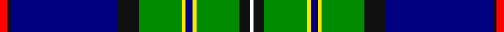

In pattern [RKBKGYBYGKW](/stripes/rkbkgybygkw/).

This was sourced from register-of-tartans.  It is a [11 stripe tartan](/stripes/stripes11/).

Original link https://www.tartanregister.gov.uk/tartanDetails.aspx?ref=10536

## Attestations

This cloth appears in 3 source records; the oldest owns this page.

- 10/06/2011 — Hororata (register-of-tartans, [record](https://www.tartanregister.gov.uk/tartanDetails.aspx?ref=10536))
- 10th June 2011 — Hororata (District) (tartans-authority, [record](http://www.tartansauthority.com/tartan-ferret/display/10536/))
- undated — Hororata District Tartan Tartan Number: 10536. Earliest known date: 9 January 2012 This tartan was created to celebrate the inaugural Hororata Highland Games in the aftermath of the 2011 earthquake which devastated Christchurch and destroyed many important buildings in the small town of Hororata. Based on the Mackenzie Clan tartan after the colourful 19th century New Zealand folk hero, James Mackenzie. Hororata is Maori for 'drooping rata', the Rata tree that produces masses of bright red flowers, leading it to be known as the South Island Christmas tree. Colours: red for the Rata flowers; black and white to complete the colours of the Maori flag; white also represents the snow capped mountains, green represents the fertile Canterbury plains and blue the major rivers flowing into the Pacific; black and yellow are the town colours of Hororata. The design and the first 30 metres of cloth were donated by the Scottish Tartans Authority and Andrew Elliot, weavers of Selkirk. The official registration in the Scottish Register of Tartans was donated by the National Records of Scotland. See products available Copyright © Blair Urquhart, Comrie, 2015 (house-of-tartan, [record](http://www.house-of-tartan.scotland.net/house/TartanViewjs.asp?colr=Def&tnam=10536))

## Register references

External register numbers recorded for this tartan.

- Scottish Register of Tartans: [10536](https://www.tartanregister.gov.uk/tartanDetails.aspx?ref=10536)

## Thread count
R/4 K2 DB60 K12 G24 Y2 DB4 Y2 G24 K6 W/2

## Palette
Each colour and the base-6 reference it is a variant of.

| Colour | Shade | Base |
|---|---|---|
| DB | <code style="background-color:#000080;">#000080</code> `oklch(27.1% 0.188 264.1)` <small>#000080</small> | B <code style="background-color:#2A418A;">#2A418A</code> |
| G | <code style="background-color:#008B00;">#008B00</code> `oklch(55.2% 0.188 142.5)` <small>#008B00</small> | G <code style="background-color:#006100;">#006100</code> |
| K | <code style="background-color:#101010;">#101010</code> `oklch(17.3% 0.000 89.9)` <small>#101010</small> | K <code style="background-color:#000000;">#000000</code> |
| R | <code style="background-color:#FF0000;">#FF0000</code> `oklch(62.8% 0.258 29.2)` <small>#FF0000</small> | R <code style="background-color:#CC0000;">#CC0000</code> |
| W | <code style="background-color:#FFFFFF;">#FFFFFF</code> `oklch(100.0% 0.000 89.9)` <small>#FFFFFF</small> | W <code style="background-color:#F7F7F7;">#F7F7F7</code> |
| Y | <code style="background-color:#FFE600;">#FFE600</code> `oklch(91.7% 0.192 101.4)` <small>#FFE600</small> | Y <code style="background-color:#F2BF00;">#F2BF00</code> |

## Nearest tartans

The nearest existing variants by ΔTartan distance, with this tartan at the top so the swatches line up against it.

ΔTartan

Tartan

Sett

—

<a href="/ttd/edit/#slug=r2k1db30k6g12ly1db2ly1g12k3w1~x2">Hororata</a> <a class="nn-out" href="/setts/s11/r2k1db30k6g12ly1db2ly1g12k3w1~x2/" title="open its dictionary page">↗</a>

0.94

<a href="/ttd/edit/#slug=db4w1k2db25k12db1k2g16k2r1~x2">Sidey Family (Dundee) (Personal)</a> <a class="nn-out" href="/setts/s10/db4w1k2db25k12db1k2g16k2r1~x2/" title="open its dictionary page">↗</a>

0.94

<a href="/ttd/edit/#slug=db10g6o4r2o4k10db6k4db28g55w4">1314 (Corporate)</a> <a class="nn-out" href="/setts/s11/db10g6o4r2o4k10db6k4db28g55w4/" title="open its dictionary page">↗</a>

1.12

<a href="/ttd/edit/#slug=r3db36lb10k8g13lo6g3lo3g3lo1~x2">Crookdake Cheng Family Tartan Tartan Number: 2207. Earliest known date: 1994 Designed by Phil Smith 1994 for the then Treasurer/Accountant of the Scottish Tartans Society at the request of Keith Lumsden. The yellow represents rice stalks. See products available Copyright © Blair Urquhart, Comrie, 2015</a> <a class="nn-out" href="/setts/s10/r3db36lb10k8g13lo6g3lo3g3lo1~x2/" title="open its dictionary page">↗</a>

1.13

<a href="/ttd/edit/#slug=lb11k2lb2k2lo2k11dg30r2dg3k1w5~x2">Labrador (District)</a> <a class="nn-out" href="/setts/s11/lb11k2lb2k2lo2k11dg30r2dg3k1w5~x2/" title="open its dictionary page">↗</a>

1.14

<a href="/ttd/edit/#slug=g4ly1t3db15g2r2g14db1t28db2~x2">Heriot Watt University</a> <a class="nn-out" href="/setts/s10/g4ly1t3db15g2r2g14db1t28db2~x2/" title="open its dictionary page">↗</a>

1.19

<a href="/ttd/edit/#slug=r2db24lb6k6g6ly4g2ly2g2ly1~x2">Crookdake-Cheng (Personal)</a> <a class="nn-out" href="/setts/s10/r2db24lb6k6g6ly4g2ly2g2ly1~x2/" title="open its dictionary page">↗</a>

1.29

<a href="/ttd/edit/#slug=w2db20dg2g2dg2g4dg8ly2r1~x2">Nova Scotia</a> <a class="nn-out" href="/setts/s9/w2db20dg2g2dg2g4dg8ly2r1~x2/" title="open its dictionary page">↗</a>

1.30

<a href="/ttd/edit/#slug=g30dp4r6w6db6dp3k14w14db50g50w2">Brehat (Personal)</a> <a class="nn-out" href="/setts/s11/g30dp4r6w6db6dp3k14w14db50g50w2/" title="open its dictionary page">↗</a>

1.30

<a href="/ttd/edit/#slug=g18r1g2r2g16r1k16n1k2r2db20r1lb2~x4">Canadian Estate</a> <a class="nn-out" href="/setts/s13/g18r1g2r2g16r1k16n1k2r2db20r1lb2~x4/" title="open its dictionary page">↗</a>

1.32

<a href="/ttd/edit/#slug=k3db2g2db26b1db1b1db1b1db1b3t2k10db3g14k3r3~x2">St Lawrence</a> <a class="nn-out" href="/setts/s17/k3db2g2db26b1db1b1db1b1db1b3t2k10db3g14k3r3~x2/" title="open its dictionary page">↗</a>

## Neighbour map

Every grey dot is one of 14299 variants placed by the first two principal components of the ΔTartan feature space (44% of its variance). Red is this tartan; blue dots are its nearest — click one to open its page.

<svg viewBox="0 0 640 380" role="img" style="max-width:100%;height:auto;border:1px solid #e0e0e0;border-radius:4px;display:block" xmlns="http://www.w3.org/2000/svg"><image href="/nn/cloud.v1.png" width="640" height="380"/><a href="/setts/s10/db4w1k2db25k12db1k2g16k2r1~x2/"><circle cx="229.7" cy="110.2" r="4" fill="#3465a4"><title>Sidey Family (Dundee) (Personal)</title></circle></a><a href="/setts/s11/db10g6o4r2o4k10db6k4db28g55w4/"><circle cx="253.7" cy="100.0" r="4" fill="#3465a4"><title>1314 (Corporate)</title></circle></a><a href="/setts/s10/r3db36lb10k8g13lo6g3lo3g3lo1~x2/"><circle cx="187.4" cy="80.7" r="4" fill="#3465a4"><title>Crookdake Cheng Family Tartan Tartan Number: 2207. Earliest known date: 1994 Designed by Phil Smith 1994 for the then Treasurer/Accountant of the Scottish Tartans Society at the request of Keith Lumsden. The yellow represents rice stalks. See products available Copyright © Blair Urquhart, Comrie, 2015</title></circle></a><a href="/setts/s11/lb11k2lb2k2lo2k11dg30r2dg3k1w5~x2/"><circle cx="223.5" cy="78.1" r="4" fill="#3465a4"><title>Labrador (District)</title></circle></a><a href="/setts/s10/g4ly1t3db15g2r2g14db1t28db2~x2/"><circle cx="231.0" cy="102.4" r="4" fill="#3465a4"><title>Heriot Watt University</title></circle></a><a href="/setts/s10/r2db24lb6k6g6ly4g2ly2g2ly1~x2/"><circle cx="173.8" cy="88.8" r="4" fill="#3465a4"><title>Crookdake-Cheng (Personal)</title></circle></a><a href="/setts/s9/w2db20dg2g2dg2g4dg8ly2r1~x2/"><circle cx="231.7" cy="115.2" r="4" fill="#3465a4"><title>Nova Scotia</title></circle></a><a href="/setts/s11/g30dp4r6w6db6dp3k14w14db50g50w2/"><circle cx="193.3" cy="99.4" r="4" fill="#3465a4"><title>Brehat (Personal)</title></circle></a><a href="/setts/s13/g18r1g2r2g16r1k16n1k2r2db20r1lb2~x4/"><circle cx="183.5" cy="99.3" r="4" fill="#3465a4"><title>Canadian Estate</title></circle></a><a href="/setts/s17/k3db2g2db26b1db1b1db1b1db1b3t2k10db3g14k3r3~x2/"><circle cx="215.5" cy="66.3" r="4" fill="#3465a4"><title>St Lawrence</title></circle></a><circle cx="233.3" cy="84.5" r="5" fill="#c00000"/></svg>

ID: /setts/s11/r2k1db30k6g12ly1db2ly1g12k3w1~x2/
