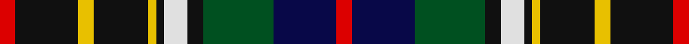

In pattern [RBGKWKYKYKR](/stripes/rbgkwkykykr/).

This was sourced from register-of-tartans.  It is a [11 stripe tartan](/stripes/stripes11/).

Original link https://www.tartanregister.gov.uk/tartanDetails.aspx?ref=1736

## Register references

External register numbers recorded for this tartan.

- Scottish Register of Tartans: [1736](https://www.tartanregister.gov.uk/tartanDetails.aspx?ref=1736)
- Scottish Tartans World Register: 2135

## Thread count
R/4 K16 Y4 K14 Y2 K2 LN6 K4 G18 DB16 R/4

## Palette
Each colour and its ΔE from the base-6 reference it is a variant of.

| Colour | Shade | Base | ΔE (OKLab) |
|---|---|---|---|
| DB | <code style="background-color:#080848;">#080848</code> `#080848` | B <code style="background-color:#2A418A;">#2A418A</code> | 0.20 |
| G | <code style="background-color:#005020;">#005020</code> `#005020` | G <code style="background-color:#006100;">#006100</code> | 0.07 |
| K | <code style="background-color:#101010;">#101010</code> `#101010` | K <code style="background-color:#000000;">#000000</code> | 0.17 |
| LN | <code style="background-color:#E0E0E0;">#E0E0E0</code> `#E0E0E0` | W <code style="background-color:#F7F7F7;">#F7F7F7</code> | 0.07 |
| R | <code style="background-color:#DC0000;">#DC0000</code> `#DC0000` | R <code style="background-color:#CC0000;">#CC0000</code> | 0.03 |
| Y | <code style="background-color:#E8C000;">#E8C000</code> `#E8C000` | Y <code style="background-color:#F2BF00;">#F2BF00</code> | 0.02 |

## Nearest tartans

The nearest existing variants by ΔTartan distance.

1. [Hislop Hunting (Name)](/setts/s11/r2k8ly2k7ly1k1w3k2g9db8r2~x2/) — ΔT 0.34
1. [Farquharson Dress (Fashion)](/setts/s13/lb6k1lb1k1lb1k8g8lo2g8k8db8k1r2~x2/) — ΔT 0.87
1. [Scottish Cultural Society (Corporate](/setts/s9/dp2g4k8lo1k1db4lb1db1lb2~x8/) — ΔT 0.93
1. [Drennan](/setts/s12/db7w3g3db18lo3k15lo3g17r6g3r2g7~x2/) — ΔT 0.94
1. [Bowie (white lines) (Name)](/setts/s13/dg8lo2dg4r4dg13w2y13w2db13r4db3r2db8~x2/) — ΔT 0.98
1. [Royal Dornoch Golf Club, The](/setts/s10/r12db22dg5db3ly3db3dg17b9dr7r2~x2/) — ΔT 0.98
1. [Cumming LO](/setts/s9/r4lr1r4dg10y1k10b4k2b4~x2/) — ΔT 0.99
1. [Crozier/Crosser](/setts/s11/w4db5r3db22ly4k3dg17r7k2r7ly2~x2/) — ΔT 1.00
1. [Gordonstoun](/setts/s12/ly4g20r3db11t3r11g11r3k20r3k3t3~x2/) — ΔT 1.00
1. [Veere (District)](/setts/s11/db6k2n2db8k18lo2g20db8n3k10lb6~x2/) — ΔT 1.00

## Neighbour map

Every grey dot is one of 14299 variants placed by the first two principal components of the ΔTartan feature space (44% of its variance). Red is this tartan; blue dots are its nearest — click one to open its page.

<svg viewBox="0 0 640 380" role="img" style="max-width:100%;height:auto;border:1px solid #e0e0e0;border-radius:4px;display:block" xmlns="http://www.w3.org/2000/svg"><image href="/nn/cloud.v1.png" width="640" height="380"/><a href="/setts/s11/r2k8ly2k7ly1k1w3k2g9db8r2~x2/"><circle cx="105.3" cy="155.0" r="4" fill="#3465a4"><title>Hislop Hunting (Name)</title></circle></a><a href="/setts/s13/lb6k1lb1k1lb1k8g8lo2g8k8db8k1r2~x2/"><circle cx="86.3" cy="155.4" r="4" fill="#3465a4"><title>Farquharson Dress (Fashion)</title></circle></a><a href="/setts/s9/dp2g4k8lo1k1db4lb1db1lb2~x8/"><circle cx="108.7" cy="165.8" r="4" fill="#3465a4"><title>Scottish Cultural Society (Corporate</title></circle></a><a href="/setts/s12/db7w3g3db18lo3k15lo3g17r6g3r2g7~x2/"><circle cx="106.8" cy="160.1" r="4" fill="#3465a4"><title>Drennan</title></circle></a><a href="/setts/s13/dg8lo2dg4r4dg13w2y13w2db13r4db3r2db8~x2/"><circle cx="69.6" cy="164.1" r="4" fill="#3465a4"><title>Bowie (white lines) (Name)</title></circle></a><a href="/setts/s10/r12db22dg5db3ly3db3dg17b9dr7r2~x2/"><circle cx="97.6" cy="150.1" r="4" fill="#3465a4"><title>Royal Dornoch Golf Club, The</title></circle></a><a href="/setts/s9/r4lr1r4dg10y1k10b4k2b4~x2/"><circle cx="84.7" cy="166.1" r="4" fill="#3465a4"><title>Cumming LO</title></circle></a><a href="/setts/s11/w4db5r3db22ly4k3dg17r7k2r7ly2~x2/"><circle cx="106.7" cy="129.0" r="4" fill="#3465a4"><title>Crozier/Crosser</title></circle></a><a href="/setts/s12/ly4g20r3db11t3r11g11r3k20r3k3t3~x2/"><circle cx="65.5" cy="155.8" r="4" fill="#3465a4"><title>Gordonstoun</title></circle></a><a href="/setts/s11/db6k2n2db8k18lo2g20db8n3k10lb6~x2/"><circle cx="97.5" cy="156.5" r="4" fill="#3465a4"><title>Veere (District)</title></circle></a><circle cx="110.5" cy="158.7" r="5" fill="#c00000"/></svg>

ID: /setts/s11/r2k8ly2k7ly1k1w3k2dg9db8r2~x2/
