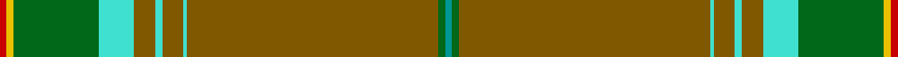

In pattern [GGGWGWGWGYR](/stripes/gggwgwgwgyr/).

This was sourced from tartans-authority.  It is a [11 stripe tartan](/stripes/stripes11/).

Original link http://www.tartansauthority.com/tartan-ferret/display/8010/

## Thread count
R/4 Y4 G48 Ba20 T12 Ba4 T12 Ba2 T142 G4 B/4

## Palette
Each colour and the base-6 reference it is a variant of.

| Colour | Shade | Base |
|---|---|---|
| B | <code style="background-color:#009894;">#009894</code> `oklch(61.4% 0.106 191.5)` <small>#009894</small> | G <code style="background-color:#006100;">#006100</code> |
| Ba | <code style="background-color:#40E0D0;">#40E0D0</code> `oklch(82.2% 0.131 185.1)` <small>#40E0D0</small> | W <code style="background-color:#F7F7F7;">#F7F7F7</code> |
| G | <code style="background-color:#006818;">#006818</code> `oklch(45.0% 0.142 145.0)` <small>#006818</small> | G <code style="background-color:#006100;">#006100</code> |
| R | <code style="background-color:#C80000;">#C80000</code> `oklch(52.3% 0.215 29.2)` <small>#C80000</small> | R <code style="background-color:#CC0000;">#CC0000</code> |
| T | <code style="background-color:#805800;">#805800</code> `oklch(49.1% 0.102 78.1)` <small>#805800</small> | G <code style="background-color:#006100;">#006100</code> |
| Y | <code style="background-color:#E8C000;">#E8C000</code> `oklch(81.9% 0.168 93.7)` <small>#E8C000</small> | Y <code style="background-color:#F2BF00;">#F2BF00</code> |

## Nearest tartans

The nearest existing variants by ΔTartan distance, with this tartan at the top so the swatches line up against it.

ΔTartan

Tartan

Sett

—

<a href="/ttd/edit/#slug=r2ly2g24lt10y6lt2y6lt1y71g2g2~x2">Original Tartan Ltd (Corporate)</a> <a class="nn-out" href="/setts/s11/r2ly2g24lt10y6lt2y6lt1y71g2g2~x2/" title="open its dictionary page">↗</a>

1.03

<a href="/ttd/edit/#slug=g43dp3o3dp2o4r3g2g13g2o9g1lo2~x2">Berry Tribute</a> <a class="nn-out" href="/setts/s12/g43dp3o3dp2o4r3g2g13g2o9g1lo2~x2/" title="open its dictionary page">↗</a>

1.34

<a href="/ttd/edit/#slug=dg43dp3o3dp2o4r3g2dg13g2o9dg1lo2~x2">Berry Tribute</a> <a class="nn-out" href="/setts/s12/dg43dp3o3dp2o4r3g2dg13g2o9dg1lo2~x2/" title="open its dictionary page">↗</a>

1.46

<a href="/ttd/edit/#slug=y30dg5g3r1g3k1g3r1g3db1lo1~x4">California Department of Forestry (Corporate)</a> <a class="nn-out" href="/setts/s11/y30dg5g3r1g3k1g3r1g3db1lo1~x4/" title="open its dictionary page">↗</a>

1.68

<a href="/ttd/edit/#slug=y80dt16dp8dp10y8lo1dt6o1~x2">Heather Isle (Fashion)</a> <a class="nn-out" href="/setts/s8/y80dt16dp8dp10y8lo1dt6o1~x2/" title="open its dictionary page">↗</a>

1.69

<a href="/ttd/edit/#slug=dy46t3dy7g2r2g2w2g11t6db2t3r2~x2">Diana Hunting Plaid Tartan Tartan Number: 1318. Earliest known date: 1981 Based on MacNab. See products available Copyright © Blair Urquhart, Comrie, 2015</a> <a class="nn-out" href="/setts/s12/dy46t3dy7g2r2g2w2g11t6db2t3r2~x2/" title="open its dictionary page">↗</a>

1.73

<a href="/ttd/edit/#slug=y60t5y8ly2y4w2y4dg16dy8y2dy4w2~x2">Stuart/Stewart Silver</a> <a class="nn-out" href="/setts/s12/y60t5y8ly2y4w2y4dg16dy8y2dy4w2~x2/" title="open its dictionary page">↗</a>

1.75

<a href="/ttd/edit/#slug=o60t5o8ly2o4w2o4g16dy8o2dy4w2~x2">Stuart Silver Commemorative Tartan Tartan Number: 1281. Earliest known date: 1977 1977 Jubilee tartan NOT accepted. No official jubilee tartan was adopted for the occasion. See products available Copyright © Blair Urquhart, Comrie, 2015</a> <a class="nn-out" href="/setts/s12/o60t5o8ly2o4w2o4g16dy8o2dy4w2~x2/" title="open its dictionary page">↗</a>

1.77

<a href="/ttd/edit/#slug=y68dy4g9lr2g3w3g3dy12y6g3y3w3~x2">Kelly Dress</a> <a class="nn-out" href="/setts/s12/y68dy4g9lr2g3w3g3dy12y6g3y3w3~x2/" title="open its dictionary page">↗</a>

1.86

<a href="/ttd/edit/#slug=g2r1g30r1g3r1g10o9g2r5db3w1r1~x2">Hans, Jaswinder (Personal)</a> <a class="nn-out" href="/setts/s13/g2r1g30r1g3r1g10o9g2r5db3w1r1~x2/" title="open its dictionary page">↗</a>

1.86

<a href="/ttd/edit/#slug=k1ly1k1ly1k1ly1k1ly1y46lr17y4lr16dr1~x2">Saunders (Personal)</a> <a class="nn-out" href="/setts/s13/k1ly1k1ly1k1ly1k1ly1y46lr17y4lr16dr1~x2/" title="open its dictionary page">↗</a>

## Neighbour map

Every grey dot is one of 14299 variants placed by the first two principal components of the ΔTartan feature space (44% of its variance). Red is this tartan; blue dots are its nearest — click one to open its page.

<svg viewBox="0 0 640 380" role="img" style="max-width:100%;height:auto;border:1px solid #e0e0e0;border-radius:4px;display:block" xmlns="http://www.w3.org/2000/svg"><image href="/nn/cloud.v1.png" width="640" height="380"/><a href="/setts/s12/g43dp3o3dp2o4r3g2g13g2o9g1lo2~x2/"><circle cx="463.2" cy="99.8" r="4" fill="#3465a4"><title>Berry Tribute</title></circle></a><a href="/setts/s12/dg43dp3o3dp2o4r3g2dg13g2o9dg1lo2~x2/"><circle cx="466.6" cy="101.3" r="4" fill="#3465a4"><title>Berry Tribute</title></circle></a><a href="/setts/s11/y30dg5g3r1g3k1g3r1g3db1lo1~x4/"><circle cx="372.5" cy="76.3" r="4" fill="#3465a4"><title>California Department of Forestry (Corporate)</title></circle></a><a href="/setts/s8/y80dt16dp8dp10y8lo1dt6o1~x2/"><circle cx="448.2" cy="83.3" r="4" fill="#3465a4"><title>Heather Isle (Fashion)</title></circle></a><a href="/setts/s12/dy46t3dy7g2r2g2w2g11t6db2t3r2~x2/"><circle cx="393.0" cy="104.4" r="4" fill="#3465a4"><title>Diana Hunting Plaid Tartan Tartan Number: 1318. Earliest known date: 1981 Based on MacNab. See products available Copyright © Blair Urquhart, Comrie, 2015</title></circle></a><a href="/setts/s12/y60t5y8ly2y4w2y4dg16dy8y2dy4w2~x2/"><circle cx="448.4" cy="97.6" r="4" fill="#3465a4"><title>Stuart/Stewart Silver</title></circle></a><a href="/setts/s12/o60t5o8ly2o4w2o4g16dy8o2dy4w2~x2/"><circle cx="457.4" cy="101.2" r="4" fill="#3465a4"><title>Stuart Silver Commemorative Tartan Tartan Number: 1281. Earliest known date: 1977 1977 Jubilee tartan NOT accepted. No official jubilee tartan was adopted for the occasion. See products available Copyright © Blair Urquhart, Comrie, 2015</title></circle></a><a href="/setts/s12/y68dy4g9lr2g3w3g3dy12y6g3y3w3~x2/"><circle cx="461.7" cy="100.1" r="4" fill="#3465a4"><title>Kelly Dress</title></circle></a><a href="/setts/s13/g2r1g30r1g3r1g10o9g2r5db3w1r1~x2/"><circle cx="409.7" cy="82.2" r="4" fill="#3465a4"><title>Hans, Jaswinder (Personal)</title></circle></a><a href="/setts/s13/k1ly1k1ly1k1ly1k1ly1y46lr17y4lr16dr1~x2/"><circle cx="410.4" cy="75.2" r="4" fill="#3465a4"><title>Saunders (Personal)</title></circle></a><circle cx="462.4" cy="77.5" r="5" fill="#c00000"/></svg>

ID: /setts/s11/r2ly2g24lt10y6lt2y6lt1y71g2g2~x2/
