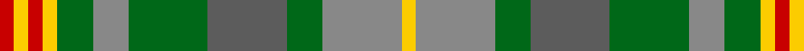

In pattern [RYRYGRGBGRY](/stripes/ryrygrgbgry/).

This was sourced from tartans-authority.  It is a [11 stripe tartan](/stripes/stripes11/).

Original link http://www.tartansauthority.com/tartan-ferret/display/10808/

## Also known as

This cloth is also recorded under:

- Vassseur Mignon

## Thread count
R/4 Y4 R4 Y4 G10 Na10 G22 N22 G10 Na22 Y/4

## Palette
Each colour and its ΔE from the base-6 reference it is a variant of.

| Colour | Shade | Base | ΔE (OKLab) |
|---|---|---|---|
| G | <code style="background-color:#006818;">#006818</code> `#006818` | G <code style="background-color:#006100;">#006100</code> | 0.02 |
| N | <code style="background-color:#5C5C5C;">#5C5C5C</code> `#5C5C5C` | B <code style="background-color:#2A418A;">#2A418A</code> | 0.15 |
| Na | <code style="background-color:#888888;">#888888</code> `#888888` | R <code style="background-color:#CC0000;">#CC0000</code> | 0.24 |
| R | <code style="background-color:#C80000;">#C80000</code> `#C80000` | R <code style="background-color:#CC0000;">#CC0000</code> | 0.01 |
| Y | <code style="background-color:#FCCC00;">#FCCC00</code> `#FCCC00` | Y <code style="background-color:#F2BF00;">#F2BF00</code> | 0.04 |

## Nearest tartans

The nearest existing variants by ΔTartan distance.

1. [Annand Family (Personal)](/setts/s11/dp4lo8g2lo2lo2lo2g2lo2dy6g10lo3~x2/) — ΔT 0.75
1. [Vasseur Mignon (Personal)](/setts/s11/r2ly2r2ly2g5lb5g11n11g5lb11ly2~x2/) — ΔT 1.13
1. [Harmony 14](/setts/s11/dg3y16dy11y2lo11y2lo11y2dy11y16w3~x2/) — ΔT 1.20
1. [Corcoran of Sherbrooke (Personal)](/setts/s9/k1lr1g5dp1g2dy5lr1y3lr1~x4/) — ΔT 1.21
1. [Niagara Falls](/setts/s12/db22g4db4g17o17g17db4g4db22ly8o8r8~x2/) — ΔT 1.21
1. [MacVicker (Name)](/setts/s13/dt12dy2ly2dy2dt2dy10g10dy3g12dy10dt11r2ly2~x2/) — ΔT 1.22
1. [MacDonald of Denovan Htg (Clan)](/setts/s12/dg10dp2dg3r4dg13k13r2g13r4g3r2g10~x2/) — ΔT 1.26
1. [Quinn (Name?)](/setts/s12/r20g5r5g30ly8g10k10g30r5g5r20g20~x2/) — ΔT 1.26
1. [Rotary Corporate Tartan Tartan Number: 2334. Earliest known date: 1996 March 1996. Check colours. Sample in STA Johnston Collection. Woven by Lochcarron of Scotland. STS entry says that it was launched at the Rotary World Convention, Glasgow, 1997 and indicates that it was designed by the Tartans Society (Keith Lumsden) for Rotary International. A counter claim suggests that Geoffrey (Tailor) was the designer. He's certainly the official supplier and can be contacted on 0131 557 0256 - 17.9.04 - "only polyviscose left and when that's finished, they won't be stocking any more." See products available Copyright © Blair Urquhart, Comrie, 2015](/setts/s12/g15r3t15r8g15ly2db4~x2/) — ΔT 1.39
1. [Muirhead (Clan)](/setts/s11/ly3g14g9db4g8w2g12r12g2r5w2~x2/) — ΔT 1.40

## Neighbour map

Every grey dot is one of 14299 variants placed by the first two principal components of the ΔTartan feature space (44% of its variance). Red is this tartan; blue dots are its nearest — click one to open its page.

<svg viewBox="0 0 640 380" role="img" style="max-width:100%;height:auto;border:1px solid #e0e0e0;border-radius:4px;display:block" xmlns="http://www.w3.org/2000/svg"><image href="/nn/cloud.v1.png" width="640" height="380"/><a href="/setts/s11/dp4lo8g2lo2lo2lo2g2lo2dy6g10lo3~x2/"><circle cx="177.3" cy="224.4" r="4" fill="#3465a4"><title>Annand Family (Personal)</title></circle></a><a href="/setts/s11/r2ly2r2ly2g5lb5g11n11g5lb11ly2~x2/"><circle cx="115.1" cy="195.8" r="4" fill="#3465a4"><title>Vasseur Mignon (Personal)</title></circle></a><a href="/setts/s11/dg3y16dy11y2lo11y2lo11y2dy11y16w3~x2/"><circle cx="205.8" cy="202.4" r="4" fill="#3465a4"><title>Harmony 14</title></circle></a><a href="/setts/s9/k1lr1g5dp1g2dy5lr1y3lr1~x4/"><circle cx="109.2" cy="204.9" r="4" fill="#3465a4"><title>Corcoran of Sherbrooke (Personal)</title></circle></a><a href="/setts/s12/db22g4db4g17o17g17db4g4db22ly8o8r8~x2/"><circle cx="142.1" cy="219.6" r="4" fill="#3465a4"><title>Niagara Falls</title></circle></a><a href="/setts/s13/dt12dy2ly2dy2dt2dy10g10dy3g12dy10dt11r2ly2~x2/"><circle cx="164.8" cy="218.2" r="4" fill="#3465a4"><title>MacVicker (Name)</title></circle></a><a href="/setts/s12/dg10dp2dg3r4dg13k13r2g13r4g3r2g10~x2/"><circle cx="149.0" cy="217.0" r="4" fill="#3465a4"><title>MacDonald of Denovan Htg (Clan)</title></circle></a><a href="/setts/s12/r20g5r5g30ly8g10k10g30r5g5r20g20~x2/"><circle cx="163.0" cy="204.4" r="4" fill="#3465a4"><title>Quinn (Name?)</title></circle></a><a href="/setts/s12/g15r3t15r8g15ly2db4~x2/"><circle cx="170.7" cy="199.8" r="4" fill="#3465a4"><title>Rotary Corporate Tartan Tartan Number: 2334. Earliest known date: 1996 March 1996. Check colours. Sample in STA Johnston Collection. Woven by Lochcarron of Scotland. STS entry says that it was launched at the Rotary World Convention, Glasgow, 1997 and indicates that it was designed by the Tartans Society (Keith Lumsden) for Rotary International. A counter claim suggests that Geoffrey (Tailor) was the designer. He's certainly the official supplier and can be contacted on 0131 557 0256 - 17.9.04 - &quot;only polyviscose left and when that's finished, they won't be stocking any more.&quot; See products available Copyright © Blair Urquhart, Comrie, 2015</title></circle></a><a href="/setts/s11/ly3g14g9db4g8w2g12r12g2r5w2~x2/"><circle cx="139.7" cy="183.2" r="4" fill="#3465a4"><title>Muirhead (Clan)</title></circle></a><circle cx="143.1" cy="213.6" r="5" fill="#c00000"/></svg>

ID: /setts/s11/r2ly2r2ly2g5o5g11n11g5o11ly2~x2/
