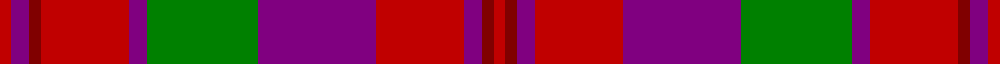

This page is one **sett** — a single exact thread-count. It belongs to the [tartan](/tartans/r2p3ri2r15p3g19p20r15p3ri2r2/)
(the same proportion at any scale), whose colour order is pattern [RBRRBGBRBRR](/stripes/rbrrbgbrbrr/).

Sourced from weddslist.  It is a [11 stripe tartan](/stripes/stripes11/).

Original link http://www.weddslist.com/cgi-bin/tartans/pg.pl?source=sts

## Thread count
R/4 P6 DR4 R30 P6 G38 P40 R30 P6 DR4 R/4

## Palette

Palette: <strong>custom</strong>
<table><thead><tr><th>Colour</th><th>Threads</th><th>Shade</th><th>Base</th><th>OKLCh</th></tr></thead><tbody><tr><td>R/</td><td style="text-align:right;font-variant-numeric:tabular-nums">4</td><td><code style="background-color:#C00000;">#C00000</code> <small style="color:#888">#C00000</small></td><td>R <code style="background-color:#CC0000;">#CC0000</code></td><td><small style="color:#888">oklch(50.7% 0.208 29.2)</small></td></tr><tr><td>P</td><td style="text-align:right;font-variant-numeric:tabular-nums">6</td><td><code style="background-color:#800080;">#800080</code> <small style="color:#888">#800080</small></td><td>B <code style="background-color:#2A418A;">#2A418A</code></td><td><small style="color:#888">oklch(42.1% 0.193 328.4)</small></td></tr><tr><td>DR</td><td style="text-align:right;font-variant-numeric:tabular-nums">4</td><td><code style="background-color:#800000;">#800000</code> <small style="color:#888">#800000</small></td><td>R <code style="background-color:#CC0000;">#CC0000</code></td><td><small style="color:#888">oklch(37.7% 0.155 29.2)</small></td></tr><tr><td>R</td><td style="text-align:right;font-variant-numeric:tabular-nums">30</td><td><code style="background-color:#C00000;">#C00000</code> <small style="color:#888">#C00000</small></td><td>R <code style="background-color:#CC0000;">#CC0000</code></td><td><small style="color:#888">oklch(50.7% 0.208 29.2)</small></td></tr><tr><td>P</td><td style="text-align:right;font-variant-numeric:tabular-nums">6</td><td><code style="background-color:#800080;">#800080</code> <small style="color:#888">#800080</small></td><td>B <code style="background-color:#2A418A;">#2A418A</code></td><td><small style="color:#888">oklch(42.1% 0.193 328.4)</small></td></tr><tr><td>G</td><td style="text-align:right;font-variant-numeric:tabular-nums">38</td><td><code style="background-color:#008000;">#008000</code> <small style="color:#888">#008000</small></td><td>G <code style="background-color:#006100;">#006100</code></td><td><small style="color:#888">oklch(52.0% 0.177 142.5)</small></td></tr><tr><td>P</td><td style="text-align:right;font-variant-numeric:tabular-nums">40</td><td><code style="background-color:#800080;">#800080</code> <small style="color:#888">#800080</small></td><td>B <code style="background-color:#2A418A;">#2A418A</code></td><td><small style="color:#888">oklch(42.1% 0.193 328.4)</small></td></tr><tr><td>R</td><td style="text-align:right;font-variant-numeric:tabular-nums">30</td><td><code style="background-color:#C00000;">#C00000</code> <small style="color:#888">#C00000</small></td><td>R <code style="background-color:#CC0000;">#CC0000</code></td><td><small style="color:#888">oklch(50.7% 0.208 29.2)</small></td></tr><tr><td>P</td><td style="text-align:right;font-variant-numeric:tabular-nums">6</td><td><code style="background-color:#800080;">#800080</code> <small style="color:#888">#800080</small></td><td>B <code style="background-color:#2A418A;">#2A418A</code></td><td><small style="color:#888">oklch(42.1% 0.193 328.4)</small></td></tr><tr><td>DR</td><td style="text-align:right;font-variant-numeric:tabular-nums">4</td><td><code style="background-color:#800000;">#800000</code> <small style="color:#888">#800000</small></td><td>R <code style="background-color:#CC0000;">#CC0000</code></td><td><small style="color:#888">oklch(37.7% 0.155 29.2)</small></td></tr><tr><td>R/</td><td style="text-align:right;font-variant-numeric:tabular-nums">4</td><td><code style="background-color:#C00000;">#C00000</code> <small style="color:#888">#C00000</small></td><td>R <code style="background-color:#CC0000;">#CC0000</code></td><td><small style="color:#888">oklch(50.7% 0.208 29.2)</small></td></tr></tbody></table>

## Nearest tartans

The nearest existing variants by ΔTartan distance, with this tartan at the top so the swatches line up against it.

ΔTartan

Tartan

Sett

—

<a href="/ttd/edit/#slug=r2p3ri2r15p3g19p20r15p3ri2r2~x2">Drumlithie, Rock and Wheel</a> <a class="nn-out" href="/setts/s11/r2p3ri2r15p3g19p20r15p3ri2r2~x2/" title="open its dictionary page">↗</a>

0.19

<a href="/ttd/edit/#slug=r2dp3ri2r15dp2g20dp20r15dp3ri2r2~x2">Drumlithie</a> <a class="nn-out" href="/setts/s11/r2dp3ri2r15dp2g20dp20r15dp3ri2r2~x2/" title="open its dictionary page">↗</a>

0.24

<a href="/ttd/edit/#slug=r2dp3ri2r15dp3g19dp20r15dp3ri2r2~x2">Drumlithie Rock and Wheel Tartan Tartan Number: 1414. Earliest known date: pre 2003 tba See products available Copyright © Blair Urquhart, Comrie, 2015</a> <a class="nn-out" href="/setts/s11/r2dp3ri2r15dp3g19dp20r15dp3ri2r2~x2/" title="open its dictionary page">↗</a>

0.58

<a href="/ttd/edit/#slug=r2dp3ri2r15dp2dg20dp20r15dp3ri2r2~x2">Drumlithie - 1790 (Fashion)</a> <a class="nn-out" href="/setts/s11/r2dp3ri2r15dp2dg20dp20r15dp3ri2r2~x2/" title="open its dictionary page">↗</a>

1.21

<a href="/ttd/edit/#slug=g12ri11p12r3ri32p8g8p8~x2">Fiddes</a> <a class="nn-out" href="/setts/s8/g12ri11p12r3ri32p8g8p8~x2/" title="open its dictionary page">↗</a>

1.22

<a href="/ttd/edit/#slug=y3dr18y4dr3y4r13y3y18dr2lo3~x2">Leitrim</a> <a class="nn-out" href="/setts/s10/y3dr18y4dr3y4r13y3y18dr2lo3~x2/" title="open its dictionary page">↗</a>

1.23

<a href="/ttd/edit/#slug=db24r3db4r6g8r3g8r30k3~x2">Gates</a> <a class="nn-out" href="/setts/s9/db24r3db4r6g8r3g8r30k3~x2/" title="open its dictionary page">↗</a>

1.24

<a href="/ttd/edit/#slug=ri3b3ri18r2ri2r3ri2r4b18ly2~x2">FC Barcelona (Corporate)</a> <a class="nn-out" href="/setts/s10/ri3b3ri18r2ri2r3ri2r4b18ly2~x2/" title="open its dictionary page">↗</a>

1.25

<a href="/ttd/edit/#slug=dp3r17k3lo3k3dp3k3r7dp8k3dp1lo3~x4">Bates-Dayton</a> <a class="nn-out" href="/setts/s12/dp3r17k3lo3k3dp3k3r7dp8k3dp1lo3~x4/" title="open its dictionary page">↗</a>

1.29

<a href="/ttd/edit/#slug=y4w2y2w3y20db6r3db2r2db2r17db3~x2">Eidart, Scotch House</a> <a class="nn-out" href="/setts/s12/y4w2y2w3y20db6r3db2r2db2r17db3~x2/" title="open its dictionary page">↗</a>

1.29

<a href="/ttd/edit/#slug=g10r25t2db25r2g2r25g2r2db25r4~x2">Hebridean 3</a> <a class="nn-out" href="/setts/s11/g10r25t2db25r2g2r25g2r2db25r4~x2/" title="open its dictionary page">↗</a>

## Neighbour map

Every grey dot is one of 14359 variants placed by the first two principal components of the ΔTartan feature space (44% of its variance). Red is this tartan; blue dots are its nearest — click one to open its page.

<svg viewBox="0 0 640 380" role="img" style="max-width:100%;height:auto;border:1px solid #e0e0e0;border-radius:4px;display:block" xmlns="http://www.w3.org/2000/svg"><image href="/nn/cloud.v1.png" width="640" height="380"/><a href="/setts/s11/r2dp3ri2r15dp2g20dp20r15dp3ri2r2~x2/"><circle cx="250.1" cy="174.6" r="4" fill="#3465a4"><title>Drumlithie</title></circle></a><a href="/setts/s11/r2dp3ri2r15dp3g19dp20r15dp3ri2r2~x2/"><circle cx="250.4" cy="176.9" r="4" fill="#3465a4"><title>Drumlithie Rock and Wheel Tartan Tartan Number: 1414. Earliest known date: pre 2003 tba See products available Copyright © Blair Urquhart, Comrie, 2015</title></circle></a><a href="/setts/s11/r2dp3ri2r15dp2dg20dp20r15dp3ri2r2~x2/"><circle cx="242.1" cy="173.8" r="4" fill="#3465a4"><title>Drumlithie - 1790 (Fashion)</title></circle></a><a href="/setts/s8/g12ri11p12r3ri32p8g8p8~x2/"><circle cx="264.1" cy="206.3" r="4" fill="#3465a4"><title>Fiddes</title></circle></a><a href="/setts/s10/y3dr18y4dr3y4r13y3y18dr2lo3~x2/"><circle cx="247.1" cy="186.3" r="4" fill="#3465a4"><title>Leitrim</title></circle></a><a href="/setts/s9/db24r3db4r6g8r3g8r30k3~x2/"><circle cx="269.6" cy="180.1" r="4" fill="#3465a4"><title>Gates</title></circle></a><a href="/setts/s10/ri3b3ri18r2ri2r3ri2r4b18ly2~x2/"><circle cx="268.2" cy="171.7" r="4" fill="#3465a4"><title>FC Barcelona (Corporate)</title></circle></a><a href="/setts/s12/dp3r17k3lo3k3dp3k3r7dp8k3dp1lo3~x4/"><circle cx="242.5" cy="146.3" r="4" fill="#3465a4"><title>Bates-Dayton</title></circle></a><a href="/setts/s12/y4w2y2w3y20db6r3db2r2db2r17db3~x2/"><circle cx="238.1" cy="160.3" r="4" fill="#3465a4"><title>Eidart, Scotch House</title></circle></a><a href="/setts/s11/g10r25t2db25r2g2r25g2r2db25r4~x2/"><circle cx="298.4" cy="172.6" r="4" fill="#3465a4"><title>Hebridean 3</title></circle></a><circle cx="244.2" cy="174.5" r="5" fill="#c00000"/></svg>

ID: /setts/s11/r2p3ri2r15p3g19p20r15p3ri2r2~x2/
