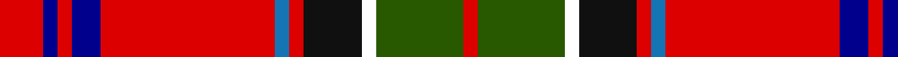

In pattern [RBRBRBRKWGR](/patterns/rbrbrbrkwgr/).

This was sourced from register-of-tartans.  It is a [11 stripes tartan](/stripes/stripes11/).

Original link https://www.tartanregister.gov.uk/tartanDetails.aspx?ref=11439

## Thread count
R/12 DB4 R4 DB8 R48 B4 R4 K16 W4 G24 R/4

## Palette
Each colour and its ΔE from the base-6 reference it is a variant of.

| Colour | Shade | Base | ΔE (OKLab) |
|---|---|---|---|
| B | <code style="background-color:#1474B4;">#1474B4</code> `#1474B4` | B <code style="background-color:#2A418A;">#2A418A</code> | 0.15 |
| DB | <code style="background-color:#00008C;">#00008C</code> `#00008C` | B <code style="background-color:#2A418A;">#2A418A</code> | 0.13 |
| G | <code style="background-color:#285800;">#285800</code> `#285800` | G <code style="background-color:#006100;">#006100</code> | 0.03 |
| K | <code style="background-color:#101010;">#101010</code> `#101010` | K <code style="background-color:#000000;">#000000</code> | 0.17 |
| R | <code style="background-color:#DC0000;">#DC0000</code> `#DC0000` | R <code style="background-color:#CC0000;">#CC0000</code> | 0.03 |
| W | <code style="background-color:#FFFFFF;">#FFFFFF</code> `#FFFFFF` | W <code style="background-color:#F7F7F7;">#F7F7F7</code> | 0.02 |

## Nearest tartans

The nearest existing variants by ΔTartan distance.

1. [Maynard](/setts/s13/y3r25g8r4b8w2b3w2b8r4k8r25y3~b2c2c80-g006818-k101010-rc80000-we0e0e0-ye8c000~x2/) — ΔT 0.61
1. [Gillespie](/setts/s9/r13g1k3y1ga4r1k2g1w1~g789484-ga003820-k101010-rc80000-wfcfcfc-ye8c000~x4/) — ΔT 0.69
1. [Hello Kitty Red](/setts/s10/w2g4k6g6r2b3r21g3r3y2~b0596fa-g603800-k000000-rb03000-wffffff-yffe600~x2/) — ΔT 0.73
1. [Gillespie Family Tartan Tartan Number: 1361. Earliest known date: pre 1992 Scott Adie were retailers from c.1860 See products available Copyright © Blair Urquhart, Comrie, 2015](/setts/s9/r13b1k3y1g4r1k2b1w1~b5c8ca8-g006818-k101010-rc80000-we0e0e0-ye8c000~x4/) — ΔT 0.76
1. [MacArthur-Fox Dress (Personal)](/setts/s11/b4k2ba3r33g9w3r5ba10r6g2k2~b5c8ca8-ba2c2c80-g006818-k101010-rc80000-wfceca0~x2/) — ΔT 0.78
1. [MacArthur-Fox Dress](/setts/s11/w4k2b3r33g9y3r5b10r6g2k2~b2a3c78-g0b5027-k101010-rd60619-wb5b5d5-yf6c42b~x2/) — ΔT 0.83
1. [Hepburn Family Tartan Tartan Number: 1381. Earliest known date: 1968 This sett was produced for Captain Charles Hepburn in 1968 by Anderson's of Edinburgh, from an existing design. Hepburns are associated with Hermitage Castle in Liddesdale and the history of Mary, Queen of Scots. James Hepburn, 4th Earl of Bothwell (1536-78), married the Queen after being implicated in the murder of her husband, Lord Darnley. See products available Copyright © Blair Urquhart, Comrie, 2015](/setts/s12/r21b4k5y2k2y2k2r7g4r2b3y2~b2c2c80-g006818-k101010-rc80000-ye8c000~x2/) — ΔT 0.91
1. [Peacock (Personal)](/setts/s13/w2k1b2wa1g4r1g4r3k3r12wa1r2k1~b1474b4-g285800-k101010-rc80000-wfcfcfc-wa98c8e8~x4/) — ΔT 0.91
1. [Gillespie](/setts/s9/r13b1k3y1g4r1k2b1w1~b5480b0-g008000-k000000-rc00000-we0e0e0-yf0c000~x4/) — ΔT 0.96
1. [Cork County Crest (Fashion)](/setts/s11/r7k6r62k15r20b15y10k16ba10k3w6~b5c5c5c-ba2c2c80-k101010-rc80000-we0e0e0-ybc8c00/) — ΔT 0.96

## Neighbour map

Every grey dot is one of 15726 variants placed by the first two principal components of the ΔTartan feature space (44% of its variance). Red is this tartan; blue dots are its nearest — click one to open its page.

<svg viewBox="0 0 640 380" role="img" style="max-width:100%;height:auto;border:1px solid #e0e0e0;border-radius:4px;display:block" xmlns="http://www.w3.org/2000/svg"><image href="/nn/cloud.v1.png" width="640" height="380"/><a href="/setts/s13/y3r25g8r4b8w2b3w2b8r4k8r25y3~b2c2c80-g006818-k101010-rc80000-we0e0e0-ye8c000~x2/"><circle cx="256.2" cy="111.7" r="4" fill="#3465a4"><title>Maynard</title></circle></a><a href="/setts/s9/r13g1k3y1ga4r1k2g1w1~g789484-ga003820-k101010-rc80000-wfcfcfc-ye8c000~x4/"><circle cx="247.0" cy="107.4" r="4" fill="#3465a4"><title>Gillespie</title></circle></a><a href="/setts/s10/w2g4k6g6r2b3r21g3r3y2~b0596fa-g603800-k000000-rb03000-wffffff-yffe600~x2/"><circle cx="215.4" cy="121.8" r="4" fill="#3465a4"><title>Hello Kitty Red</title></circle></a><a href="/setts/s9/r13b1k3y1g4r1k2b1w1~b5c8ca8-g006818-k101010-rc80000-we0e0e0-ye8c000~x4/"><circle cx="249.2" cy="108.6" r="4" fill="#3465a4"><title>Gillespie Family Tartan Tartan Number: 1361. Earliest known date: pre 1992 Scott Adie were retailers from c.1860 See products available Copyright © Blair Urquhart, Comrie, 2015</title></circle></a><a href="/setts/s11/b4k2ba3r33g9w3r5ba10r6g2k2~b5c8ca8-ba2c2c80-g006818-k101010-rc80000-wfceca0~x2/"><circle cx="287.4" cy="98.2" r="4" fill="#3465a4"><title>MacArthur-Fox Dress (Personal)</title></circle></a><a href="/setts/s11/w4k2b3r33g9y3r5b10r6g2k2~b2a3c78-g0b5027-k101010-rd60619-wb5b5d5-yf6c42b~x2/"><circle cx="288.6" cy="96.2" r="4" fill="#3465a4"><title>MacArthur-Fox Dress</title></circle></a><a href="/setts/s12/r21b4k5y2k2y2k2r7g4r2b3y2~b2c2c80-g006818-k101010-rc80000-ye8c000~x2/"><circle cx="256.5" cy="126.0" r="4" fill="#3465a4"><title>Hepburn Family Tartan Tartan Number: 1381. Earliest known date: 1968 This sett was produced for Captain Charles Hepburn in 1968 by Anderson's of Edinburgh, from an existing design. Hepburns are associated with Hermitage Castle in Liddesdale and the history of Mary, Queen of Scots. James Hepburn, 4th Earl of Bothwell (1536-78), married the Queen after being implicated in the murder of her husband, Lord Darnley. See products available Copyright © Blair Urquhart, Comrie, 2015</title></circle></a><a href="/setts/s13/w2k1b2wa1g4r1g4r3k3r12wa1r2k1~b1474b4-g285800-k101010-rc80000-wfcfcfc-wa98c8e8~x4/"><circle cx="199.6" cy="107.4" r="4" fill="#3465a4"><title>Peacock (Personal)</title></circle></a><a href="/setts/s9/r13b1k3y1g4r1k2b1w1~b5480b0-g008000-k000000-rc00000-we0e0e0-yf0c000~x4/"><circle cx="231.7" cy="104.0" r="4" fill="#3465a4"><title>Gillespie</title></circle></a><a href="/setts/s11/r7k6r62k15r20b15y10k16ba10k3w6~b5c5c5c-ba2c2c80-k101010-rc80000-we0e0e0-ybc8c00/"><circle cx="263.5" cy="100.1" r="4" fill="#3465a4"><title>Cork County Crest (Fashion)</title></circle></a><circle cx="248.4" cy="110.4" r="5" fill="#c00000"/></svg>

ID: /setts/s11/r3b1r1b2r12ba1r1k4w1g6r1~b00008c-ba1474b4-g285800-k101010-rdc0000-wffffff~x4/
