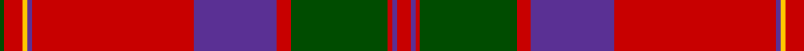

In pattern [GRYBRBRGRBR](/patterns/grybrbrgrbr/).

This was sourced from weddslist.  It is a [11 stripes tartan](/stripes/stripes11/).

Original link http://www.weddslist.com/cgi-bin/tartans/pg.pl?source=rb

## Thread count
G/2 R8 Y2 P2 R70 P36 R6 G42 R2 P2 R/6

## Palette
Each colour and its ΔE from the base-6 reference it is a variant of.

| Colour | Shade | Base | ΔE (OKLab) |
|---|---|---|---|
| G | <code style="background-color:#004C00;">#004C00</code> `#004C00` | G <code style="background-color:#006100;">#006100</code> | 0.07 |
| P | <code style="background-color:#5A3094;">#5A3094</code> `#5A3094` | B <code style="background-color:#2A418A;">#2A418A</code> | 0.08 |
| R | <code style="background-color:#C80000;">#C80000</code> `#C80000` | R <code style="background-color:#CC0000;">#CC0000</code> | 0.01 |
| Y | <code style="background-color:#FFC800;">#FFC800</code> `#FFC800` | Y <code style="background-color:#F2BF00;">#F2BF00</code> | 0.03 |

## Nearest tartans

The nearest existing variants by ΔTartan distance.

1. [MacPherson of Cluny](/setts/s11/r5b2r2g42r5b36r70b2y2r7g2x2~b800080-g008000-rc00000-yf0c000/) — ΔT 0.43
1. [MacGillivray Clan Tartan Tartan Number: 446. Earliest known date: 1831 "A characteristic Clan Chattan tartan...", writes D.C.Stewart, with much in common with the setts of the neighbouring clans in Strathnairn and Morvern. Wilson produced this sett with a black stripe in the centre of the the red square. The chiefship of Clan MacGillivray is vacant and the 'Steward' of clan affairs, appointed by Lord Lyon, is Commander Colonel George Brown MacGillivray. See products available Copyright © Blair Urquhart, Comrie, 2015](/setts/s13/r4b1ba1r32b2r2ba12r2g16r4b1r4ba2x2~b5c8ca8-ba2c2c80-g006818-rc80000/) — ΔT 0.69
1. [MacDonell of Keppoch (artefact)](/setts/s11/r6b1r1g28r4b8w1r32g1r4g2x2~b2c4084-g005020-rdc0000-we0e0e0/) — ΔT 0.80
1. [MacGillivray](/setts/s13/r4b1ba1r32b2r2ba12r2g16r4b1r4ba2x2~b5480b0-ba304080-g008000-rc00000/) — ΔT 0.82
1. [Chisholm D](/setts/s10/r6w1r24b6g2b1g2b1g12r1x2~b5a3094-g004c00-rc80000-wd0d0d0/) — ΔT 0.83
1. [MacPherson of Cluny](/setts/s11/r5k2r2g42r5k36r70k2y2r7g2~g006818-k1c002c-rc80000-ye8c000/) — ΔT 0.89
1. [MacGillivray](/setts/s13/r4b1ba1r32b2r2ba12r2g16r4b1r4ba2x2~b4367ae-ba000052-g11450d-raa0000/) — ΔT 0.93
1. [Chisholm](/setts/s10/r6w1r24b6g2b1g2b1g12r1x2~b2c2c80-g006818-rc80000-wfcfcfc/) — ΔT 0.97
1. [Grant or Drummond Clan Tartan Tartan Number: 1384. Earliest known date: 1831 The usual design is sometimes called Drummond. It is recorded by Logan (1831), Smibert (1850), and Smith (1850). McIan's drawing of the Grant tartan is too roughly done to make out the pattern details. A certain difficulty arises in establishing a single Grant tartan to represent the clan, illustrated by the existance of ten Grant portraits at Cullen House in which each brother is wearing a different tartan, and where a coat or plaid is worn, these also differ. The chief of the Grants is Lord Strathspey. See products available Copyright © Blair Urquhart, Comrie, 2015](/setts/s15/r6b2r2g24r2g2r2b8r2ba2r32b2r2b1r6x2~b2c2c80-ba2888c4-g006818-rc80000/) — ΔT 0.98
1. [Drummond Clan Tartan Tartan Number: 457. Earliest known date: 1822 The sett closely resembles the pattern used by McIan for his Drummond figure, which Logan asserts is in fact a Grant tartan. Nevertheless it is established that the Drummonds wore this sett to meet George IV in Edinburgh in 1822. The illustration here come from a sample in the MacGregor-Hastie Collection. There is also a Drummond of Perth sett. See products available Copyright © Blair Urquhart, Comrie, 2015](/setts/s16/r6b1r2b2r28ba2r2b9r2g2r2g24r3b2r6b2x2~b2c2c80-ba5c8ca8-g006818-rc80000/) — ΔT 0.98

## Neighbour map

Every grey dot is one of 15726 variants placed by the first two principal components of the ΔTartan feature space (44% of its variance). Red is this tartan; blue dots are its nearest — click one to open its page.

<svg viewBox="0 0 640 380" role="img" style="max-width:100%;height:auto;border:1px solid #e0e0e0;border-radius:4px;display:block" xmlns="http://www.w3.org/2000/svg"><image href="/nn/cloud.v1.png" width="640" height="380"/><a href="/setts/s11/r5b2r2g42r5b36r70b2y2r7g2x2~b800080-g008000-rc00000-yf0c000/"><circle cx="368.4" cy="100.6" r="4" fill="#3465a4"><title>MacPherson of Cluny</title></circle></a><a href="/setts/s13/r4b1ba1r32b2r2ba12r2g16r4b1r4ba2x2~b5c8ca8-ba2c2c80-g006818-rc80000/"><circle cx="391.4" cy="100.6" r="4" fill="#3465a4"><title>MacGillivray Clan Tartan Tartan Number: 446. Earliest known date: 1831 &quot;A characteristic Clan Chattan tartan...&quot;, writes D.C.Stewart, with much in common with the setts of the neighbouring clans in Strathnairn and Morvern. Wilson produced this sett with a black stripe in the centre of the the red square. The chiefship of Clan MacGillivray is vacant and the 'Steward' of clan affairs, appointed by Lord Lyon, is Commander Colonel George Brown MacGillivray. See products available Copyright © Blair Urquhart, Comrie, 2015</title></circle></a><a href="/setts/s11/r6b1r1g28r4b8w1r32g1r4g2x2~b2c4084-g005020-rdc0000-we0e0e0/"><circle cx="374.7" cy="106.1" r="4" fill="#3465a4"><title>MacDonell of Keppoch (artefact)</title></circle></a><a href="/setts/s13/r4b1ba1r32b2r2ba12r2g16r4b1r4ba2x2~b5480b0-ba304080-g008000-rc00000/"><circle cx="395.4" cy="103.1" r="4" fill="#3465a4"><title>MacGillivray</title></circle></a><a href="/setts/s10/r6w1r24b6g2b1g2b1g12r1x2~b5a3094-g004c00-rc80000-wd0d0d0/"><circle cx="373.1" cy="126.9" r="4" fill="#3465a4"><title>Chisholm D</title></circle></a><a href="/setts/s11/r5k2r2g42r5k36r70k2y2r7g2~g006818-k1c002c-rc80000-ye8c000/"><circle cx="344.9" cy="96.4" r="4" fill="#3465a4"><title>MacPherson of Cluny</title></circle></a><a href="/setts/s13/r4b1ba1r32b2r2ba12r2g16r4b1r4ba2x2~b4367ae-ba000052-g11450d-raa0000/"><circle cx="390.3" cy="106.1" r="4" fill="#3465a4"><title>MacGillivray</title></circle></a><a href="/setts/s10/r6w1r24b6g2b1g2b1g12r1x2~b2c2c80-g006818-rc80000-wfcfcfc/"><circle cx="364.4" cy="124.8" r="4" fill="#3465a4"><title>Chisholm</title></circle></a><a href="/setts/s15/r6b2r2g24r2g2r2b8r2ba2r32b2r2b1r6x2~b2c2c80-ba2888c4-g006818-rc80000/"><circle cx="390.9" cy="93.4" r="4" fill="#3465a4"><title>Grant or Drummond Clan Tartan Tartan Number: 1384. Earliest known date: 1831 The usual design is sometimes called Drummond. It is recorded by Logan (1831), Smibert (1850), and Smith (1850). McIan's drawing of the Grant tartan is too roughly done to make out the pattern details. A certain difficulty arises in establishing a single Grant tartan to represent the clan, illustrated by the existance of ten Grant portraits at Cullen House in which each brother is wearing a different tartan, and where a coat or plaid is worn, these also differ. The chief of the Grants is Lord Strathspey. See products available Copyright © Blair Urquhart, Comrie, 2015</title></circle></a><a href="/setts/s16/r6b1r2b2r28ba2r2b9r2g2r2g24r3b2r6b2x2~b2c2c80-ba5c8ca8-g006818-rc80000/"><circle cx="359.4" cy="97.9" r="4" fill="#3465a4"><title>Drummond Clan Tartan Tartan Number: 457. Earliest known date: 1822 The sett closely resembles the pattern used by McIan for his Drummond figure, which Logan asserts is in fact a Grant tartan. Nevertheless it is established that the Drummonds wore this sett to meet George IV in Edinburgh in 1822. The illustration here come from a sample in the MacGregor-Hastie Collection. There is also a Drummond of Perth sett. See products available Copyright © Blair Urquhart, Comrie, 2015</title></circle></a><circle cx="368.4" cy="103.9" r="5" fill="#c00000"/></svg>

ID: /setts/s11/r3b1r1g21r3b18r35b1y1r4g1x2~b5a3094-g004c00-rc80000-yffc800/
